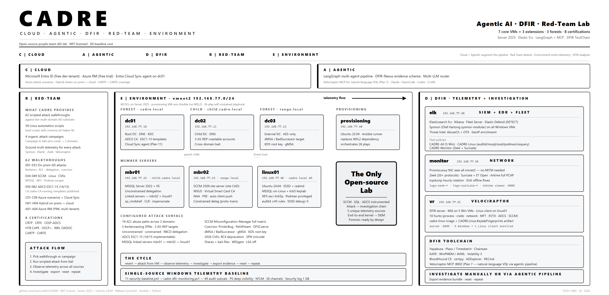

```
CADRE
├── C — Cloud       ── Entra + Azure + Azure attack scenarios + Azure RM
├── A — Agentic     ── LangGraph + DFIR-Nexus + multi-LLM + Velociraptor MCP
├── D — DFIR        ── Elastic SIEM + Velociraptor + Plaso + Hayabusa + Timesketch
├── R — Red-team    ── 60+ red-team attack surfaces · multi-domain AD + cloud
└── E — Environment ── Server 2025 + Linux AD · 7 core VMs + 3 extensions 
```

**Cloud · Agentic · DFIR · Red-team · Environment**

The first open-source lab combining red-team practice, agentic AI investigation, DFIR tooling, cloud identity (Azure/Entra), and 8 industry certifications in a single instrumented substrate. Every attack produces ground-truth telemetry. Investigate manually or via multi-agent AI pipeline. Export structured evidence. Reset. Repeat.

MIT licensed. $0 baseline cost.

---

## Quick Start

```powershell
python cadre.py check                              # Pre-flight (RAM, disk, Vagrant, VMware)
python cadre.py install                            # Deploy 7 core VMs + AD + vulnerabilities
python cadre.py install -e elk-fleet               # SIEM + EDR + Fleet agents
python cadre.py install -e net-monitor             # Zeek + Suricata + Arkime + PCAP
python cadre.py install -e velociraptor            # DFIR server + clients
```

Full guide: [docs/deployment.md](docs/deployment.md)

---

## What CADRE Does

1. **Red-team practice** — 60 walkthroughs across 8 certifications against live multi-domain AD + Azure
2. **Telemetry knowledge via offense** — every attack produces artifacts across Sysmon, Elastic Defend, Zeek, Suricata, Arkime, Velociraptor
3. **DFIR investigation** — Velociraptor VQL hunts, Hayabusa timelines, Plaso, KAPE, Volatility 3
4. **Agentic AI investigation** — LangGraph multi-agent pipeline (6 agents) + DFIR-Nexus + multi-LLM router
5. **Cloud + hybrid identity** — Azure attack scenarios, Azure RM (CARTE), hybrid chains bridging on-prem and cloud
6. **C2 practice** — C2Stack integration (Mythic/Sliver/Havoc)

---

## Architecture

- **7 core VMs + 3 extensions** on vmnet2 `192.168.77.0/24` (isolated host-only)
- **5x Server 2025** — 3 DCs (2 forests + child) + 2 members (MSSQL/IIS + WSUS/VSC)
- **Linux AD member** — Ubuntu 24.04 domain-joined (SSSD, MSSQL-on-Linux, NFS-krb5, Podman) — fully instrumented with auditd (≥45 immutable rules), MSSQL audit, SSSD debug, podman events, osquery, Velociraptor Linux client. First open-source lab to do this.
- **Elastic 9.x + Fleet** — host telemetry. Windows baseline configured by `cadre-dfir-monitoring.ps1` (49 audit subcats + PowerShell deep visibility + NTLM auditing + 26 operational channels incl. Server 2025-only Kerberos/KDC/LDAP-Client/Credential-Guard). Sysmon (Olaf Hartong sysmon-modular). EDR detect-mode.
- **Zeek + Suricata + Arkime** — network telemetry (promiscuous NIC, full PCAP)
- **Velociraptor** — endpoint DFIR (Windows + Linux clients)

Full topology: [docs/architecture.md](docs/architecture.md)

---

## 8 Certifications Attack Coverage

| Cert | Focus |
|------|-------|
| CRTP | AD pentesting fundamentals |
| CRTE | AD expert (cross-forest, delegation, dMSA) |
| CESP-ADCS | Certificate Services ESC1-15 |
| HTB CAPE | AD + coercion + Linux cross-platform |
| OSCP+ | Offensive Security AD portion |
| WKL OADOC | SCCM Misconfiguration-Manager + Virtual Smart Cards |
| CARTP | Azure Red Team Professional (Azure scenarios + Cloud Sync) |
| CARTE | Azure Red Team Expert (Azure RM + PIM + multi-tenant + Arc) |

---

## Documentation

Full doc index: [`DOCS.md`](DOCS.md) — start there to find the right page for what you're doing.

| Doc | What |
|-----|------|
| [Deployment Guide](docs/deployment.md) | Step-by-step: prerequisites → 4 stages → verification |
| [Architecture](docs/architecture.md) | Topology, VMs, data flow, detection coverage |
| [Extensions](docs/extensions.md) | ELK-Fleet, Net-Monitor, Velociraptor, MISP, C2Stack |
| [Forensic Workflow](docs/forensic-workflow.md) | Attack → Telemetry → Investigate → Export → Reset cycle |
| [Testing](docs/testing-recommendations.md) | 83-check verification recipe |
| [DFIR Logging Reference](docs/dfir-logging-reference.md) | Every channel / EID / auditd key / Elastic index in one page |
| [Cert Coverage](docs/cert-coverage.md) | Honest % coverage for all 8 certifications (post-deploy + roadmap completion) |
| [Goals / Roadmap](docs/goals.md) | 11-plan roadmap with status |

---

## Current Status

**Plan 0 — Deployed.** All infrastructure, attack surface, and telemetry stack deployed and verified. 124/127 static structure checks pass (the 3 non-passing check for user-provided installer media — SCCM/SQL, gitignored, not shipped). All 60 attacks configured (WT#002-062 — numbering starts at WT#002). Cloud identity (Plan 11) and agentic pipeline (Plan 7) remain.

---

## Next

**Plan 1 — Telemetry Catalog.** 60 Sigma YAML files mapping every attack to expected artifacts across Sysmon, Elastic, Zeek, and Velociraptor.

---

## License

MIT. No attribution required. No copyleft. See [LICENSE](LICENSE).
