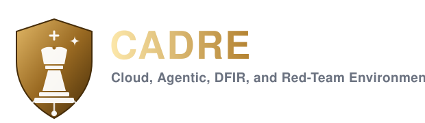
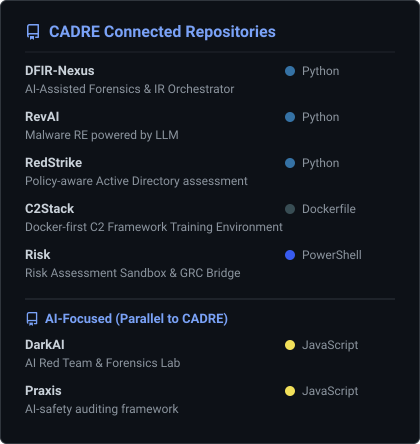
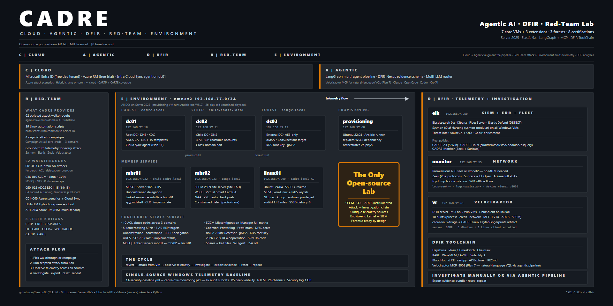

# CADRE

<p align="center">
  
</p>

<p align="center">
  <strong>Cloud, Agentic, DFIR, and Red-Team Environment</strong>
</p>

<p align="center">
  <a href="LICENSE"></a>
  
  
</p>

| Pillar | Dimension | Focus & Core Stack |
| :--- | :--- | :--- |
|  | **Hybrid Cloud Identity** | Microsoft Entra ID (Free Tenant) • Azure Resource Manager (ARM) • Hybrid attack scenarios bridging On-Prem and Cloud |
|  | **Autonomous Investigation** | LangGraph Multi-Agent Workflows • DFIR-Nexus Evidence Schema • Local LLMs & RAG Routing • Velociraptor MCP |
|  | **Forensics & Telemetry** | Elastic SIEM (Host Telemetry) • Velociraptor (Live Hunts) • Zeek & Suricata (Network Flows) • Plaso, Hayabusa & Timesketch |
|  | **Offensive Emulation** | 105 scripted attack scenarios against live multi-domain AD + Azure, spanning on-prem, hybrid, and cloud identity |
|  | **Active Substrate** | Server 2025 (3 DCs, 2 members) • Win11 workstation beachhead • Ubuntu 24.04 Linux AD • 8 core VMs + 3 extensions (ELK, Net-Monitor, VR) |

An open-source lab combining red-team practice, agentic AI investigation, DFIR tooling, and cloud identity (Azure/Entra) in a single instrumented substrate. Every attack produces ground-truth telemetry. Investigate manually or via multi-agent AI pipeline. Export structured evidence. Reset. Repeat.

MIT licensed. $0 baseline cost.

> [!NOTE]
> **Work in progress — and the fuel for the rest of the stack.**
>
> **CADRE (this lab)**
>
> - Research/training lab, not a finished product
> - Core AD + many campaign attacks are usable for practice
> - Detection rules, telemetry catalog, agentic wiring, and docs still evolving
> - Prefer campaign runbooks and live lab behavior over “fully validated” claims
> - Shared AD range + evidence generator — not a polished XDR product
>
> ---
>
> **Sibling tools CADRE fuels:**
>
> <p align="left">
>   
> </p>

---

## Quickstart

```powershell
python cadre.py check                              # Pre-flight (RAM, disk, Vagrant, VMware)
python cadre.py install                            # Deploy 8 core VMs + AD + vulnerabilities
python cadre.py install -e elk-fleet               # SIEM + EDR + Fleet agents
python cadre.py install -e net-monitor             # Zeek + Suricata + Arkime + PCAP
python cadre.py install -e velociraptor            # DFIR server + clients
```

Full guide: [docs/deployment.md](docs/deployment.md)

---

## Core Capabilities

1. **Red-team practice** — 105 scripted attack scenarios against live multi-domain AD + Azure environments
2. **Telemetry knowledge via offense** — every attack produces artifacts across Sysmon, Elastic Defend, Zeek, Suricata, Arkime, Velociraptor
3. **DFIR investigation** — Velociraptor VQL hunts, Hayabusa timelines, Plaso, KAPE, Volatility 3
4. **Agentic AI investigation** — LangGraph multi-agent pipeline (6 agents) + DFIR-Nexus + multi-LLM router
5. **Cloud + hybrid identity** — Azure attack scenarios, hybrid chains bridging on-prem and cloud
6. **Tool ecosystem** — Companion projects for C2 training, DFIR automation, and offensive orchestration (standalone repos)

---

## Architecture & Data Flow

- **8 core VMs + 3 extensions** on vmnet2 `192.168.77.0/24` (isolated host-only)
- **5x Server 2025** — 3 DCs (2 forests + child) + 2 members (MSSQL/IIS + WSUS/SCCM)
- **1x Windows 11 workstation** — beachhead for initial access scenarios (ws01)
- **Linux AD member** — Ubuntu 24.04 domain-joined (SSSD, MSSQL-on-Linux, NFS-krb5, Podman) — fully instrumented with auditd (≥45 immutable rules), MSSQL audit, SSSD debug, podman events, osquery, Velociraptor Linux client. First open-source lab to do this.
- **Elastic 9.x + Fleet** — host telemetry. Windows baseline configured by `cadre-dfir-monitoring.ps1` (49 audit subcats + PowerShell deep visibility + NTLM auditing + 26 operational channels incl. Server 2025-only Kerberos/KDC/LDAP-Client/Credential-Guard). Sysmon (Olaf Hartong sysmon-modular). EDR detect-mode.
- **Zeek + Suricata + Arkime** — network telemetry (promiscuous NIC, full PCAP)
- **Velociraptor** — endpoint DFIR (Windows + Linux clients)



Full topology: [docs/architecture.md](docs/architecture.md)

---

## Project Structure & Documentation

Full doc index: [`DOCS.md`](DOCS.md) — start there to find the right page for what you're doing.

| Doc | What |
|-----|------|
| [Deployment Guide](docs/deployment.md) | Step-by-step: prerequisites → 4 stages → verification |
| [Architecture](docs/architecture.md) | Topology, VMs, data flow, detection coverage |
| [Extensions](docs/extensions.md) | ELK-Fleet, Net-Monitor, Velociraptor, MISP |
| [Forensic Workflow](docs/forensic-workflow.md) | Attack → Telemetry → Investigate → Export → Reset cycle |
| [Testing](docs/testing-recommendations.md) | 83-check verification recipe |
| [DFIR Logging Reference](docs/dfir-logging-reference.md) | Every channel / EID / auditd key / Elastic index in one page |
| [Goals / Roadmap](docs/goals.md) | 11-plan roadmap with status |

---

## Current Status & Roadmap

**Plan 0 — Deployed.** All infrastructure, attack surface, and telemetry stack deployed and verified. 124/127 static structure checks pass (the 3 non-passing check for user-provided installer media — SCCM/SQL, gitignored, not shipped). 105 attack scenarios configured across 8 phases + 4 branches (ws01 beachhead to cross-forest DA).

### Current
**Plan 1 — Telemetry Catalog.** Full campaign execution (scripted + RedStrike orchestrated) to generate ground-truth telemetry. Sigma YAML files mapping every attack to expected artifacts across Sysmon, Elastic, Zeek, and Velociraptor.

---

## License

Distributed under the MIT License. See [LICENSE](LICENSE) for details.

> Copyright (c) 2026 CADRE Platform contributors.
