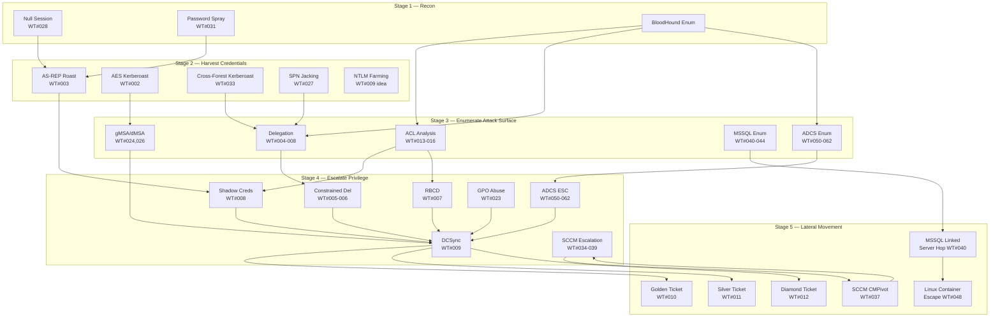
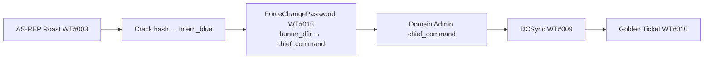
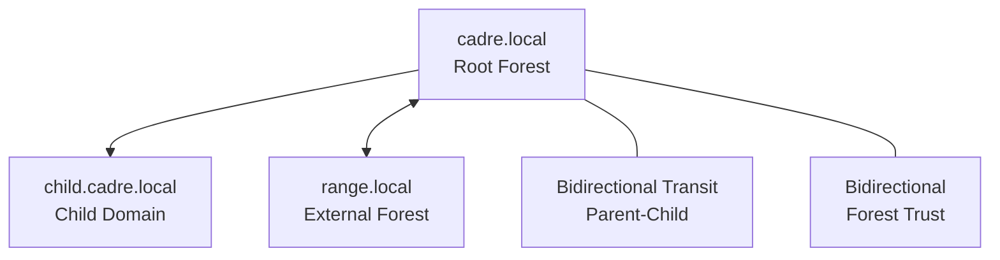

# CADRE — Attack Flow Diagram

## 5-Stage Attack Chain

## Minimum Path to Domain Admin (cadre.local)

## Target IP Map

| Host | IP | Domain | Role |
|------|----|--------|------|
| dc01 | 192.168.77.10 | cadre.local | Root forest DC |
| dc02 | 192.168.77.11 | child.cadre.local | Child domain DC |
| dc03 | 192.168.77.12 | range.local | External forest DC |
| mbr01 | 192.168.77.22 | child.cadre.local | Member (IIS, MSSQL) |
| mbr02 | 192.168.77.23 | range.local | Member (SCCM, MSSQL, WSUS, ADCS) |
| linux01 | 192.168.77.40 | cadre.local | Linux AD member (MSSQL, NFS, Podman) |
| elk | 192.168.77.50 | — | Elastic + Fleet Server |
| vr | 192.168.77.51 | — | Velociraptor Server |
| monitor | 192.168.77.55 | — | Zeek + Suricata + Arkime |
| provisioning | 192.168.77.60 | — | Ansible provisioning |

## Trust Relationships

