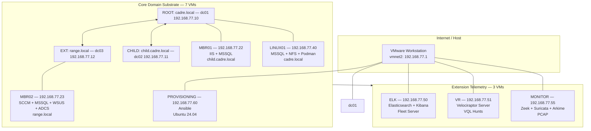
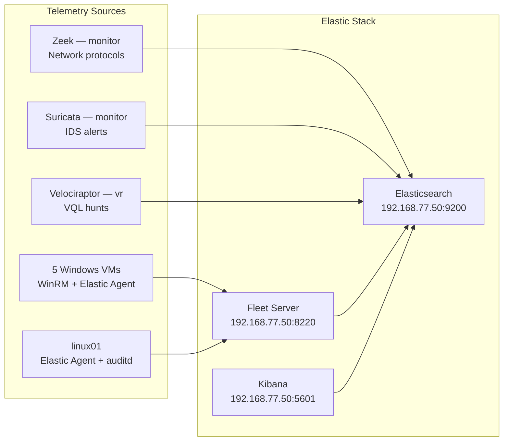

# CADRE — Architecture Reference

## Topology

## VM Specifications

| VM | vCPU | RAM | OS | Storage |
|----|:----:|:---:|----|:-------:|
| dc01 | 2 | 4 GB | Windows Server 2025 | 40 GB |
| dc02 | 2 | 4 GB | Windows Server 2025 | 40 GB |
| dc03 | 2 | 4 GB | Windows Server 2025 | 40 GB |
| mbr01 | 2 | 4 GB | Windows Server 2025 | 40 GB |
| mbr02 | 4 | 4 GB | Windows Server 2025 | 40 GB |
| linux01 | 2 | 4 GB | Ubuntu 24.04 | 40 GB |
| provisioning | 2 | 2 GB | Ubuntu 24.04 | 20 GB |
| elk | 6 | 12 GB | Ubuntu 24.04 | 60 GB (ES 6 GB heap) |
| vr | 2 | 4 GB | Ubuntu 24.04 | 40 GB |
| monitor | 4 | 8 GB | Ubuntu 24.04 | 60 GB |

## Data Flow

