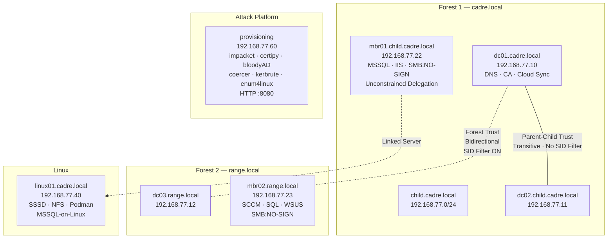
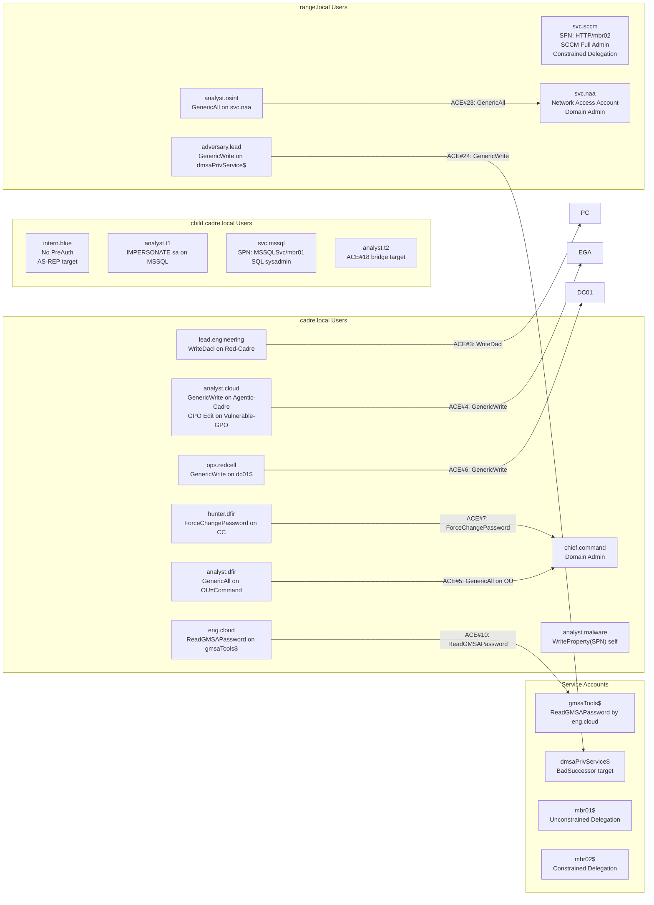
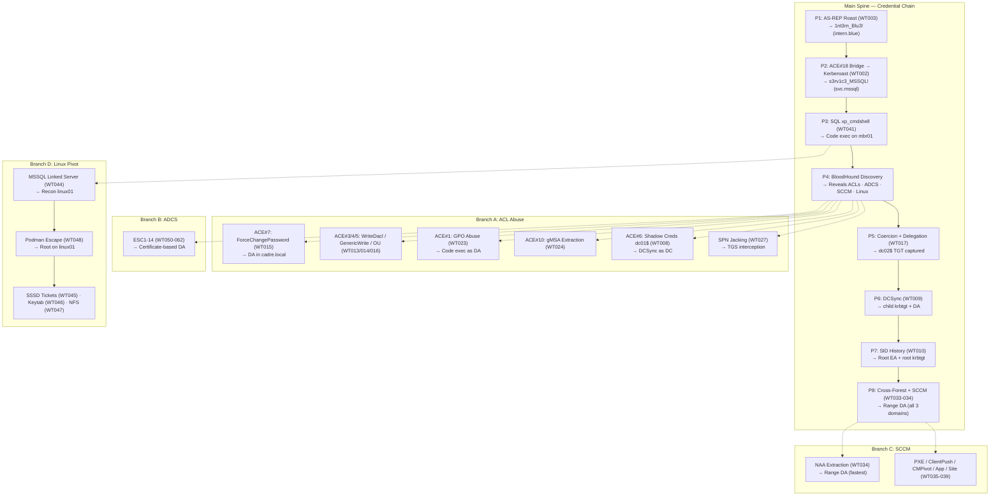
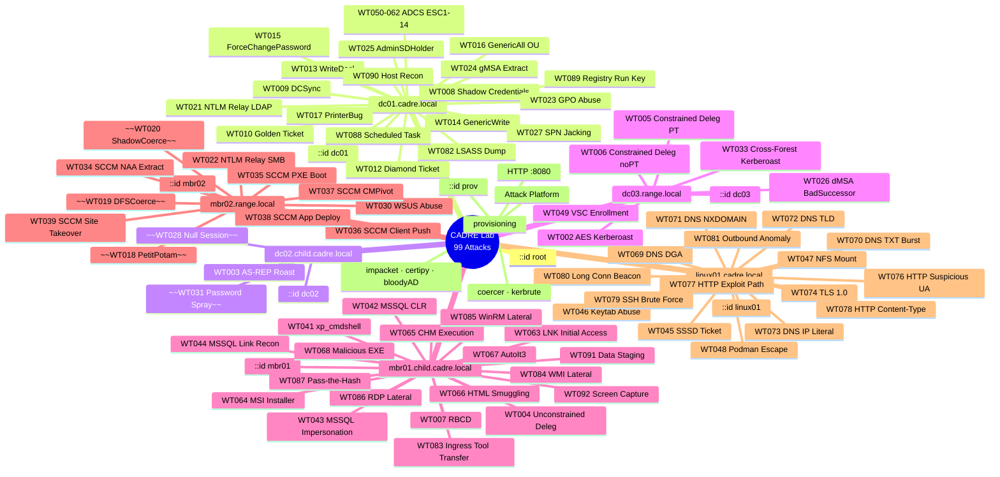

# CADRE — Attack Map

> A visual mindmap of the CADRE lab's Active Directory attack surface: 3 domains, 7 hosts, ~49 users, **75 campaign attacks** + 14 E exercises + 10 F supply-chain. Updated 2026-06-03 for the single-campaign/branch structure.

---

## Overview: Domain Topology



---

## Identity Map — Users & Privileges



---

## Attack Flow — Main Spine + 4 Branches



**Main chain:** `1nt3rn_Blu3!` → `s3rv1c3_MSSQL!` → dc02$ TGT → child krbtgt → root EA → `s3rv1c3_SCCM!` → `N@A_s3rv1c3!`

**Branches diverge from Phase 4 (BH discovery)** and converge back at various points. All optional — each teaches a distinct technique class.

---

## Machine Configuration Map

```mermaid
graph TB
    subgraph "dc01 — cadre.local CA + DNS"
        DC01_S["Services"]
        DC01_CA["ADCS Enterprise CA<br/>cadre-CA"]
        DC01_D["DNS for cadre.local"]
        DC01_V["Vulnerabilities"]
        DC01_V1["LDAP Signing: NOT Required"]
        DC01_V2["WDigest: ON"]
        DC01_V3["LSA PPL: OFF"]
        DC01_V4["CredGuard: OFF"]
        DC01_V5["RestrictedAdmin: 0"]
        DC01_S --> DC01_CA
        DC01_S --> DC01_D
        DC01_V --> DC01_V1
        DC01_V --> DC01_V2
        DC01_V --> DC01_V3
        DC01_V --> DC01_V4
        DC01_V --> DC01_V5
    end

    subgraph "dc02 — child.cadre.local"
        DC02_S["Services"]
        DC02_S1["Print Spooler: ON"]
        DC02_S2["WebClient: ON"]
        DC02_S3["DFS Namespace: ON"]
        DC02_V["Vulnerabilities"]
        DC02_V1["RestrictAnonymous: 0"]
        DC02_V2["RestrictAnonymousSAM: 1 ❌"]
        DC02_V3["DONT_REQUIRE_PREAUTH: intern_blue"]
        DC02_V4["ACE#18: ForceChangePassword"]
        DC02_S --> DC02_S1
        DC02_S --> DC02_S2
        DC02_S --> DC02_S3
        DC02_V --> DC02_V1
        DC02_V --> DC02_V2
        DC02_V --> DC02_V3
        DC02_V --> DC02_V4
    end

    subgraph "dc03 — range.local"
        DC03_S["Services"]
        DC03_S1["Print Spooler: ON"]
        DC03_S2["AES-only Kerberos"]
        DC03_D["DNS for range.local"]
        DC03_V["Vulnerabilities"]
        DC03_V1["Weak Cert Mapping"]
        DC03_V2["dMSA Enabled"]
        DC03_S --> DC03_S1
        DC03_S --> DC03_S2
        DC03_S --> DC03_D
        DC03_V --> DC03_V1
        DC03_V --> DC03_V2
    end

    subgraph "mbr01 — SQL + Web"
        MBR01_S["Services"]
        MBR01_S1["MSSQL: xp_cmdshell ON"]
        MBR01_S2["IIS: Default Web Site"]
        MBR01_S3["Linked: → mbr02, linux01"]
        MBR01_S4["Unconstrained Delegation: ON"]
        MBR01_V["Vulnerabilities"]
        MBR01_V1["SMB Signing: OFF"]
        MBR01_V2["Shares: public, restricted"]
        MBR01_S --> MBR01_S1
        MBR01_S --> MBR01_S2
        MBR01_S --> MBR01_S3
        MBR01_S --> MBR01_S4
        MBR01_V --> MBR01_V1
        MBR01_V --> MBR01_V2
    end

    subgraph "mbr02 — SCCM"
        MBR02_S["Services"]
        MBR02_S1["SCCM Site: CAD"]
        MBR02_S2["MSSQL: CLR ON"]
        MBR02_S3["WSUS: ON"]
        MBR02_S4["Constrained Delegation"]
        MBR02_V["Vulnerabilities"]
        MBR02_V1["SMB Signing: OFF"]
        MBR02_V2["NAA: svc.naa (DA)"]
        MBR02_V3["PXE: No Password"]
        MBR02_S --> MBR02_S1
        MBR02_S --> MBR02_S2
        MBR02_S --> MBR02_S3
        MBR02_S --> MBR02_S4
        MBR02_V --> MBR02_V1
        MBR02_V --> MBR02_V2
        MBR02_V --> MBR02_V3
    end

    subgraph "linux01 — Linux Pivot"
        LX01_S["Services"]
        LX01_S1["MSSQL-on-Linux: ON"]
        LX01_S2["NFSv4: krb5p export"]
        LX01_S3["Podman: --privileged"]
        LX01_S4["SSSD: AD Joined"]
        LX01_V["Vulnerabilities"]
        LX01_V1["Keytab: /var/opt/mssql/secrets/"]
        LX01_V2["SSSD Cache: readable"]
        LX01_S --> LX01_S1
        LX01_S --> LX01_S2
        LX01_S --> LX01_S3
        LX01_S --> LX01_S4
        LX01_V --> LX01_V1
        LX01_V --> LX01_V2
    end
```



---

## Technique Reference — WT# Index by Machine



---

## Trust & Delegation Map

```mermaid
graph LR
    subgraph "Trust Relationships"
        CADRE["cadre.local<br/>S-1-5-21-XXXX"]
        CHILD_D["child.cadre.local<br/>S-1-5-21-YYYY"]
        RANGE["range.local<br/>S-1-5-21-ZZZZ"]
    end

    subgraph "Delegation Configs"
        MBR01_D["mbr01$<br/>Unconstrained<br/>TrustedForDelegation=TRUE"]
        MBR02_D1["mbr02$<br/>Constrained+PT<br/>→ cifs/dc03, ldap/dc03"]
        SVC_D["svc.sccm<br/>Constrained noPT<br/>→ HTTP/mbr02"]
    end

    CADRE -->|"Parent-Child<br/>Transitive · No SID Filter"| CHILD_D
    CADRE -.->|"Forest<br/>Bidirectional<br/>SID Filter ON| RANGE
    MBR01_D -.->|"Captures TGT from"| CHILD_D
    MBR02_D1 -.->|"S4U2Proxy →"| RANGE
```

---

## Coverage Summary

| Section | Phase / Branch | WT# Range | Count |
|:--------|:---------------|:---------:|:-----:|
| Main Spine | P1: Initial Access | 003 | 1 |
| | P2: Credential Harvesting | 002 | 1 |
| | P3: Execution (primary + H alternate) | 041-043, 063-068 | 9 |
| | P4: Discovery | BH + 044 | 2 |
| | P5: Lateral + Coercion | 004-007, 017, 021-022 | 7 |
| | P6: DCSync | 009 | 1 |
| | P7: Forest Trust | 010-012 | 3 |
| | P8: Cross-Forest + SCCM | 033-039, 030, 049 | 10 |
| | **G — Post-Exploit** (blended inline) | 082-092 | 11 |
| Branch A | ACL Abuse | 013-016, 023-025, 027, 008 | 10 |
| Branch B | ADCS | 050-062 | 14 |
| Branch C | SCCM | 034-039, 030, 049 | 8 |
| Branch D | Linux Pivot | 044-048 | 5 |
| | **Total campaign** | **75** | **75** |
| E | Network Defense Exercises | 069-081, 093 | 14 |
| F | Supply-Chain Scenarios | F-01 to F-10 | 10 |
| | **Total lab** | **99** | **99** |

**Removed / Non-functional:** WT028 ❌ (null session), WT031 ⏳ (pending relocation), WT018/019/020 ❌ (Server 2025 coercion).
