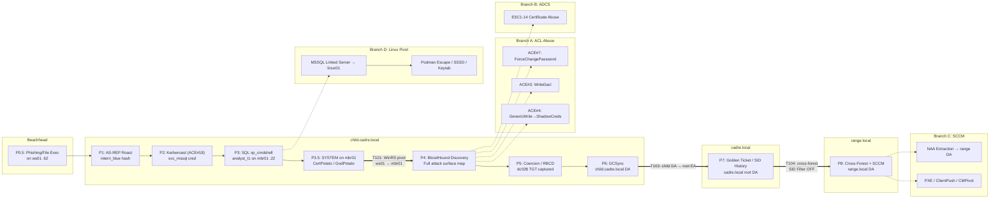

# CADRE — Attack Campaign (v3)

> **v3 is current.** Per-phase runbooks below are the primary path — full narrative + commands for learning and live testing.
> **Archived v1:** [`CAMPAIGNS_v1_archived.md`](CAMPAIGNS_v1_archived.md) · **Full v3 reference:** [`CAMPAIGNS_v3.md`](CAMPAIGNS_v3.md)

**81 campaign attacks + 14 E exercises + 10 F supply-chain scenarios = 105 total.**

## Phase runbooks (v3 — read + execute)

Open **one runbook per phase**. Each file contains the full explanation, prerequisites, detection notes, and commands from the campaign — sized for learning and live testing.

| Phase / stream | Runbook | Notes |
|----------------|---------|-------|
| **0** Recon | [`Runbooks/CAMPAIGNS-RUNBOOK-0.md`](Runbooks/CAMPAIGNS-RUNBOOK-0.md) | Zero creds |
| **1** Initial access | [`Runbooks/CAMPAIGNS-RUNBOOK-1.md`](Runbooks/CAMPAIGNS-RUNBOOK-1.md) | AS-REP verified |
| **2** Cred harvest | [`Runbooks/CAMPAIGNS-RUNBOOK-2.md`](Runbooks/CAMPAIGNS-RUNBOOK-2.md) | Kerberoast verified |
| **3** Execution | [`Runbooks/CAMPAIGNS-RUNBOOK-3.md`](Runbooks/CAMPAIGNS-RUNBOOK-3.md) | SQL → GodPotato verified |
| **3.5** Cred theft | [`Runbooks/CAMPAIGNS-RUNBOOK-3.5.md`](Runbooks/CAMPAIGNS-RUNBOOK-3.5.md) | + study refs |
| **4** Discovery | [`Runbooks/CAMPAIGNS-RUNBOOK-4.md`](Runbooks/CAMPAIGNS-RUNBOOK-4.md) | BloodHound |
| **5** Lateral | [`Runbooks/CAMPAIGNS-RUNBOOK-5.md`](Runbooks/CAMPAIGNS-RUNBOOK-5.md) | Coercion |
| **6** DCSync | [`Runbooks/CAMPAIGNS-RUNBOOK-6.md`](Runbooks/CAMPAIGNS-RUNBOOK-6.md) | + study refs |
| **7** Forest trust | [`Runbooks/CAMPAIGNS-RUNBOOK-7.md`](Runbooks/CAMPAIGNS-RUNBOOK-7.md) | SID History |
| **8** Cross-forest | [`Runbooks/CAMPAIGNS-RUNBOOK-8.md`](Runbooks/CAMPAIGNS-RUNBOOK-8.md) | + study refs |
| **A–D** Branches | [`Runbooks/CAMPAIGNS-RUNBOOK-branch-a.md`](Runbooks/CAMPAIGNS-RUNBOOK-branch-a.md) … [`branch-d`](Runbooks/CAMPAIGNS-RUNBOOK-branch-d.md) | Optional |
| **E / F / G** | [`e`](Runbooks/CAMPAIGNS-RUNBOOK-e.md) · [`f`](Runbooks/CAMPAIGNS-RUNBOOK-f.md) · [`g`](Runbooks/CAMPAIGNS-RUNBOOK-exercises-g.md) | Standalone |

**Full monolithic reference (search / print):** [`CAMPAIGNS_v2.md`](CAMPAIGNS_v2.md) · **Archived v1:** [`CAMPAIGNS_v1_archived.md`](CAMPAIGNS_v1_archived.md)

**Per-attack metadata:** [`CAMPAIGNS-METADATA.md`](CAMPAIGNS-METADATA.md) · **DFIR bridge:** [`DFIR-Nexus-Pioneer-workflow.md`](DFIR-Nexus-Pioneer-workflow.md)

**Editing:** Update the runbook and `CAMPAIGNS_v2.md` together. Run `python tools/split-campaign-runbooks.py --check` after bulk regen.

---
## Lab Topology — Attack Surface

```mermaid
flowchart LR
    subgraph KALI_GROUP["Kali — Attacker / Operator"]
        K["192.168.77.60<br/>impacket · certipy<br/>bloodyAD · nxc · coercer<br/>lsassy · DonPAPI"]
    end

    subgraph WS_GROUP["Workstation Beachhead"]
        WS01["ws01 (192.168.77.62)<br/>Win11 Workstation · MDE P2<br/>analyst_t1 · Local Admin"]
    end

    subgraph F1["Forest 1 — child.cadre.local"]
        D2["dc02 (192.168.77.11)<br/>Child DC · ACE#18<br/>intern_blue (no preauth)"]
        M1["mbr01 (192.168.77.22)<br/>MSSQL 2022 · IIS CertPotato<br/>SMB signing OFF"]
    end

    subgraph F1_ROOT["Forest 1 — cadre.local"]
        D1["dc01 (192.168.77.10)<br/>Root DC · CA: cadre-CA<br/>DNS · Cloud Sync Agent"]
    end

    subgraph F2["Forest 2 — range.local"]
        D3["dc03 (192.168.77.12)<br/>Root DC · AES-only<br/>dMSA: ON"]
        M2["mbr02 (192.168.77.23)<br/>SCCM Site: CAD<br/>WSUS · CLR: ON"]
    end

    subgraph LX_GROUP["Linux — AD Joined"]
        L1["linux01 (192.168.77.40)<br/>SSSD · NFS: krb5p<br/>Podman: privileged"]
    end

    K ==>|"Phishing / Initial Access"| WS01
    WS01 ==>|"T101: WinRS / PSRemoting<br/>as analyst_t1"| M1
    M1 ==>|"Escalate: IIS CertPotato /<br/>SQL xp_cmdshell"| M1
    M1 ==>|"T102: Coercion / RBCD /<br/>DCSync to dc02"| D2
    D2 ==>|"Golden Ticket / SID History"| D1
    D1 ==>|"Cross-forest trust<br/>SID Filter: OFF¹"| D3
    D3 ==>|"SCCM NAA / PXE"| M2
    M1 -.->|"Linked Server"| L1
    M2 -.->|"Linked Server"| L1
```

> **Line types:** `==>` Attack chain    `-.-` Forest trust    `-.->` SQL linked server
>
> ¹ SID filtering disabled — verified by `01-core-ad.yml` checking `SIDFilteringQuarantined = $false` on both dc01 and dc03 sides. Default behavior for forest trusts on Server 2025.

## Attack Flow — Multi-Hop 9 Phases + 4 Branches

**START HERE.** The main spine begins with **Phase 0.5** (initial access on the `ws01` workstation via phishing/file execution). The campaign is built as a multi-hop chain: `ws01 → mbr01 → dc02 → dc01 → range.local`. Each hop uses a different identity, crosses a different sensor boundary, and leaves distinct telemetry.

- **Branch A** — ACL abuse in cadre.local (ForceChangePassword, WriteDacl, GenericWrite, GPO, gMSA, Shadow Creds)
- **Branch B** — ADCS certificate template abuse (ESC1–14)
- **Branch C** — SCCM hierarchy takeover (NAA extraction, PXE, site escalation)
- **Branch D** — Linux post-exploit (MSSQL link, Podman escape, SSSD tickets, NFS, Keytab)

Branches converge back into the main spine — they earn credentials that accelerate or enable the main chain.

- **Branch A** — ACL abuse in cadre.local (ForceChangePassword, WriteDacl, GenericWrite, GPO, gMSA, Shadow Creds)
- **Branch B** — ADCS certificate template abuse (ESC1–14)
- **Branch C** — SCCM hierarchy takeover (NAA extraction, PXE, site escalation)
- **Branch D** — Linux post-exploit (MSSQL link, Podman escape, SSSD tickets, NFS, Keytab)

Branches converge back into the main spine — they earn credentials that accelerate or enable the main chain.

---

## Multi-Hop Campaign Philosophy

The v3 campaign is designed as a realistic red-team engagement within a single VM budget. The chain is not a checklist of isolated tools — it is a sequence of beachheads, each with its own identity, sensor context, and fallback options.

1. **Beachhead diversity.** The spine starts on a compromised Windows workstation (`ws01`) with endpoint telemetry visible. The operator must work inside that context, just as a real intruder would.

2. **Mandatory lateral movement.** The campaign cannot reach domain admin without moving from `ws01 → mbr01 → dc02`. Each hop crosses a distinct identity boundary: `analyst_t1` (workstation user) → `svc_mssql` (service account) → `dc02$` (machine account) → `krbtgt` (domain tier).

3. **Tool staging on the initial beachhead (`ws01`).** Rubeus, mimikatz, and LPE tools are downloaded once onto `ws01` (the first compromised domain workstation), then copied laterally to `mbr01`/`dc02`/`dc01` over SMB (`C$`/`ADMIN$`). This mirrors real-world CRTP/CAPE operator behavior and avoids C2-to-DC HTTP traffic.

4. **Failure-tolerant paths.** Every major objective has a fallback:
   - If `T101` WinRS is blocked → fallback to `psexec` over SMB or PowerShell remoting.
   - If `T102` coercion fails → fallback to RBCD via `T007` or ACL abuse `Branch A`.
   - If `T010` Golden Ticket triggers alerts → fallback to `T011` Silver Ticket or `T012` Diamond Ticket.

5. **Cross-sensor telemetry coverage.** Each hop touches a different sensor:
   - `ws01` → workstation EDR, Sysmon, WinSec 4624 Type 10/7.
   - `mbr01` → server EDR, SQL audit, IIS logs, SMB coercion Suricata alerts.
   - `dc02/dc01` → DC replication events, DCSync detections, Kerberos alerts.
   - `dc03/mbr02` → cross-forest logs, SCCM audit, WSUS telemetry.

6. **Outcome.** A learner who completes this campaign can articulate not just *what* each tool does, but *where* to run it, *why* the location matters, and *what telemetry* it generates.

---

---

## Coverage Summary

> **Status notes:** WT028 (null session) ❌ Invalid. WT031 (password spray) ⏳ Pending relocation. WT018/019/020 (coercion) ❌ Non-functional on Server 2025. The six H vectors (H-01..H-06) are now Phase 0.5 of the main spine. Remaining 81 attacks active.

| Phase / Branch                | Primary WT#                      | Alternative                                                                                        | What you earn                |
| ----------------------------- | -------------------------------- | -------------------------------------------------------------------------------------------------- | ---------------------------- |
| **P0.5: Initial Access**      | H-01..H-06 (WT063-068)           | —                                                                                                  | C2 on `ws01` as `analyst_t1` |
| **P1: Initial Access**        | 003                              | —                                                                                                  | `1nt3rn_Blu3!`               |
| **P2: Credential Harvesting** | 002                              | 042, 043                                                                                           | `s3rv1c3_MSSQL!`             |
| **P3: Execution**             | 041                              | —                                                                                                  | Code exec on mbr01           |
| **P4: Discovery**             | BH + 044                         | —                                                                                                  | Attack surface map           |
| **P5: Coercion + Delegation** | 004, 017                         | 007, 021, 022                                                                                      | `dc02$` TGT                  |
| **P6: DCSync**                | 009                              | —                                                                                                  | Child DA + krbtgt            |
| **P7: Forest Trust**          | 010                              | 011, 012                                                                                           | Root EA + krbtgt             |
| **P8: Cross-Forest + SCCM**   | 033, 034                         | 035-039, 030, 049                                                                                  | Range DA                     |
| **Branch A: ACL Abuse**       | 015                              | 013, 014, 016, 023, 024, 027, 008, plus ACE#2/8-14 (direct DCSync), #15-20 (child), #21-26 (range) | cadre.local DA               |
| **Branch A — Direct DCSync**  | 13+14                            | `eng_agentic` → `DC=cadre`: GetChanges                                                             | **Direct DCSync without DA** |
| **Branch B: ADCS**            | 050-061 (ESC1-14, 12 in-scope)   | —                                                                                                  | Certificate DA               |
| **Branch C: SCCM**            | 034-039                          | 030, 049                                                                                           | Range DA                     |
| **Branch D: Linux Pivot**     | 044, 048, 045, 047, 046          | —                                                                                                  | Domain creds                 |
| **G — Post-Exploit**          | 082, 083, 084-089, 090, 091, 092 | —                                                                                                  | Blended inline               |
| **Total**                     | **81**                           | —                                                                                                  | —                            |

---

