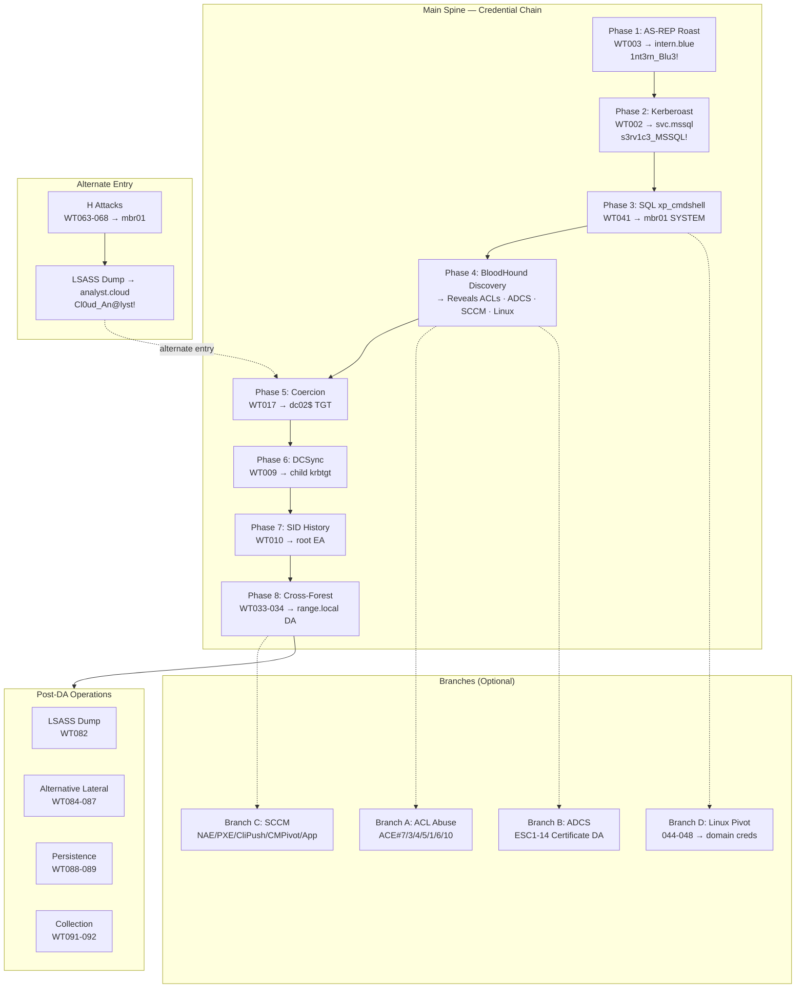

# CADRE — Attack Flow Diagram

## Main Spine + 4 Branches

**Credential chain:** `1nt3rn_Blu3!` → `s3rv1c3_MSSQL!` → dc02$ TGT → child krbtgt → root EA → `s3rv1c3_SCCM!` → `N@A_s3rv1c3!`

**Status:** 75 campaign attacks (8 phases + 4 branches) + 14 E exercises + 10 F supply-chain = 99 total. WT028 ❌, WT031 ⏳, WT018-020 ❌.

## Full Campaign

See [`../CAMPAIGNS.md`](../CAMPAIGNS.md) for the complete campaign with identity-driven credential flow, detection references, and DFIR Report real-world case studies.
